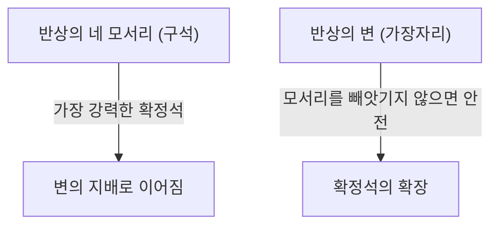

## 1. 배우는 데는 1분, 마스터하는 데는 평생

오셀로(리버시)는 1973년 일본의 하세가와 고로 씨가 고안하여 전 세계적으로 사랑받고 있는 보드게임입니다.
규칙은 매우 간단합니다. "상대방의 돌을 양쪽에서 포위하여 자신의 색으로 뒤집는다", "최종적으로 반상(8×8의 64칸)에 자신의 색이 더 많은 쪽이 승리한다" 이것뿐입니다.

하지만 초보자가 경험자에게 이기는 것은 거의 불가능합니다. 왜냐하면 오셀로에는 "**초반에는 일부러 자신의 돌을 적게 만든다**"라는 직관에 반하는 깊은 전략 이론이 존재하기 때문입니다.

## 2. 절대로 뒤집히지 않는 '확정석'의 가치

오셀로에서 가장 중요한 개념 중 하나가 "**확정석(確定石)**"입니다.
이는 '게임이 끝날 때까지 상대가 어떻게 해도 절대로 뒤집을 수 없는 돌'을 뜻합니다.

반상의 "**모서리(네 구석)**"에 놓은 돌은 어느 방향에서도 포위당하지 않기 때문에 가장 강력한 확정석이 됩니다. 일단 모서리를 차지하면, 그곳을 기점으로 변의 돌들도 차례차례 확정석으로 만들어 갈 수 있습니다.
그렇기 때문에 오셀로의 전략은 근본적으로 "**어떻게 하면 상대에게 모서리를 내주지 않고 자신이 모서리를 차지할 것인가**"를 다루는 게임이라고 할 수 있습니다.

## 3. 모서리를 내주지 않기 위한 'X두기'와 'C두기'의 위험성

모서리를 빼앗기지 않기 위해서는 모서리 바로 옆 칸에 돌을 놓지 않는 것이 철칙입니다.
오셀로 용어로는 모서리의 대각선 안쪽 칸을 "**X(엑스)**", 모서리의 상하좌우 칸을 "**C(씨)**"라고 부릅니다.

- **X두기의 위험**: 만약 당신이 X에 돌을 놓으면 상대는 즉시 그 돌을 포위하여 '모서리'를 차지할 수 있게 됩니다. 따라서 초반~중반의 X두기는 '자살 행위'로 간주됩니다.
- **C두기의 위험**: 마찬가지로 C에 돌을 놓는 것도 모서리를 빼앗길 위험이 매우 높기 때문에 숙련자가 아닌 이상 피해야 합니다.

## 4. 왜 '초반에는 돌을 잡지 않는' 것이 유리할까? (개방도 이론)

초보자는 '많이 포위할 수 있는 곳'이 있으면 기뻐하며 뒤집어 버립니다. 하지만 이는 오셀로에서 가장 피해야 할 악수입니다.

오셀로에서는 자신의 돌이 많아지면 '다음에 자신이 둘 수 있는 곳'이 적어지고, 상대의 돌이 많으면 '자신이 둘 수 있는 곳'이 많아진다는 법칙이 있습니다. 이를 "**개방도(開放度) 이론**"이라고 부릅니다.

초반에 돌을 너무 많이 잡아버리면 자신의 돌이 반상의 바깥쪽에 노출되어 다음에 둘 곳이 없어지게 됩니다. 둘 수 있는 곳이 없는(선택지가 없는) 상태가 되면 결국 '사실은 두고 싶지 않은 위험한 곳(X나 C)'에 억지로 두게 됩니다.
이를 오셀로 용어로 "**수막힘(패스)**"이나 "**강제수**"라고 부릅니다.

강한 플레이어는 초반에서 중반에 걸쳐 자신의 돌을 가급적 '반상의 중심'에 작게 모아두고(속 빼기, 中割り), 상대가 바깥쪽을 둘러싸게 만듭니다. 그리고 상대가 둘 수 있는 곳을 서서히 빼앗아 가서, 마지막에는 상대를 X에 억지로 두게 한 뒤 자신이 모서리를 빼앗는 것입니다.

## 5. 초보자가 이기기 위한 3가지 단계

만약 당신이 오셀로에서 이기고 싶다면, 다음의 3가지 규칙을 지키는 것만으로도 극적으로 강해집니다.

1. **초반에는 '1개만' 뒤집는다**: 많이 잡을 수 있는 곳이 있어도 참으며, 반상 중심의 돌을 1개만 뒤집는 '속 빼기(나카와리)'를 철저히 한다.
2. **자신의 돌을 적게 유지한다**: 상대가 바깥쪽을 둘러싸게 하고, 자신은 안쪽에 숨는다.
3. **절대로 X와 C에는 두지 않는다**: 수가 막혀서 강제될 때까지 모서리 주변에는 절대로 손을 대지 않는다.

## 6. 요약

오셀로는 '직관적인 욕망(많이 뒤집고 싶다)'을 논리적인 이성으로 억누르는 게임입니다.
눈앞의 이익을 버리고 최종적인 승리(확정석)를 취하러 가는 그 전략성은 비즈니스나 투자와도 통하는 깊은 교훈을 담고 있습니다. 다음에 대국할 때는 꼭 '돌을 적게 유지한다'는 전략을 시험해 보시기 바랍니다.
