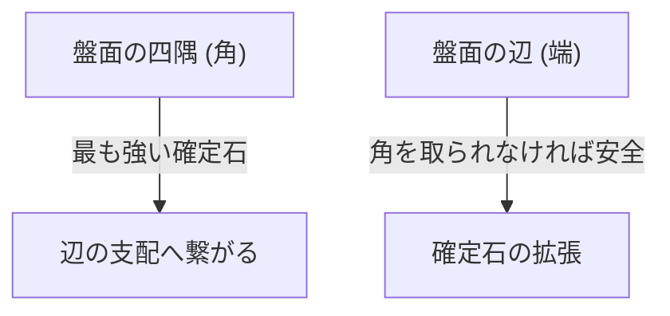

## 1. 覚えるのは1分、極めるのは一生

オセロ（リバーシ）は、1973年に日本の長谷川五郎氏によって考案され、世界中で愛されているボードゲームです。
ルールは極めてシンプル。「相手の石を挟んで自分の色にひっくり返す」「最終的に盤面（8×8の64マス）に自分の色が多い方が勝ち」これだけです。

しかし、初心者が経験者に勝つことはほぼ不可能です。なぜなら、オセロには「**序盤はわざと自分の石を少なくする**」という、直感に反する深い戦略理論が存在するからです。

## 2. 絶対にひっくり返されない「確定石」の価値

オセロにおいて最も重要な概念の一つが「**確定石（かくていせき）**」です。
これは「ゲームが終わるまで、相手がどうやっても絶対にひっくり返せない石」のことを指します。

盤面の「**角（四隅）**」に置いた石は、どの方向からも挟まれることがないため、最強の確定石となります。一度角を取れば、そこを起点として辺の石も次々と確定石にしていくことができます。
そのため、オセロの戦略は根本的に「**いかにして相手に角を取らせず、自分が角を取るか**」というゲームだと言えます。

## 3. 角を取らせないための「X打ち」と「C打ち」の危険性

角を取られないためには、角のすぐ隣のマスに石を置かないことが鉄則です。
オセロの用語では、角の斜め内側のマスを「**X（エックス）**」、角の上下左右のマスを「**C（シー）**」と呼びます。

- **X打ちの危険**: もしあなたがXに石を置くと、相手はすぐにその石を挟んで「角」を取ることができてしまいます。そのため、序盤〜中盤でのX打ちは「自殺行為」とされています。
- **C打ちの危険**: 同様に、Cに石を置くのも角を取られるリスクが非常に高いため、熟練者でない限り避けるべきです。

## 4. なぜ「序盤は石を取らない」のが強いのか？（開放度理論）

初心者は「たくさん挟める場所」があると喜んでひっくり返してしまいます。しかし、これはオセロで最もやってはいけない悪手です。

オセロでは、自分の石が多くなると「次に自分が打てる場所」が少なくなり、相手の石が多いと「自分が打てる場所」が多くなるという法則があります。これを「**開放度（かいほうど）理論**」と呼びます。

序盤でたくさん石を取ってしまうと、自分の石が盤面の外側に露出し、次に打てる場所がなくなってしまいます。打てる場所がない（選択肢がない）状態になると、最終的に「本当は打ちたくない危険な場所（XやC）」に無理やり打たされることになります。
これをオセロ用語で「**手詰まり（パス）**」や「**強制手**」と呼びます。

強いプレイヤーは、序盤から中盤にかけて、自分の石をなるべく「盤面の中心」に小さくまとめ（中割り）、相手に外側を囲ませます。そして相手の打てる場所を徐々に奪っていき、最後に相手をXに無理やり打たせて、自分が角を奪い取るのです。

## 5. 初心者が勝つための3つのステップ

もしあなたがオセロで勝ちたいなら、以下の3つのルールを守るだけで劇的に強くなります。

1. **序盤は「1個だけ」ひっくり返す**: たくさん取れる場所があっても我慢し、盤面の中心の石を1個だけ返す「中割り（なかわり）」を徹底する。
2. **自分の石を少なく保つ**: 相手に外側を囲ませ、自分は内側に隠れる。
3. **絶対にXとCには打たない**: 手詰まりになって強制されるまで、角の周りには絶対に手を出さない。

## 6. まとめ

オセロは「直感的な欲望（たくさんひっくり返したい）」を論理的な理性で抑え込むゲームです。
目先の利益を捨てて最終的な勝利（確定石）を取りに行くその戦略性は、ビジネスや投資にも通じる深い教訓を持っています。次に対局する時は、ぜひ「石を少なく保つ」という戦略を試してみてください。
