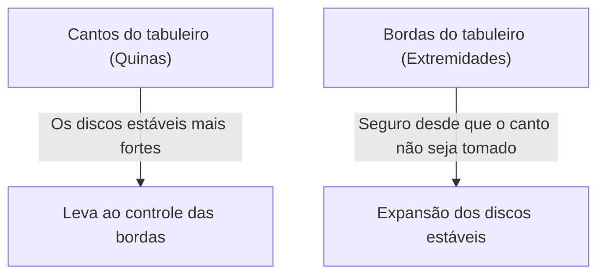

## 1. Um minuto para aprender, uma vida para dominar

Othello (Reversi) é um jogo de tabuleiro inventado no Japão por Goro Hasegawa em 1973 e é amado em todo o mundo.
As regras são extremamente simples. "Cercar os discos do oponente para virá-los para a sua cor" e "quem tiver mais discos da sua cor no tabuleiro (grade de 8x8, 64 casas) no final ganha". É apenas isso.

No entanto, é quase impossível para um iniciante vencer um jogador experiente. Isso ocorre porque o Othello tem uma teoria estratégica profunda e contra-intuitiva: "**manter intencionalmente poucos discos no início do jogo**".

## 2. O valor dos "Discos Estáveis" que nunca podem ser virados

Um dos conceitos mais importantes no Othello é o "**Disco Estável**".
Isso se refere a "um disco que o oponente não pode virar de forma alguma até o fim do jogo".

Os discos colocados nos "**cantos (quinas)**" do tabuleiro não podem ser cercados de nenhuma direção, tornando-os os discos estáveis mais fortes. Uma vez que você toma um canto, você pode usá-lo como ponto de partida para transformar os discos das bordas em discos estáveis, um após o outro.
Portanto, pode-se dizer que a estratégia do Othello é fundamentalmente um jogo de "**como impedir o oponente de pegar os cantos e, em vez disso, pegá-los para si mesmo**".

## 3. Os perigos das "Jogadas X" e "Jogadas C" para evitar ceder os cantos

Para evitar ter os cantos tomados, a regra de ouro é não colocar discos nas casas imediatamente adjacentes aos cantos.
Na terminologia do Othello, a casa diagonalmente interna a um canto é chamada de "**X**", e as casas acima, abaixo, à esquerda e à direita do canto são chamadas de "**C**".

- **Perigo da jogada X**: Se você colocar um disco em X, o oponente pode cercá-lo imediatamente e pegar o "canto". Portanto, jogar em X no início ou meio do jogo é considerado "suicídio".
- **Perigo da jogada C**: Da mesma forma, colocar um disco em C tem um risco muito alto de ter o canto tomado, então deve ser evitado a menos que você seja um especialista.

## 4. Por que é forte "não capturar discos no início do jogo"? (Teoria da Mobilidade)

Iniciantes ficam felizes em virar discos quando há "um lugar onde podem cercar muitos". No entanto, essa é a pior jogada que você pode fazer no Othello.

No Othello, há uma regra de que quando seus discos aumentam, "seus próximos lugares possíveis para jogar" diminuem, e quando os discos do oponente aumentam, "seus lugares possíveis para jogar" aumentam. Isso é chamado de "**Teoria da Mobilidade**".

Se você capturar muitos discos no início, seus discos ficarão expostos do lado de fora do tabuleiro, e você não terá onde jogar em seguida. Quando você chega a um estado onde não tem onde jogar (sem opções), acabará sendo forçado a jogar em "lugares perigosos onde você realmente não quer jogar (X ou C)".
Isso é chamado de "**passar a vez**" ou "**jogada forçada**" na terminologia do Othello.

Jogadores fortes mantêm seus discos compactos no "centro do tabuleiro" (jogada interna) tanto quanto possível do início ao meio do jogo, e deixam o oponente cercá-los por fora. Então, eles gradualmente tiram as opções de jogada do oponente, forçando-o a jogar em X por último, para que eles próprios possam roubar os cantos.

## 5. Três passos para iniciantes vencerem

Se você quer vencer no Othello, você se tornará dramaticamente mais forte apenas seguindo estas três regras:

1. **Vire apenas "1 disco" no início do jogo**: Seja paciente mesmo que haja lugares onde você pode capturar muito, e atenha-se à "jogada interna" (virando apenas 1 disco no centro do tabuleiro).
2. **Mantenha seus discos em menor número**: Deixe o oponente cercar o lado de fora, enquanto você se esconde no lado de dentro.
3. **Nunca jogue em X e C**: Nunca toque nas áreas ao redor dos cantos até ficar sem opções e ser forçado a fazê-lo.

## 6. Conclusão

Othello é um jogo onde você reprime "desejos intuitivos (querer virar muito)" com raciocínio lógico.
Essa natureza estratégica de abandonar o lucro imediato para buscar a vitória final (discos estáveis) traz lições profundas que também se aplicam a negócios e investimentos. Da próxima vez que você jogar, não deixe de tentar a estratégia de "manter poucos discos".
