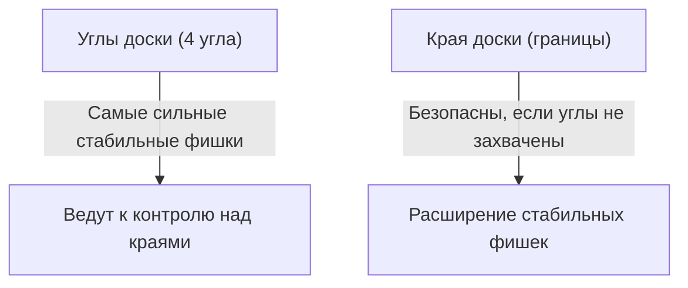

## 1. Освоишь за минуту, а постигать будешь всю жизнь

Отелло (Реверси) — это настольная игра, придуманная в 1973 году японцем Горо Хасэгавой, которая стала популярной во всем мире.
Правила предельно просты: «зажимайте фишки противника, чтобы перевернуть их в свой цвет» и «побеждает тот, у кого в конце игры больше фишек своего цвета на доске (64 клетки, 8×8)». И всё.

Однако новичку почти невозможно победить опытного игрока. Всё потому, что в Отелло существует глубокая, противоречащая интуиции стратегическая теория: «**в начале игры намеренно держите количество своих фишек минимальным**».

## 2. Ценность «стабильных фишек», которые невозможно перевернуть

Одно из самых важных понятий в Отелло — это «**стабильные фишки**».
Это фишки, которые «противник не сможет перевернуть ни при каких обстоятельствах до самого конца игры».

Фишка, помещенная в «**угол (один из четырех)**» доски, становится сильнейшей стабильной фишкой, так как её невозможно зажать ни с одной стороны. Захватив угол однажды, вы сможете использовать его как отправную точку, чтобы последовательно превращать краевые фишки в стабильные.
Поэтому по своей сути стратегия Отелло сводится к игре: «**как не дать противнику захватить углы и занять их самому**».

## 3. Опасность ходов «X» и «C»: как не отдать угол

Чтобы не потерять угол, золотое правило гласит: не ставьте фишку на клетки, непосредственно прилегающие к углу.
В терминологии Отелло клетки по диагонали внутрь от угла называются «**X**» (икс), а клетки сверху, снизу, слева и справа от угла — «**C**» (си).

- **Опасность хода X**: Если вы ставите фишку на позицию X, противник сможет немедленно зажать её и захватить «угол». Поэтому ходы на X на начальном и среднем этапах игры считаются «самоубийством».
- **Опасность хода C**: Аналогично, постановка фишки на C несет в себе очень высокий риск потери угла, поэтому таких ходов следует избегать, если вы не являетесь опытным игроком.

## 4. Почему «не захватывать фишки в начале» — это сильная стратегия? (Теория открытости)

Новички часто радуются, видя «места, где можно зажать много фишек», и с удовольствием переворачивают их. Однако это самая грубая ошибка, которую только можно совершить в Отелло.

В Отелло действует закон: когда ваших фишек становится много, «мест, куда вы можете пойти следующим ходом», становится меньше; а когда фишек противника много, «мест для вашего хода» становится больше. Это называется «**теорией открытости**».

Если вы захватите много фишек в начале игры, ваши фишки окажутся снаружи на доске, и у вас не останется возможных ходов на будущее. Когда возникает ситуация отсутствия ходов (нет выбора), в конечном итоге вас заставят сделать вынужденный ход в «опасное место, куда вы на самом деле не хотите ходить (X или C)».
В терминологии Отелло это называется «**тупик (пас)**» или «**вынужденный ход**».

Сильные игроки на начальном и среднем этапах стараются держать свои фишки в небольшой группе ближе к «центру доски» (внутреннее разделение), заставляя противника окружать их снаружи. Затем они постепенно лишают противника доступных ходов и в конце концов вынуждают его пойти на X, забирая угол себе.

## 5. Три шага к победе для новичков

Если вы хотите побеждать в Отелло, просто соблюдайте следующие три правила, и вы станете значительно сильнее.

1. **В начале игры переворачивайте «только 1 фишку»**: Даже если есть возможность захватить много, сдерживайтесь. Строго придерживайтесь тактики «внутреннего разделения», переворачивая лишь одну фишку ближе к центру доски.
2. **Сохраняйте малое количество своих фишек**: Заставляйте противника окружать вас снаружи, а сами прячьтесь внутри.
3. **Никогда не ходите на X и C**: Пока вас не загонят в тупик и не заставят, ни в коем случае не приближайтесь к углам.

## 6. Заключение

Отелло — это игра, в которой «интуитивное желание (перевернуть как можно больше)» подавляется логическим рассудком.
Стратегия отказа от сиюминутной выгоды ради окончательной победы (стабильных фишек) несет в себе глубокий урок, применимый также в бизнесе и инвестициях. Когда будете играть в следующий раз, обязательно попробуйте применить стратегию «сохранения малого количества фишек».
