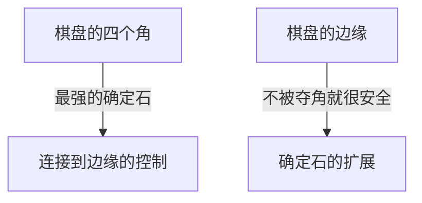

## 1. 一分钟学会，一生精通

黑白棋（奥赛罗）是由日本的长谷川五郎于 1973 年发明，并在世界范围内广受喜爱的桌面游戏。
规则非常简单。“夹住对方的棋子使其翻转成自己的颜色”“最终在棋盘（8×8的64个格子）上自己颜色的棋子多者获胜”，仅此而已。

然而，初学者几乎不可能战胜有经验的玩家。因为在黑白棋中存在着“ **开局时故意减少自己的棋子** ”这样有悖直觉的深刻战略理论。

## 2. 绝对不会被翻转的“确定石”的价值

在黑白棋中最重要的概念之一就是“ **确定石** ”。
这指的是“直到游戏结束，无论对手怎么做都绝对无法翻转的棋子”。

放在棋盘“ **角（四个角落）** ”的棋子，因为不会从任何方向被夹住，所以成为最强的确定石。一旦夺取了角，就可以以此为起点，将边缘的棋子也接连变成确定石。
因此，黑白棋的战略从根本上可以说是“ **如何不让对手夺角，自己去夺角** ”的游戏。

## 3. 为了不让对手夺角的“X位”与“C位”下法的危险性

为了不被夺角，铁则是不要把棋子下在紧挨着角的格子里。
在黑白棋的术语中，角斜内侧的格子被称为“ **X位** ”，角上下左右的格子被称为“ **C位** ”。

- **X位下法的危险** ：如果你在X位下子，对手马上就能夹住那颗棋子并夺取“角”。因此，在开局到中盘阶段在X位下子被视为“自杀行为”。
- **C位下法的危险** ：同样地，在C位下子被夺角的风险也非常高，除非是熟练的玩家，否则应该避免。

## 4. 为什么“开局不吃子”会很强？（开放度理论）

初学者看到“能夹住很多棋子的地方”就会很高兴地去翻转。然而，这是黑白棋中最不该下的劣手。

在黑白棋中，有一个法则：自己的棋子一多，“接下来自己能下的地方”就会变少；对方的棋子多，“自己能下的地方”就会变多。这被称为“ **开放度理论** ”。

如果在开局就吃掉很多棋子，自己的棋子就会暴露在棋盘的外侧，接下来就没有可以下的地方了。当陷入没有可以下的地方（没有选择）的状态时，最终就会被迫下在“其实不想下的危险地方（X位或C位）”。
这在黑白棋术语中被称为“ **无棋可下（Pass）** ”或“ **强迫手** ”。

强劲的玩家，从开局到中盘，会尽量把自己的棋子在“棋盘中心”小范围地集中（中割），让对手去包围外侧。然后逐渐夺走对手能下的地方，最后强迫对手下在X位，自己再夺取角。

## 5. 初学者获胜的3个步骤

如果你想在黑白棋中获胜，只要遵守以下3个规则就能变得出奇地强。

1. **开局只翻转“1个”** ：即使有能吃很多子的地方也要忍耐，彻底贯彻只翻转棋盘中心1个棋子的“中割”策略。
2. **保持自己的棋子数量少** ：让对手包围外侧，自己隐藏在内侧。
3. **绝对不要下在X位和C位** ：直到无棋可下被迫行动之前，绝对不要碰角周围的地方。

## 6. 总结

黑白棋是一个用逻辑理性来抑制“直觉欲望（想翻转很多棋子）”的游戏。
舍弃眼前的利益去争取最终的胜利（确定石），这种战略性包含着与商业和投资相通的深刻教训。下次对局时，请一定要尝试一下“保持棋子数量少”的战略。
