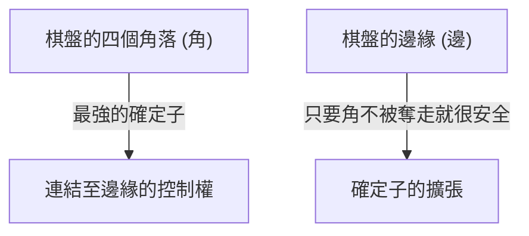

## 1. 1分鐘學會，一輩子精通

黑白棋（Reversi），於1973年由日本的長谷川五郎先生所發明，是深受世界各地喜愛的桌上遊戲。
規則極為簡單。「夾住對手的棋子並將其翻轉成自己的顏色」「最終在棋盤（8×8的64個格子）上自己顏色的棋子較多者獲勝」，就只有這樣。

然而，新手幾乎不可能戰勝經驗豐富的玩家。因為在黑白棋中，存在著一種違反直覺的深層戰略理論： 「 **序盤要刻意減少自己的棋子** 」 。

## 2. 絕對不會被翻轉的「確定子」之價值

在黑白棋中，最重要的概念之一就是 「 **確定子** 」 。
這指的是「直到遊戲結束，無論對手怎麼做都絕對無法翻轉的棋子」。

在棋盤的 「 **角落（四角）** 」 放置的棋子，因為不會被任何方向夾住，所以會成為最強的確定子。一旦佔領角落，就可以以此為起點，將邊緣的棋子也陸續變成確定子。
因此，黑白棋的戰略根本上可以說是一場 「 **如何不讓對手佔領角落，並由自己奪取角落** 」 的遊戲。

## 3. 避免被奪取角落的「X位」與「C位」之危險性

為了不讓對手奪取角落，鐵則就是不要把棋子下在緊鄰角落的格子裡。
在黑白棋的術語中，角落斜內側的格子被稱為 「 **X（X位）** 」 ，角落上下左右的格子被稱為 「 **C（C位）** 」 。

- **下在X位的危險**: 如果你將棋子下在X位，對手就能立刻夾住該棋子並佔領「角落」。因此，在序盤至中盤下在X位被視為「自殺行為」。
- **下在C位的危險**: 同樣地，將棋子下在C位被奪取角落的風險也非常高，除非是熟練的玩家，否則應該盡量避免。

## 4. 為什麼「序盤不要吃子」比較強？（開放度理論）

新手看到有「可以夾住很多棋子的地方」，就會很高興地把它們全部翻轉過來。然而，這是黑白棋中最不該犯的錯誤。

在黑白棋中，有一個法則：當自己的棋子變多時，「下一步自己可以下的位置」就會變少；當對手的棋子變多時，「自己可以下的位置」就會變多。這被稱為 「 **開放度理論** 」 。

如果在序盤就吃掉很多棋子，自己的棋子就會暴露在棋盤的外側，導致下一步沒有地方可以下。當處於沒有地方可以下（沒有選擇）的狀態時，最終就會被強迫下在「其實根本不想下的危險位置（X位或C位）」。
這在黑白棋術語中被稱為 「 **無棋可下（Pass）** 」 或 「 **強制手** 」 。

強大玩家在序盤到中盤階段，會盡量把自己的棋子「集中在棋盤中心」保持小規模（中割），並讓對手包圍外側。然後逐漸剝奪對手可以下的位置，最後強迫對手下在X位，進而讓自己奪取角落。

## 5. 新手獲勝的三個步驟

如果你想在黑白棋中獲勝，只要遵守以下三個規則，就能戲劇性地變強。

1. **序盤只翻轉「1顆」**: 即使有可以吃掉很多棋子的地方也要忍耐，貫徹只翻轉棋盤中心1顆棋子的「中割」策略。
2. **保持自己的棋子數量少**: 讓對手包圍外側，自己則隱藏在內側。
3. **絕對不下在X位與C位**: 直到無棋可下被強迫為止，絕對不要對角落周圍出手。

## 6. 總結

黑白棋是一款用邏輯理性來抑制「直覺慾望（想翻轉很多棋子）」的遊戲。
捨棄眼前利益以追求最終勝利（確定子）的戰略性，蘊含著能通往商業或投資領域的深刻教訓。下次對局時，請務必嘗試看看「保持棋子數量少」的戰略。
