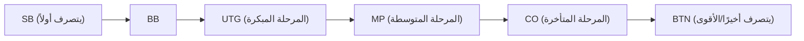

## 1. "لعبة المعلومات غير المكتملة" المطلقة

الشطرنج وشوغي وعطيل هي "ألعاب معلومات مكتملة" حيث تكون جميع معلومات الرقعة مرئية لكلا الطرفين. في المقابل، تُصنف البوكر وماجونغ كـ "**ألعاب معلومات غير مكتملة**" حيث لا يمكنك رؤية أوراق الخصم.

نظرًا لعدم رؤية أوراق الخصم، يتدخل عنصر الحظ. ومع ذلك، في لعبة البوكر، ليس الحظ هو ما يحدد الفوز أو الخسارة على المدى الطويل. بل "**الرياضيات (الاحتمالات والعوائد) وعلم النفس (المخادعة) وإدارة المخاطر (إدارة رأس المال)**".
القواعد الأكثر شيوعًا للبوكر في العالم اليوم، "**تكساس هولدم**"، معترف بها كرياضة ذهنية متقدمة يحبها المستثمرون والمبرمجون بشدة.

## 2. القواعد الأساسية للعبة تكساس هولدم

تضمنت ألعاب البوكر القديمة في اليابان (لعبة السحب) توزيع 5 أوراق واستبدالها، لكن قواعد تكساس هولدم مختلفة تمامًا.

- **أوراق اليد (أوراق الهول)**: يُوزع لكل لاعب **ورقتان** فقط (لا يراهما سوى اللاعب نفسه).
- **الأوراق المشتركة (أوراق المجتمع)**: يتم الكشف عن ما يصل إلى **5 أوراق** مكشوفة في وسط الطاولة يمكن للجميع استخدامها.
- **كيفية تكوين مجموعة (اليد)**: الفائز هو من يُكون **أقوى مجموعة من 5 أوراق من إجمالي 7 أوراق (ورقتان في اليد و 5 أوراق مشتركة)**.

### جولات الرهان

في كل مرة تُكشف فيها الأوراق، تحدث حركة الرهان بالرقائق (أو الانسحاب) 4 مرات.

1. **قبل الفلوب (Pre-flop)**: الرهان بينما لم يُوزع سوى الورقتين الخاصتين بك.
2. **الفلوب (Flop)**: الرهان مع كشف "3 أوراق" من الأوراق المشتركة.
3. **التيرن (Turn)**: الرهان مع كشف "الورقة الرابعة" المشتركة.
4. **الريفر (River)**: الرهان مع كشف "الورقة الخامسة" والأخيرة.
5. **كشف الأوراق (Showdown)**: يكشف الجميع عن أوراقهم، ويأخذ الفائز جميع الرقائق.

إذا شعرت في المنتصف بـ "عدم الرغبة في المراهنة بمزيد من الرقائق"، فيمكنك دائمًا **الانسحاب (Fold)** والخروج من اللعبة. على العكس من ذلك، إذا انسحب جميع الخصوم، يمكنك أخذ جميع الرقائق كـ "الشخص الوحيد المتبقي" مهما كانت أوراقك ضعيفة. هذه هي الآلية التي تنجح بها "**المخادعة (Bluffing)**".

## 3. لماذا يعتبر "الموقع" هو كل شيء؟

في لعبة تكساس هولدم، يُعد "**الموقع (مكان الجلوس)**" بأهمية قوة اليد نفسها (أو ربما أكثر).
تحدث حركة الرهان في اتجاه عقارب الساعة بدءًا من يسار العلامة المعروفة باسم زر الموزع (Dealer Button)، ولكن **كلما كان دور اللاعب متأخرًا، زادت أفضليته بشكل ساحق**.

ويرجع ذلك إلى أن اللاعبين الذين يتصرفون لاحقًا (خاصة BTN: الزر) **يمكنهم تحديد حركتهم بعد رؤية جميع المعلومات** حول "ما إذا كان اللاعبون السابقون قد راهنوا (لديهم يد قوية) أو انسحبوا (كانت يدهم ضعيفة)".
لذلك، يجب على المبتدئين الالتزام بنظرية صارمة (نطاق اليد) تقضي بـ "عدم المشاركة عندما تكون في مواقع متقدمة إلا إذا كان لديك يد قوية جدًا (مثل AA أو KK)".

## 4. رياضيات القيمة المتوقعة (EV) وعوائد الرهان (Pot Odds)

جوهر البوكر ليس القمار، بل "**عملية تكرار مستمرة لاستثمارات ذات قيمة متوقعة (Expected Value: EV) إيجابية**".

على سبيل المثال، لنفترض أن رقائق الطاولة (الرهان الإجمالي - Pot) تحتوي على "100 دولار".
راهن خصمك بـ "50 دولارًا". للاستمرار في اللعبة (استدعاء الرهان - Call)، عليك دفع "50 دولارًا".
في هذه الحالة، يبلغ إجمالي الرهان 150 دولارًا، بينما تدفع أنت 50 دولارًا. أي أن العائد هو "150 : 50 = 3 : 1".
يقودنا هذا إلى الاستنتاج الرياضي بأنه **"إذا كان احتمال فوزك 25% أو أكثر (1 / 4)، فيجب عليك دفع المال وقبول التحدي (القيمة المتوقعة إيجابية)"**.

لا يعتمد محترفو البوكر على قوة يدهم أو عادات خصمهم فحسب، بل يقومون دائمًا بحساب هذا "العائد للرهان (Pot Odds)" و"احتمالية سحب الورقة التي يريدونها (Outs)" ذهنيًا، ويتخذون فقط القرارات الصحيحة رياضيًا بعيدًا عن العواطف.

## 5. المخادعة ليست "كذبة" بل "قصة رياضية"

المخادعة (المراهنة بمبالغ كبيرة بيد ضعيفة لإجبار الخصم على الانسحاب) ليست حربًا نفسية تتمثل في "كشف الكذب" بالنظر إلى عيني الخصم كما في الأفلام. المخادعة في البوكر الحديث منطقية للغاية.

بينما تتقدم اللعبة من قبل الفلوب إلى الفلوب ثم التيرن فالريفر، يقوم اللاعبون الأقوياء بـ "**رهانات تحكي قصة متسقة**" كما لو كانوا يمتلكون بالفعل أوراقًا قوية جدًا (على سبيل المثال، فلاش - Flush).
من وجهة نظر الخصم، يفكر قائلاً: "لقد راهن بهذا المبلغ منذ البداية. إذن، من المنطقي رياضيًا أن نفترض أن لديه تلك اليد القوية. لذا سأنسحب"، وتنجح المخادعة كنتيجة لاتخاذ قرار صحيح رياضيًا.

## 6. الخلاصة

يُقال إن لعبة تكساس هولدم "تستغرق 10 دقائق لتعلم القواعد، ولكن تستغرق مدى الحياة لإتقانها".
على المدى القصير، في يد واحدة أو ليوم واحد، قد يفوز "مبتدئ محظوظ يحصل على أوراق قوية" على محترف. ومع ذلك، عند تكرار المحاولات إلى 10,000 يد أو 100,000 يد، فإن أرباح اللاعب الذي يكرر القرارات الصحيحة بناءً على القيمة المتوقعة سترسم خطًا مستقيمًا تصاعديًا رائعًا.
عالم البوكر، حيث يتشابك الحظ والمهارة، والاحتمالات وعلم النفس بشكل معقد، هو أيضًا أفضل ساحة تدريب للأعمال والاستثمار.
