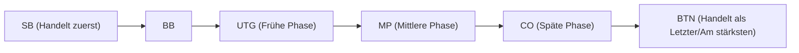

## 1. Das ultimative "Spiel mit unvollständiger Information"

Schach, Shogi und Othello sind "Spiele mit vollständiger Information", bei denen alle Informationen auf dem Spielbrett für beide Seiten sichtbar sind. Im Gegensatz dazu werden Poker und Mahjong als "**Spiele mit unvollständiger Information**" eingestuft, da die Hand des Gegners nicht sichtbar ist.

Da man die Hand des Gegners nicht sehen kann, spielt der Faktor Glück eine Rolle. Was jedoch beim Poker langfristig über Sieg und Niederlage entscheidet, ist nicht das Glück. Es sind "**Mathematik (Wahrscheinlichkeit und Odds) und Psychologie (Bluffs) sowie Risikomanagement (Bankroll-Management)**".
Die heute weltweit beliebteste Poker-Variante, "**Texas Hold'em**", ist als hochkomplexer Denksport anerkannt, der von Investoren und Programmierern enthusiastisch geliebt wird.

## 2. Die Grundregeln von Texas Hold'em

Beim älteren Poker (Draw Poker) in Japan wurden 5 Karten ausgeteilt und ausgetauscht, aber die Regeln von Texas Hold'em sind völlig anders.

- **Hand (Hole Cards)**: Jedem Spieler werden nur **2 Karten** ausgeteilt (die nur er selbst sehen kann).
- **Gemeinschaftskarten (Community Cards)**: In der Mitte des Tisches werden maximal **5 Karten** offen ausgeteilt, die von allen gemeinsam genutzt werden können.
- **Wie man eine Hand bildet**: Der Gewinner ist die Person, die aus den insgesamt 7 Karten (den 2 eigenen Handkarten und den 5 Gemeinschaftskarten) die **stärkste 5-Karten-Kombination (Hand)** bildet.

### Die Setzrunden (Betting Rounds)

Jedes Mal, wenn Karten aufgedeckt werden, gibt es 4 Aktionen, bei denen Chips gesetzt (oder gepasst) werden können.

1. **Preflop**: Das Setzen, wenn nur die eigenen 2 Handkarten ausgeteilt wurden.
2. **Flop**: Das Setzen, wenn "3" Gemeinschaftskarten aufgedeckt wurden.
3. **Turn**: Das Setzen, wenn die "4." Gemeinschaftskarte aufgedeckt wurde.
4. **River**: Das Setzen, wenn die letzte und "5." Gemeinschaftskarte aufgedeckt wurde.
5. **Showdown**: Alle Spieler zeigen ihre Karten und der Gewinner erhält alle Chips.

Wenn man zwischendurch denkt: "Ich möchte keine weiteren Chips mehr setzen", kann man jederzeit **aussteigen (folden)** und das Spiel verlassen. Umgekehrt kann man, wenn alle Gegner gefoldet haben, als "letzter verbleibender Spieler" alle Chips gewinnen, egal wie schwach die eigene Hand ist. Dies ist der Mechanismus, der einen "**Bluff**" ermöglicht.

## 3. Warum ist die "Position" alles?

Beim Texas Hold'em ist die "**Position (Sitzplatz)**" genauso wichtig wie (oder sogar wichtiger als) die Stärke der Hand.
Die Aktionen (das Setzen) erfolgen im Uhrzeigersinn, beginnend links vom sogenannten Dealer-Button, und **je später jemand handeln kann, desto überwältigender ist sein Vorteil**.

Spieler, die später handeln können (insbesondere der BTN: Button), können ihre eigenen Aktionen entscheiden, **nachdem sie alle Informationen darüber gesehen haben**, ob "die vorherigen Spieler Chips gesetzt haben (eine starke Hand haben) oder gefoldet haben (eine schwache Hand hatten)".
Daher müssen Anfänger die strikte Theorie (Hand-Range) befolgen: "Wenn man sich in einer frühen Position befindet, sollte man nicht teilnehmen, es sei denn, man hat eine extrem starke Hand (wie AA oder KK)".

## 4. Die Mathematik des Erwartungswerts (EV) und der Pot Odds

Das Wesen von Poker ist kein Glücksspiel, sondern "**der Prozess der endlosen Wiederholung von Investitionen mit einem positiven Erwartungswert (Expected Value: EV)**".

Nehmen wir zum Beispiel an, es befinden sich "$100" an Chips in der Mitte (Pot).
Ihr Gegner hat "$50" gesetzt. Um im Spiel zu bleiben (zu callen), müssen Sie "$50" zahlen.
Zu diesem Zeitpunkt beträgt der Gesamtpot $150, während Ihre Zahlung $50 beträgt. Das bedeutet, die Odds sind "150 : 50 = 3 : 1".
Daraus ergibt sich die mathematische Schlussfolgerung: **"Wenn die Gewinnwahrscheinlichkeit 25 % oder mehr (1 / 4) beträgt, sollten Sie dieses Spiel annehmen und bezahlen (der Erwartungswert ist positiv)"**.

Pokerprofis berechnen nicht nur die Stärke ihrer Hand und die Gewohnheiten ihrer Gegner, sondern im Kopf ständig diese "Pot Odds" und die "Wahrscheinlichkeit, dass die gewünschte Karte fällt (Outs)", und treffen nur mathematisch korrekte Entscheidungen ohne Emotionen.

## 5. Ein Bluff ist keine "Lüge", sondern eine "mathematische Geschichte"

Beim Bluffen (das Setzen großer Geldbeträge mit einer schwachen Hand, um den Gegner zum Aufgeben zu zwingen) geht es nicht um psychologische Kriegsführung, wie man sie aus Filmen kennt, wo man dem Gegner in die Augen schaut und "die Lüge durchschaut". Das moderne Bluffen beim Poker ist äußerst logisch.

Starke Spieler platzieren im Verlauf von Preflop, Flop, Turn und River einen "**konsistenten, erzählerischen Bet**, als ob sie wirklich starke Karten (z. B. einen Flush) hätten".
Aus der Sicht des Gegners denkt dieser: "Er hat von Anfang an diesen Betrag gesetzt. Daher ist es logisch anzunehmen, dass er wahrscheinlich diese starke Hand hat. Also werde ich folden." Infolgedessen gelingt ein Bluff als Ergebnis einer mathematisch korrekten Entscheidung des Gegners.

## 6. Zusammenfassung

Man sagt, Texas Hold'em sei ein Spiel, das "man in 10 Minuten lernt, aber für das man ein Leben lang braucht, um es zu meistern".
Auf kurze Sicht, wie bei einer einzelnen Hand oder an einem einzigen Tag, kann ein "Anfänger, der zufällig starke Karten bekommt", durchaus gegen einen Profi gewinnen. Wenn man jedoch die Anzahl der Versuche auf 10.000 oder 100.000 Hände erhöht, wird der Gewinn eines Spielers, der wiederholt die richtigen, auf dem Erwartungswert basierenden Entscheidungen trifft, eine schöne, stetig ansteigende Kurve (Gerade) beschreiben.
Die Pokerwelt, in der Glück und Können, Wahrscheinlichkeit und Psychologie komplex miteinander verflochten sind, ist auch das beste Trainingsgelände für das Geschäftsleben und für Investitionen.
