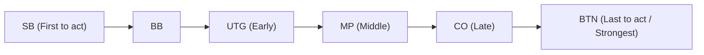

## 1. The Ultimate "Imperfect Information Game"

Chess, shogi, and Othello are "perfect information games" where all the information on the board is visible to both players. On the other hand, poker and mahjong are classified as "**imperfect information games**" because the opponent's hand is hidden.

Since you cannot see your opponent's hand, an element of luck is involved. However, it is not luck that determines long-term success in poker. It is "**mathematics (probability and odds), psychology (bluffing), and risk management (bankroll management)**".
The most mainstream poker rule in the world today, "**Texas Hold'em**", is recognized as a highly sophisticated mind sport passionately loved by investors and programmers.

## 2. Basic Rules of Texas Hold'em

The older form of poker in Japan (draw poker) involved dealing and exchanging 5 cards, but the rules of Texas Hold'em are completely different.

- **Hand (Hole Cards)**: Each player is dealt only **2 cards** (which only you can see).
- **Shared Cards (Community Cards)**: Up to **5 cards** are dealt face-up in the center of the board for everyone to use.
- **How to Make a Hand**: The winner is the person who makes the **strongest 5-card combination (hand) out of a total of 7 cards**: their 2 hole cards and the 5 community cards.

### Betting Rounds

Every time cards are revealed, there is a round of action where players bet chips (or fold). This happens 4 times.

1. **Pre-flop**: Betting when only your 2 hole cards have been dealt.
2. **Flop**: Betting when "3" community cards have been revealed.
3. **Turn**: Betting when the "4th" community card is revealed.
4. **River**: Betting when the final "5th" community card is revealed.
5. **Showdown**: Everyone reveals their cards, and the winner takes all the chips.

If you ever feel "I don't want to put in any more chips," you can **fold** and exit the game at any time. Conversely, if all your opponents fold, you can take all the chips as the "last person standing," no matter how weak your hand is. This is the mechanism that makes a "**bluff**" possible.

## 3. Why is "Position" Everything?

In Texas Hold'em, "**position (where you sit)**" is just as important as (or even more important than) the strength of your hand.
Action (betting) proceeds clockwise starting from the left of the marker called the dealer button, and **the later you can act, the more overwhelmingly advantageous it is**.

This is because the players who act later (especially the BTN: Button) can **determine their actions after seeing all the information** of "whether the players before them bet chips (have a strong hand) or folded (had a weak hand)".
Therefore, beginners must adhere to a strict theory (hand range): "When you are in an early position, you should not participate unless you have a very strong hand (like AA or KK)."

## 4. The Mathematics of Expected Value (EV) and Pot Odds

The essence of poker is not gambling, but rather the "**process of eternally repeating investments with a positive Expected Value (EV)**".

For example, suppose there is "$100" in the chips on the table (the pot).
Your opponent bets "$50". To stay in the game (call), you need to pay "$50".
At this time, your payment is $50 against a total pot of $150. That is, the odds are "150 : 50 = 3 : 1".
This leads to the mathematical conclusion that "**if you have a 25% or higher (1 / 4) chance of winning, you should pay the money and take this challenge (the expected value is positive)**".

Poker pros are constantly calculating not only the strength of their hands and their opponents' tendencies, but also these "pot odds" and the "probability that the card they want will fall (outs)" in their heads, making only mathematically correct choices while eliminating emotion.

## 5. Bluffing is not a "Lie" but a "Mathematical Story"

Bluffing (betting a large amount of money with a weak hand to make the opponent fold) is not a psychological battle of "seeing through lies" while looking into the opponent's eyes like in the movies. Modern poker bluffing is highly logical.

Strong players make "**consistent, story-driven bets**" throughout the pre-flop, flop, turn, and river, acting as if they truly hold a strong hand (e.g., a flush).
From the opponent's perspective, they think, "He has been betting this amount consistently since the early stages. If that's the case, it is logical to assume probabilistically that he has that strong hand. Therefore, I will fold," and the bluff succeeds as a result of the opponent making a mathematically correct decision.

## 6. Conclusion

It is said that Texas Hold'em takes "10 minutes to learn the rules, but a lifetime to master."
Over a short period like a single hand or a single day, a "lucky beginner who gets strong cards" can sometimes beat a pro. However, when the number of trials reaches 10,000 or 100,000 hands, the profit of a player who repeatedly makes the right decisions based on expected value draws a beautifully upward-sloping straight line.
The world of poker, where luck and skill, probability and psychology intricately intertwine, is also one of the best training grounds for business and investment.
