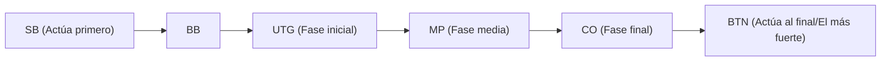

## 1. El "juego de información imperfecta" definitivo

El ajedrez, el shogi y el othello son "juegos de información perfecta" donde toda la información del tablero es visible para ambos jugadores. En cambio, el póker y el mahjong se clasifican como "**juegos de información imperfecta**" porque las cartas del oponente no son visibles.

Dado que las cartas del oponente no se ven, hay un elemento de suerte involucrado. Sin embargo, lo que determina la victoria o derrota a largo plazo en el póker no es la suerte. Son "**las matemáticas (probabilidades y odds), la psicología (farol) y la gestión de riesgos (gestión de fondos)**".

La regla de póker más popular del mundo en la actualidad, el "**Texas Hold'em**", es reconocido como un deporte mental avanzado y altamente valorado por inversores y programadores.

## 2. Reglas básicas del Texas Hold'em

El antiguo póker japonés (Draw Poker) consistía en repartir 5 cartas y cambiarlas, pero las reglas del Texas Hold'em son completamente diferentes.

- **Cartas de mano (Hole cards)**: A cada jugador solo se le reparten **2 cartas** (solo uno mismo las puede ver).
- **Cartas comunitarias (Community cards)**: En el centro de la mesa se revelan boca arriba un máximo de **5 cartas** que todos pueden usar en común.
- **Cómo formar una mano**: El ganador es la persona que forma **la combinación de 5 cartas más fuerte (mano) entre un total de 7 cartas**, usando sus 2 cartas de mano y las 5 cartas comunitarias.

### Rondas de apuestas (Betting)

Cada vez que se revelan cartas, hay 4 acciones para apostar fichas (o retirarse).

1. **Pre-flop**: Apuesta cuando solo se han repartido tus 2 cartas de mano.
2. **Flop**: Apuesta cuando se han revelado "3 cartas" comunitarias.
3. **Turn**: Apuesta cuando se revela la "cuarta carta" comunitaria.
4. **River**: Apuesta cuando se revela la última y "quinta carta" comunitaria.
5. **Showdown**: Todos muestran sus cartas y el ganador se lleva todas las fichas.

Si en algún momento piensas "no quiero apostar más fichas", siempre puedes hacer **fold (retirarte)** y salir del juego. Por el contrario, si todos los oponentes se retiran, puedes llevarte todas las fichas como "la única persona que queda", sin importar lo débil que sea tu mano. Este es el mecanismo por el cual el "**farol (bluff)**" tiene éxito.

## 3. ¿Por qué la "posición" lo es todo?

En el Texas Hold'em, tan importante como la fuerza de la mano (o incluso más) es la "**posición (dónde te sientas)**".

Las acciones (apuestas) se realizan en el sentido de las agujas del reloj, empezando por el jugador a la izquierda de la marca llamada botón del repartidor (dealer button), pero **las personas que pueden actuar más tarde tienen una ventaja abrumadora**.

Esto se debe a que los jugadores que actúan más tarde (especialmente el BTN: Botón) **pueden decidir sus acciones después de ver toda la información**, como "si los jugadores anteriores apostaron fichas (tienen una mano fuerte) o se retiraron (tenían una mano débil)".

Por lo tanto, los principiantes deben seguir la estricta teoría (rango de manos) de que "cuando estás en una de las primeras posiciones, no debes participar a menos que tengas una mano muy fuerte (como AA o KK)".

## 4. Matemáticas del Valor Esperado (EV) y Pot Odds

La esencia del póker no es apostar, sino el "**trabajo de repetir infinitamente inversiones con un Valor Esperado (Expected Value: EV) positivo**".

Por ejemplo, supongamos que hay "$100" en las fichas en juego (el bote o pot).
Tu oponente ha apostado "$50". Para que puedas continuar en el juego (igualar o call), necesitas pagar "$50".
En este momento, el total del bote es de $150 frente a tu pago de $50. Es decir, las probabilidades u odds son "150 : 50 = 3 : 1".
Esto lleva a la conclusión matemática de que **"si la probabilidad de ganar es del 25% o más (1 / 4), deberías pagar para aceptar este desafío (el valor esperado es positivo)"**.

Los profesionales del póker no solo se fijan en la fuerza de sus manos y los hábitos de sus oponentes, sino que siempre calculan mentalmente estas "pot odds" y "la probabilidad de que salga la carta que necesitan (outs)", tomando solo decisiones matemáticamente correctas sin dejar que las emociones interfieran.

## 5. Un farol no es una "mentira", sino una "historia matemática"

Un farol (apostar una gran cantidad de dinero con una mano débil para obligar al oponente a retirarse) no es una batalla psicológica en la que se mira a los ojos del oponente para "descubrir una mentira" como en las películas. El farol en el póker moderno es extremadamente lógico.

A medida que el juego avanza desde el pre-flop hasta el flop, el turn y el river, los jugadores fuertes hacen "**apuestas con una historia coherente**, como si realmente tuvieran cartas muy fuertes (por ejemplo, un color o flush)".

Desde la perspectiva del oponente: "Él ha estado apostando esta cantidad desde el principio. Por lo tanto, es lógico pensar que tiene esa mano fuerte desde un punto de vista probabilístico. Así que me retiraré". El farol tiene éxito como resultado de una decisión matemáticamente correcta del oponente.

## 6. Resumen

Se dice que en el Texas Hold'em "tardas 10 minutos en aprender las reglas, pero toda una vida en dominarlo".
En una sola mano o en un día a corto plazo, un "principiante que tuvo la suerte de recibir cartas fuertes" podría ganarle a un profesional. Sin embargo, cuando se acumulan intentos de 10,000 o 100,000 manos, las ganancias de un jugador que repite decisiones correctas basadas en el valor esperado trazarán una hermosa línea recta ascendente.
El mundo del póker, donde la suerte y la habilidad, así como las probabilidades y la psicología, se entrelazan de manera compleja, es también el mejor campo de entrenamiento para los negocios y las inversiones.
