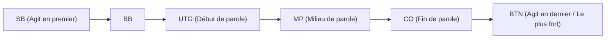

## 1. L'ultime "jeu à information imparfaite"

Les échecs, le shogi et l'othello sont des "jeux à information parfaite" où toutes les informations sur le plateau sont visibles par les deux joueurs. En revanche, le poker et le mahjong sont classés comme des "**jeux à information imparfaite**" car les cartes des adversaires sont cachées.

Comme les cartes de l'adversaire sont invisibles, un élément de chance entre en jeu. Cependant, ce n'est pas la chance qui détermine le succès ou l'échec à long terme au poker. Ce sont "**les mathématiques (probabilités et cotes), la psychologie (bluff) et la gestion des risques (gestion du capital)**".
La règle de poker la plus populaire aujourd'hui dans le monde, le "**Texas Hold'em**", est reconnue comme un sport de l'esprit (jeu de réflexion) de haut niveau, adoré par les investisseurs et les programmeurs.

## 2. Règles de base du Texas Hold'em

L'ancien poker japonais (Draw Poker) consistait à distribuer et à échanger 5 cartes, mais les règles du Texas Hold'em sont complètement différentes.

- **Cartes fermées (Hole Cards)** : Seules **2 cartes** sont distribuées à chaque joueur (seul le joueur peut les voir).
- **Cartes communes (Community Cards)** : Au centre de la table, jusqu'à **5 cartes** que tout le monde peut utiliser sont dévoilées face visible.
- **Comment former une main** : Le gagnant est celui qui réalise **la meilleure combinaison de 5 cartes parmi le total de 7 cartes** (ses 2 cartes fermées et les 5 cartes communes).

### Les tours d'enchères (Bettings Rounds)

À chaque fois que des cartes sont révélées, il y a 4 occasions de miser des jetons (ou de se coucher).

1. **Pré-flop (Preflop)** : Enchères avec seulement ses 2 cartes fermées distribuées.
2. **Flop** : Enchères lorsque "3 cartes" communes sont dévoilées.
3. **Turn** : Enchères lorsque la "4ème carte" commune est dévoilée.
4. **River** : Enchères lorsque la "5ème et dernière carte" commune est dévoilée.
5. **Abattage (Showdown)** : Tous les joueurs montrent leurs cartes, et le gagnant remporte la totalité des jetons (le pot).

Si, à tout moment, vous pensez "je ne veux plus miser de jetons", vous pouvez **vous coucher (Fold)** et quitter la partie. À l'inverse, si tous vos adversaires se couchent, peu importe la faiblesse de votre main, vous remportez tous les jetons en tant que "dernier joueur restant". C'est ainsi que le "**bluff**" est rendu possible.

## 3. Pourquoi la "position" est-elle primordiale ?

Au Texas Hold'em, la "**position (place assise)**" est tout aussi (voire plus) importante que la force de votre main.
Les actions (enchères) se font dans le sens des aiguilles d'une montre à partir de la gauche d'un marqueur appelé le bouton du donneur (Dealer Button), et **plus vous agissez tard, plus vous avez un avantage écrasant**.

Les joueurs qui agissent plus tard (en particulier le BTN : Bouton) **peuvent décider de leur propre action après avoir vu toutes les informations**, c'est-à-dire "si les joueurs précédents ont misé des jetons (ont une main forte) ou se sont couchés (avaient une main faible)".
C'est pourquoi les débutants doivent respecter une théorie stricte (éventail de mains ou hand range) selon laquelle "lorsque vous êtes dans les premières positions, vous ne devez pas participer à moins d'avoir une main extrêmement forte (comme AA ou KK)".

## 4. Les mathématiques de l'espérance de gain (EV) et de la cote du pot

L'essence du poker n'est pas le jeu d'argent, mais "**la répétition infinie d'investissements avec une espérance de gain (Expected Value : EV) positive**".

Par exemple, supposons qu'il y ait 100 $ dans les jetons au centre (le pot).
Votre adversaire mise 50 $. Pour continuer la partie (suivre ou call), vous devez payer 50 $.
À ce moment-là, le montant total du pot est de 150 $ et vous devez payer 50 $. La cote est donc de "150 : 50 = 3 : 1".
Cela conduit à la conclusion mathématique suivante : **"Si vous avez plus de 25 % (1/4) de chances de gagner, vous devriez payer pour relever ce défi (l'EV est positive)"**.

Les joueurs professionnels de poker calculent toujours mentalement cette "cote du pot" et la "probabilité que la carte souhaitée tombe (outs)", en plus d'analyser la force de leur main et les habitudes de leurs adversaires. Ils ne font que des choix mathématiquement justes, en excluant toute émotion.

## 5. Le bluff n'est pas un "mensonge" mais une "histoire mathématique"

Le bluff (miser beaucoup d'argent avec une main faible pour forcer l'adversaire à se coucher) n'est pas une bataille psychologique où l'on regarde l'adversaire dans les yeux pour "détecter un mensonge" comme dans les films. Le bluff au poker moderne est extrêmement logique.

Les bons joueurs, au fur et à mesure que le pré-flop, le flop, le turn et la river progressent, réalisent "**des mises (bets) cohérentes racontant une histoire**", comme s'ils avaient vraiment une carte très forte (par exemple une couleur).
Du point de vue de l'adversaire, "Il a misé ce montant depuis le début. Il est donc logique de penser qu'il a très probablement cette main forte. Par conséquent, je vais me coucher". Le bluff réussit comme résultat de ce jugement mathématiquement correct de la part de l'adversaire.

## 6. Résumé

On dit souvent du Texas Hold'em qu'il faut "10 minutes pour en apprendre les règles, mais toute une vie pour le maîtriser".
À court terme, sur une seule main ou une seule journée, un "débutant chanceux avec des cartes fortes" peut parfois battre un professionnel. Cependant, lorsqu'on répète l'exercice sur 10 000 ou 100 000 mains, le profit d'un joueur qui prend continuellement les bonnes décisions basées sur l'espérance de gain dessine une ligne droite qui monte de façon spectaculaire.
Le monde du poker, où la chance et le talent, ainsi que les probabilités et la psychologie s'entremêlent de façon complexe, est également le meilleur terrain d'entraînement pour les affaires et l'investissement.
