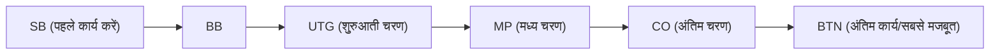

## 1. अंतिम "अपूर्ण सूचना गेम"

शतरंज, शोगी, और ओथेलो "पूर्ण सूचना गेम" हैं जहाँ बोर्ड की सारी जानकारी दोनों खिलाड़ियों को दिखाई देती है। इसके विपरीत, पोकर और महजोंग को " **अपूर्ण सूचना गेम** " के रूप में वर्गीकृत किया गया है क्योंकि आप अपने प्रतिद्वंद्वी के कार्ड नहीं देख सकते हैं।

चूँकि आप अपने प्रतिद्वंद्वी के कार्ड नहीं देख सकते हैं, इसलिए भाग्य का तत्व शामिल होता है। हालाँकि, पोकर में दीर्घकालिक जीत और हार भाग्य से तय नहीं होती है। यह " **गणित (संभाव्यता और ऑड्स) और मनोविज्ञान (ब्लफिंग), और जोखिम प्रबंधन (फंड प्रबंधन)** " है।
वर्तमान में दुनिया में सबसे मुख्यधारा का पोकर नियम, " **टेक्सास होल्डम** ", निवेशकों और प्रोग्रामर्स द्वारा एक अत्यधिक उन्नत माइंड स्पोर्ट (बौद्धिक खेल) के रूप में मान्यता प्राप्त है और इसे बहुत पसंद किया जाता है।

## 2. टेक्सास होल्डम के बुनियादी नियम

पुराने जापानी पोकर (ड्रॉ पोकर) में 5 कार्ड बांटे जाते थे और बदले जाते थे, लेकिन टेक्सास होल्डम के नियम बिल्कुल अलग हैं।

- **होल कार्ड (आपके कार्ड)** : प्रत्येक खिलाड़ी को केवल **2 कार्ड** दिए जाते हैं (जिन्हें केवल आप देख सकते हैं)।
- **कम्युनिटी कार्ड (साझा कार्ड)** : बोर्ड के केंद्र में, अधिकतम **5 कार्ड** फेस-अप (खुले हुए) रखे जाते हैं, जिनका उपयोग सभी कर सकते हैं।
- **हाथ (Hand) कैसे बनाएं** : वह व्यक्ति जो अपने 2 होल कार्ड और 5 कम्युनिटी कार्ड के **कुल 7 कार्डों में से सबसे मजबूत 5 कार्ड का संयोजन (हाथ)** बनाता है, वह विजेता होता है।

### बेटिंग (दांव लगाने) के राउंड

हर बार जब कोई कार्ड खोला जाता है, तो चिप्स पर दांव लगाने (या फोल्ड करने) की 4 बार क्रियाएं होती हैं।

1. **प्री-फ्लॉप** : केवल आपके 2 होल कार्ड बांटे जाने के बाद की बेटिंग।
2. **फ्लॉप** : "3 कम्युनिटी कार्ड" खोले जाने के बाद की बेटिंग।
3. **टर्न** : "चौथा" कम्युनिटी कार्ड खोले जाने के बाद की बेटिंग।
4. **रिवर** : अंतिम "पांचवां" कम्युनिटी कार्ड खोले जाने के बाद की बेटिंग।
5. **शोडाउन** : सभी खिलाड़ी अपने कार्ड दिखाते हैं, और विजेता सारे चिप्स जीत लेता है।

यदि आप रास्ते में किसी भी समय सोचते हैं, "मैं और चिप्स नहीं लगाना चाहता," तो आप कभी भी **फोल्ड (Fold - छोड़ना)** कर सकते हैं और गेम से बाहर हो सकते हैं। इसके विपरीत, यदि अन्य सभी खिलाड़ी फोल्ड कर देते हैं, तो आपका हाथ कितना भी कमजोर क्यों न हो, आप "अंतिम बचे हुए व्यक्ति" के रूप में सारे चिप्स जीत सकते हैं। यही वह तंत्र है जो " **ब्लफ (Bluff - झांसा देना)** " को संभव बनाता है।

## 3. "पोजीशन" ही सब कुछ क्यों है?

टेक्सास होल्डम में, हाथ की ताकत जितनी (या उससे भी अधिक) महत्वपूर्ण " **पोजीशन (बैठने की स्थिति)** " है।
एक्शन (बेटिंग) डीलर बटन नामक मार्कर के बाईं ओर से शुरू होकर दक्षिणावर्त दिशा में होती है, और **जो व्यक्ति जितनी बाद में कार्रवाई कर सकता है, उसे उतना ही अधिक लाभ होता है** ।

बाद में कार्य करने वाले खिलाड़ी (विशेष रूप से BTN: बटन) अपना निर्णय यह सारी जानकारी देखने के बाद ले सकते हैं कि **"क्या पहले के लोगों ने चिप्स की बाजी लगाई (उनके पास मजबूत हाथ है) या फोल्ड किया (कमजोर हाथ था)"** ।
इसलिए, शुरुआती खिलाड़ियों को इस सख्त सिद्धांत (हैंड रेंज) का पालन करना चाहिए कि "जब आप शुरुआती पोजीशन में हों, तो तब तक भाग न लें जब तक कि आपके पास बहुत मजबूत हाथ (जैसे AA या KK) न हो।"

## 4. अपेक्षित मूल्य (EV) और पॉट ऑड्स का गणित

पोकर का सार कोई जुआ नहीं है, बल्कि " **एक ऐसा कार्य है जहाँ सकारात्मक अपेक्षित मूल्य (Expected Value: EV) वाले निवेश को बार-बार दोहराया जाता है** "।

उदाहरण के लिए, मान लें कि टेबल पर रखे चिप्स (पॉट) में "$100" हैं।
आपके प्रतिद्वंद्वी ने "$50" का दांव लगाया है। खेल में बने रहने (कॉल करने) के लिए, आपको "$50" का भुगतान करना होगा।
इस समय, पॉट की कुल राशि $150 है, जबकि आपका भुगतान $50 है। यानी, ऑड्स "150 : 50 = 3 : 1" हैं।
यह इस गणितीय निष्कर्ष की ओर ले जाता है कि **"यदि आपके जीतने की संभावना 25% (1 / 4) या उससे अधिक है, तो आपको पैसे देकर यह दांव लेना चाहिए (अपेक्षित मूल्य सकारात्मक है)"** ।

पोकर पेशेवर न স্বয়ং हाथ की ताकत और प्रतिद्वंद्वी की आदतों पर विचार करते हैं, बल्कि वे हमेशा मानसिक रूप से इस "पॉट ऑड्स" और "वांछित कार्ड मिलने की संभावना (आउट्स)" की गणना करते हैं, और भावनाओं को हटाकर केवल गणितीय रूप से सही निर्णय लेते हैं।

## 5. ब्लफ "झूठ" नहीं, बल्कि एक "गणितीय कहानी" है

ब्लफ (कमजोर हाथ होने पर बड़ी रकम का दांव लगाकर प्रतिद्वंद्वी को फोल्ड कराना) कोई मनोवैज्ञानिक लड़ाई नहीं है जहाँ आप फिल्मों की तरह प्रतिद्वंद्वी की आंखों में देखकर "झूठ पकड़ते" हैं। आधुनिक पोकर में ब्लफ अत्यधिक तार्किक है।

मजबूत खिलाड़ी प्री-फ्लॉप, फ्लॉप, टर्न और रिवर के माध्यम से आगे बढ़ते हुए " **एक सुसंगत कहानी के साथ बेट (दांव) लगाते हैं** , जैसे कि उनके पास वास्तव में एक बहुत मजबूत कार्ड (उदाहरण के लिए, फ्लश) हो"।
प्रतिद्वंद्वी के नजरिए से, "वह शुरुआत से ही इतनी बड़ी रकम का दांव लगा रहा है। इसलिए, तार्किक रूप से यह मानना सही है कि उसके पास वह मजबूत हाथ होने की उच्च संभावना है। इसलिए, मुझे फोल्ड कर देना चाहिए," इस प्रकार एक गणितीय रूप से सही निर्णय के परिणामस्वरूप ब्लफ सफल होता है।

## 6. निष्कर्ष

टेक्सास होल्डम के बारे में कहा जाता है कि "नियमों को सीखने में 10 मिनट लगते हैं, लेकिन इसे मास्टर करने में जीवन भर का समय लगता है"।
अल्पावधि में, एक हाथ या एक दिन में, "एक शुरुआती खिलाड़ी जिसे भाग्य से मजबूत कार्ड मिलते हैं" एक पेशेवर को हरा सकता है। हालांकि, जब 10,000 या 100,000 हाथों तक कोशिश की जाती है, तो अपेक्षित मूल्य के आधार पर बार-बार सही निर्णय लेने वाले खिलाड़ी का लाभ स्पष्ट रूप से ऊपर की ओर एक सीधी रेखा बनाता है।
पोकर की दुनिया, जहाँ भाग्य और कौशल, साथ ही साथ संभावना और मनोविज्ञान जटिल रूप से आपस में जुड़े हुए हैं, व्यापार और निवेश के लिए भी सबसे अच्छा प्रशिक्षण मैदान है।
