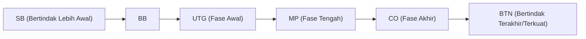

## 1. "Permainan Informasi Tidak Sempurna" yang Pamungkas

Catur, shogi, dan othello adalah "permainan informasi sempurna" di mana semua informasi di papan terlihat oleh kedua pemain. Sebaliknya, poker dan mahjong diklasifikasikan sebagai "**permainan informasi tidak sempurna**" karena Anda tidak dapat melihat kartu lawan Anda.

Karena Anda tidak dapat melihat kartu lawan, elemen keberuntungan ikut terlibat. Namun, dalam poker, bukan keberuntungan yang menentukan kemenangan dan kekalahan dalam jangka panjang. Melainkan "**matematika (peluang/odds), psikologi (gertakan), dan manajemen risiko (manajemen dana)**".
Aturan poker paling umum di dunia saat ini, "**Texas Hold'em**", diakui sebagai olahraga pikiran (kompetisi otak) tingkat tinggi yang sangat dicintai oleh para investor dan pemrogram.

## 2. Aturan Dasar Texas Hold'em

Poker gaya lama di Jepang (Draw Poker) membagikan 5 kartu untuk ditukar, tetapi aturan Texas Hold'em sama sekali berbeda.

- **Kartu Tangan (Hole Cards)**: Setiap pemain hanya dibagikan **2 kartu** (hanya bisa dilihat oleh diri sendiri).
- **Kartu Bersama (Community Cards)**: Maksimal **5 kartu** yang dapat digunakan bersama oleh semua pemain dibuka menghadap ke atas di tengah meja.
- **Cara Membuat Kombinasi (Hand)**: Pemenangnya adalah orang yang membuat **kombinasi 5 kartu terkuat (hand) dari total 7 kartu** yang terdiri dari 2 kartu tangan dan 5 kartu bersama.

### Ronde Taruhan (Betting)

Setiap kali kartu dibuka, ada 4 kali aksi bertaruh (atau menyerah).

1. **Pre-Flop**: Taruhan saat hanya 2 kartu tangan yang dibagikan.
2. **Flop**: Taruhan saat "3 kartu" bersama dibuka.
3. **Turn**: Taruhan saat kartu bersama "ke-4" dibuka.
4. **River**: Taruhan saat kartu bersama terakhir, yaitu "ke-5" dibuka.
5. **Showdown**: Semua orang menunjukkan kartu mereka, dan pemenangnya mengambil seluruh chip.

Jika di tengah permainan Anda merasa "tidak ingin mengeluarkan chip lagi", Anda selalu dapat melakukan **fold (menyerah)** dan keluar dari permainan. Sebaliknya, jika semua lawan melakukan fold, Anda bisa mengambil seluruh chip sebagai "satu-satunya orang yang tersisa", tidak peduli seberapa lemahnya kartu Anda. Inilah mekanisme yang membuat "**gertakan (bluff)**" berhasil.

## 3. Mengapa "Posisi" Adalah Segalanya?

Dalam Texas Hold'em, hal yang sama pentingnya dengan (atau bahkan lebih penting dari) kekuatan kartu tangan adalah "**posisi (tempat duduk)**".
Aksi (taruhan) dilakukan searah jarum jam mulai dari sebelah kiri penanda yang disebut tombol dealer (dealer button), dan **orang yang bertindak belakangan akan jauh lebih diuntungkan**.

Karena pemain yang dapat bertindak belakangan (terutama BTN: Button) dapat **memutuskan tindakan mereka setelah melihat semua informasi** seperti "apakah orang sebelumnya bertaruh (memiliki kartu yang kuat) atau menyerah (memiliki kartu yang lemah)".
Oleh karena itu, pemula harus mematuhi teori ketat (rentang kartu atau *hand range*) yaitu "ketika berada di posisi awal, Anda tidak boleh ikut bermain kecuali jika memiliki kartu yang sangat kuat (seperti AA atau KK)".

## 4. Matematika Nilai Harapan (EV) dan Peluang Pot (Pot Odds)

Esensi poker bukanlah perjudian, melainkan "**pekerjaan mengulangi investasi dengan Nilai Harapan (Expected Value: EV) positif secara terus-menerus**".

Sebagai contoh, misalkan ada "$100" chip di tengah meja (pot).
Lawan Anda bertaruh "$50". Anda harus membayar "$50" untuk terus bermain (melakukan *call*).
Pada saat ini, total pot adalah $150, sedangkan bayaran Anda adalah $50. Artinya, peluangnya (odds) adalah "150 : 50 = 3 : 1".
Ini menghasilkan kesimpulan matematis bahwa **"jika peluang menang Anda 25% atau lebih (1/4), Anda harus membayar untuk menerima tantangan ini (nilai harapannya positif)"**.

Pemain poker profesional tidak hanya memikirkan kekuatan kartu tangan dan kebiasaan lawan, tetapi selalu menghitung di luar kepala "peluang pot (pot odds)" ini serta "peluang munculnya kartu yang diinginkan (outs)", lalu membuat pilihan yang benar secara matematis dengan mengesampingkan emosi.

## 5. Gertakan (Bluffing) Bukanlah "Kebohongan", Melainkan "Cerita Matematis"

Gertakan atau *bluff* (mempertaruhkan banyak uang dengan kartu lemah agar lawan menyerah) bukanlah perang psikologis seperti melihat mata lawan untuk "membongkar kebohongan" seperti di film-film. Gertakan dalam poker modern sangatlah logis.

Pemain yang kuat akan melakukan "**taruhan dengan cerita yang konsisten**", seolah-olah mereka benar-benar memiliki kartu yang kuat (misalnya Flush), saat permainan berlanjut dari Pre-Flop, Flop, Turn, hingga River.
Dari sudut pandang lawan, "Dia terus bertaruh dengan jumlah ini sejak awal. Jadi, secara probabilitas, logis untuk berpikir bahwa dia memiliki kartu kuat tersebut. Oleh karena itu, saya harus menyerah", dan sebagai hasil dari membuat keputusan yang benar secara matematis, gertakan tersebut berhasil.

## 6. Kesimpulan

Dikatakan bahwa "aturan Texas Hold'em butuh 10 menit untuk dipelajari, tetapi butuh seumur hidup untuk dikuasai".
Dalam jangka pendek untuk 1 permainan (*hand*) atau dalam hitungan satu hari, "pemula yang kebetulan mendapatkan kartu kuat" bisa saja mengalahkan pemain profesional. Namun, ketika jumlah percobaan diulang hingga 10.000 atau 100.000 *hand*, keuntungan pemain yang terus membuat keputusan yang benar berdasarkan nilai harapan akan membentuk garis lurus yang naik ke kanan dengan indahnya.
Dunia poker, di mana keberuntungan dan keterampilan, serta peluang dan psikologi saling terkait secara kompleks, juga merupakan tempat pelatihan terbaik untuk bisnis dan investasi.
