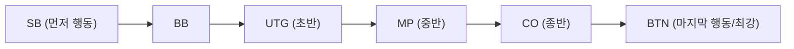

## 1. 궁극의 '불완전 정보 게임'

체스나 쇼기, 오셀로는 반상의 정보를 서로가 모두 볼 수 있는 '완전 정보 게임'입니다. 반면, 포커나 마작은 상대방의 패가 보이지 않는 **불완전 정보 게임** 으로 분류됩니다.

상대방의 패가 보이지 않기 때문에 운적인 요소가 얽히게 됩니다. 하지만 포커에서 장기적인 승패를 결정하는 것은 운이 아닙니다. **수학(확률·오즈)과 심리(블러핑), 그리고 리스크 관리(자금 관리)** 입니다.
현재 세계에서 가장 주류인 포커 규칙인 **텍사스 홀덤** 은 투자자나 프로그래머들에게 열광적으로 사랑받는, 고도의 마인드 스포츠(두뇌 경기)로 인식되고 있습니다.

## 2. 텍사스 홀덤의 기본 규칙

일본의 예전 포커(드로우 포커)는 5장의 카드를 나눠 받고 교환하는 방식이었지만, 텍사스 홀덤의 규칙은 전혀 다릅니다.

- **패 (홀 카드)** : 각 플레이어에게는 **2장** 씩만 주어집니다 (자신만 볼 수 있음).
- **공유 패 (커뮤니티 카드)** : 테이블 중앙에 모두가 공통으로 사용할 수 있는 카드가 최대 **5장** 앞면이 보이게 펼쳐집니다.
- **족보를 만드는 법** : 자신의 패 2장과 공유 패 5장을 합친 **총 7장 중에서 가장 강한 5장의 조합(족보)** 을 만든 사람이 승자가 됩니다.

### 베팅 라운드

카드가 펼쳐질 때마다 칩을 걸거나(베팅) 포기하는(폴드) 액션이 4번 발생합니다.

1. **프리플롭** : 자신의 패 2장만 받은 상태에서의 베팅.
2. **플롭** : 공유 패가 '3장' 펼쳐진 상태에서의 베팅.
3. **턴** : 공유 패가 '4장째' 펼쳐진 상태에서의 베팅.
4. **리버** : 공유 패가 마지막 '5장째' 펼쳐진 상태에서의 베팅.
5. **쇼다운** : 모두가 카드를 공개하고, 승자가 칩을 독식합니다.

도중에 '더 이상 칩을 내고 싶지 않다'고 생각하면 언제든지 **폴드(기권)** 하고 게임에서 빠질 수 있습니다. 반대로, 상대방이 모두 폴드한 경우에는 자신이 아무리 약한 패를 가지고 있더라도 '남은 1인'으로서 칩을 독식할 수 있습니다. 이것이 **블러핑(허세)** 이 성립하는 원리입니다.

## 3. 왜 '포지션'이 전부인가?

텍사스 홀덤에서 패의 강함만큼이나 (혹은 그 이상으로) 중요한 것이 **포지션 (앉는 위치)** 입니다.
딜러 버튼이라고 불리는 표식의 왼쪽 옆부터 시계 방향으로 액션(베팅)을 진행하는데, **나중에 행동할 수 있는 사람일수록 압도적으로 유리** 해집니다.

나중에 행동할 수 있는 플레이어(특히 BTN: 버튼)는 '앞 사람들이 칩을 걸었는지(강한 패를 가졌는지), 기권했는지(약한 패였는지)'라는 **정보를 모두 보고 나서 자신의 행동을 결정할 수 있기** 때문입니다.
따라서 초보자는 '앞쪽 포지션에 있을 때는 매우 강한 패(AA나 KK 등)가 아닌 한 참여해서는 안 된다'는 엄격한 이론(핸드 레인지)을 지킬 필요가 있습니다.

## 4. 기댓값(EV)과 팟 오즈의 수학

포커의 본질은 도박이 아니라 ' **기댓값(Expected Value: EV)이 플러스인 투자를 영원히 반복하는 작업** '입니다.

예를 들어, 테이블의 칩(팟)에 '$100'가 들어있다고 가정해 봅시다.
상대방이 '$50'를 베팅했습니다. 당신이 게임을 계속하기(콜하기) 위해서는 '$50'를 지불해야 합니다.
이때 팟의 총액은 $150 에 대해 당신의 지불액은 $50 입니다. 즉, 오즈는 '150 : 50 = 3 : 1'이 됩니다.
이는 **'이길 확률이 25% 이상 (1 / 4) 있다면, 이 승부는 돈을 지불하고 받아들여야 한다 (기댓값이 플러스)'** 라는 수학적인 결론을 도출해 냅니다.

포커 프로는 패의 강함이나 상대의 습관뿐만 아니라, 항상 이 '팟 오즈'와 '자신이 원하는 카드가 나올 확률(아웃츠)'을 암산하며, 수학적으로 올바른 선택만을 감정을 배제하고 실행하고 있는 것입니다.

## 5. 블러핑은 '거짓말'이 아니라 '수학적인 스토리'

블러핑(약한 패로 큰돈을 걸어 상대를 기권하게 만드는 것)은 영화처럼 상대방의 눈을 보고 '거짓말을 간파하는' 심리전이 아닙니다. 현대 포커의 블러핑은 지극히 논리적입니다.

강한 플레이어는 프리플롭, 플롭, 턴, 리버로 진행되는 과정에서 '자신이 마치 정말로 강한 카드(예를 들어 플러시)를 가지고 있는 것처럼 **일관된 스토리가 있는 베팅** '을 합니다.
상대방 입장에서 보면 '그는 초반부터 이 금액을 계속 걸고 있다. 그렇다면 확률적으로 그 강한 패를 가지고 있다고 생각하는 것이 논리적이다. 그러니 기권하자'라며, 수학적으로 올바른 판단을 한 결과로서 블러핑이 성공하는 것입니다.

## 6. 요약

텍사스 홀덤은 '규칙을 배우는 데는 10분이지만, 마스터하는 데는 평생이 걸린다'고 말합니다.
단기적인 1핸드나 하루 단위로는 '운 좋게 강한 카드가 들어온 초보자'가 프로를 이길 수도 있습니다. 하지만 1만 핸드, 10만 핸드로 시행 횟수를 거듭했을 때, 기댓값에 기반한 올바른 결단을 반복한 플레이어의 이익은 놀라울 정도로 우상향하는 직선을 그립니다.
운과 실력, 그리고 확률과 심리가 복잡하게 얽히는 포커의 세계는 비즈니스나 투자의 최고 훈련장이기도 한 것입니다.
