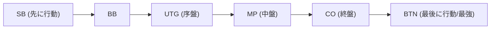

## 1. 究極の「不完全情報ゲーム」

チェスや将棋、オセロは、盤面の情報がお互いにすべて見えている「完全情報ゲーム」です。対して、ポーカーや麻雀は、相手の手札が見えない「**不完全情報ゲーム**」に分類されます。

相手の手札が見えないため、運の要素が絡みます。しかし、ポーカーにおいて長期的な勝敗を決めるのは運ではありません。「**数学（確率・オッズ）と心理（ブラフ）、そしてリスク管理（資金管理）**」です。
現在世界で最も主流なポーカーのルール「**テキサスホールデム**」は、投資家やプログラマーから熱狂的に愛される、高度なマインドスポーツ（頭脳競技）として認知されています。

## 2. テキサスホールデムの基本ルール

日本の古いポーカー（ドローポーカー）は5枚のカードを配って交換するものでしたが、テキサスホールデムのルールは全く異なります。

- **手札（ホールカード）**: 各プレイヤーには**2枚**しか配られません（自分だけが見られる）。
- **共有札（コミュニティカード）**: 盤面の中央に、全員が共通して使えるカードが最大**5枚**表向きに開かれます。
- **役の作り方**: 自分の手札2枚と、共有札5枚の**合計7枚の中から、最も強い5枚の組み合わせ（役）**を作った人が勝者です。

### ベット（賭け）のラウンド

カードが開かれるたびに、チップを賭ける（または降りる）アクションが4回発生します。

1. **プリフロップ**: 自分の手札2枚だけが配られた状態での賭け。
2. **フロップ**: 共有札が「3枚」開かれた状態での賭け。
3. **ターン**: 共有札が「4枚目」開かれた状態での賭け。
4. **リバー**: 共有札が最後の「5枚目」開かれた状態での賭け。
5. **ショーダウン**: 全員がカードを見せ合い、勝者がチップを総取りする。

途中で「これ以上チップを出したくない」と思えば、いつでも**フォールド（降りる）**してゲームから抜けることができます。逆に、相手が全員フォールドした場合は、自分がどんなに弱い手札でも「残った1人」としてチップを総取りできます。これが「**ブラフ（ハッタリ）**」が成立する仕組みです。

## 3. なぜ「ポジション」がすべてなのか？

テキサスホールデムにおいて、手札の強さと同じくらい（あるいはそれ以上に）重要なのが「**ポジション（座る位置）**」です。
ディーラーボタンと呼ばれる目印の左隣から時計回りにアクション（賭け）を行いますが、**後に行動できる人ほど圧倒的に有利**になります。

後に行動できるプレイヤー（特にBTN：ボタン）は、「前の人たちがチップを賭けたか（強い手を持っているか）、降りたか（弱い手だったか）」という**情報をすべて見てから自分の行動を決定できる**からです。
そのため、初心者は「前の方のポジションにいる時は、よほど強い手札（AAやKKなど）でない限り参加してはいけない」という厳格な理論（ハンドレンジ）を守る必要があります。

## 4. 期待値（EV）とポットオッズの数学

ポーカーの本質はギャンブルではなく、「**期待値（Expected Value: EV）がプラスの投資を永遠に繰り返す作業**」です。

例えば、場のチップ（ポット）に「$100」が入っているとします。
相手が「$50」を賭けてきました。あなたがゲームを続ける（コールする）ためには「$50」を支払う必要があります。
このとき、ポットの総額は $150 に対して、あなたの支払いは $50 です。つまりオッズは「150 : 50 = 3 : 1」となります。
これは**「勝つ確率が25%以上（1 / 4）あるなら、この勝負はお金を払って受けるべき（期待値がプラス）」**という数学的な結論を導き出します。

ポーカープロは、手札の強さや相手の癖だけでなく、常にこの「ポットオッズ」と「自分が欲しいカードが落ちる確率（アウツ）」を暗算し、数学的に正しい選択だけを感情を排除して行っているのです。

## 5. ブラフは「嘘」ではなく「数学的なストーリー」

ブラフ（弱い手札で大金を賭けて相手を降ろすこと）は、映画のように相手の目を見て「嘘を見破る」ような心理戦ではありません。現代ポーカーのブラフは、極めて論理的です。

強いプレイヤーは、プリフロップ、フロップ、ターン、リバーと進む中で、「自分がまるで本当に強いカード（例えばフラッシュ）を持っているかのように、**一貫したストーリー性のあるベット**」を行います。
相手からすれば「彼は序盤からこの額を賭け続けている。となると、確率的にあの強い手札を持っていると考えるのが論理的だ。だから降りよう」と、数学的に正しい判断をした結果としてブラフが成功するのです。

## 6. まとめ

テキサスホールデムは「ルールを覚えるのは10分だが、マスターするには一生かかる」と言われます。
短期的な1ハンドや1日単位では「運良く強いカードが来た初心者」がプロに勝つこともあります。しかし、1万ハンド、10万ハンドと試行回数を重ねた時、期待値に基づいた正しい決断を繰り返したプレイヤーの利益は、見事なまでに右肩上がりの直線を描きます。
運と実力、そして確率と心理が複雑に絡み合うポーカーの世界は、ビジネスや投資の最高の訓練場でもあるのです。
