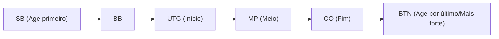

## 1. O Definitivo "Jogo de Informação Imperfeita"

Xadrez, shogi e othello são "jogos de informação perfeita", onde todas as informações do tabuleiro estão visíveis para ambos os jogadores. Em contraste, poker e mahjong são classificados como "**jogos de informação imperfeita**", pois as cartas do oponente estão ocultas.

Como as mãos do oponente não são visíveis, o elemento sorte está envolvido. No entanto, o que determina vitórias e derrotas a longo prazo no poker não é a sorte. É a "**matemática (probabilidades e odds), psicologia (blefes) e gestão de riscos (gestão de banca)**".
A variante de poker mais popular do mundo atualmente, o "**Texas Hold'em**", é amplamente reconhecido como um esporte mental altamente avançado, apaixonadamente amado por investidores e programadores.

## 2. Regras Básicas do Texas Hold'em

O poker antigo (Draw Poker) consistia em distribuir e trocar 5 cartas, mas as regras do Texas Hold'em são completamente diferentes.

- **Mão (Hole Cards)**: Cada jogador recebe apenas **2 cartas** (vistas apenas por si mesmo).
- **Cartas Comunitárias (Community Cards)**: No centro da mesa, até **5 cartas** que todos podem compartilhar são abertas viradas para cima.
- **Como formar uma mão**: De um **total de 7 cartas (as 2 da sua mão e as 5 comunitárias), a pessoa que formar a melhor combinação de 5 cartas (mão)** é a vencedora.

### As Rodadas de Apostas (Betting Rounds)

A cada vez que as cartas são abertas, ocorrem ações de apostar fichas (ou desistir), repetidas 4 vezes.

1. **Pré-Flop (Pre-flop)**: Apostas com apenas as 2 cartas da mão distribuídas.
2. **Flop (Flop)**: Apostas com "3 cartas" comunitárias abertas.
3. **Turn (Turn)**: Apostas com a "4ª carta" comunitária aberta.
4. **River (River)**: Apostas com a última e "5ª carta" comunitária aberta.
5. **Showdown (Showdown)**: Todos revelam suas cartas e o vencedor leva todas as fichas.

Se a qualquer momento você pensar "não quero apostar mais fichas", você pode **desistir (fold)** e sair daquela rodada. Inversamente, se todos os oponentes desistirem, independentemente de quão fraca seja sua mão, como o "último jogador restante", você levará todas as fichas. Este é o mecanismo que torna os "**blefes (bluffs)**" possíveis.

## 3. Por Que a "Posição" é Tudo?

No Texas Hold'em, tão importante quanto (ou até mais que) a força da sua mão é a "**posição (onde você está sentado)**".
As ações (apostas) ocorrem no sentido horário, começando à esquerda de um marcador chamado Dealer Button (Botão), o que torna **aqueles que agem depois esmagadoramente favorecidos**.

Os jogadores que agem depois (especialmente o BTN: Button) podem **decidir suas ações após observar todas as informações**, ou seja, "se os jogadores anteriores apostaram (indicando uma mão forte) ou desistiram (indicando uma mão fraca)".
Por isso, iniciantes devem aderir a uma teoria estrita (range de mãos): "quando você está nas primeiras posições, não deve participar a menos que tenha uma mão extremamente forte (como AA ou KK)".

## 4. A Matemática do Valor Esperado (EV) e Pot Odds

A essência do poker não é o jogo de azar, mas sim a "**prática de repetir infinitamente investimentos com Valor Esperado (Expected Value: EV) positivo**".

Por exemplo, suponha que há $100 em fichas na mesa (o pote).
Seu oponente aposta $50. Para você continuar no jogo (pagar a aposta ou call), você precisa pagar $50.
Nesse momento, o valor total do pote será $150 contra o seu pagamento de $50. Ou seja, as odds (chances) são "150 : 50 = 3 : 1".
Isso leva à conclusão matemática de que **"se a probabilidade de ganhar for de 25% ou mais (1 / 4), você deve pagar por essa aposta (o valor esperado é positivo)"**.

Jogadores profissionais de poker não consideram apenas a força de suas cartas ou os hábitos de seus oponentes; eles estão constantemente calculando mentalmente essas "pot odds" e a "probabilidade de a carta que precisam aparecer (outs)", tomando apenas decisões matematicamente corretas, eliminando a emoção.

## 5. Blefar Não é "Mentir", é uma "História Matemática"

O blefe (apostar muito dinheiro com uma mão fraca para forçar o oponente a desistir) não é uma batalha psicológica de "ler a mentira" nos olhos do oponente, como nos filmes. O blefe no poker moderno é extremamente lógico.

Jogadores fortes, ao avançarem pelo Pré-Flop, Flop, Turn e River, fazem "**apostas consistentes baseadas em histórias**, como se realmente tivessem uma mão forte (como um Flush, por exemplo)".
Do ponto de vista do oponente, "Ele continua apostando esse valor desde o início. Então, em termos de probabilidade, é lógico pensar que ele tem aquela mão forte. Por isso, vou desistir". Como resultado de uma tomada de decisão matematicamente correta, o blefe tem sucesso.

## 6. Conclusão

Diz-se sobre o Texas Hold'em: "Leva 10 minutos para aprender as regras, mas uma vida inteira para dominar".
A curto prazo, em uma única mão ou ao longo de um dia, "um iniciante que tem sorte e recebe cartas fortes" pode vencer um profissional. No entanto, após 10.000 ou 100.000 mãos repetidas, o lucro do jogador que tomou as decisões corretas repetidamente, com base no valor esperado, traça uma bela linha reta ascendente.
O mundo do poker, onde sorte e habilidade, e probabilidades e psicologia, se entrelaçam de forma complexa, é também um excelente campo de treinamento para negócios e investimentos.
