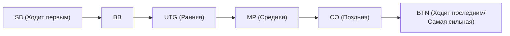

## 1. Ультимативная «игра с неполной информацией»

Шахматы, сёги и реверси — это «игры с полной информацией», где ситуация на доске полностью видна обоим игрокам. Напротив, покер и маджонг относятся к **играм с неполной информацией**, так как карты соперника скрыты.

Поскольку карты противника не видны, присутствует элемент удачи. Однако в долгосрочной перспективе исход в покере решает не удача. Его определяют **математика (вероятности и шансы), психология (блеф) и управление рисками (банкролл-менеджмент)**.
Самый популярный сегодня в мире вид покера, **Техасский холдем**, признан сложным интеллектуальным спортом, который страстно любят инвесторы и программисты.

## 2. Базовые правила Техасского холдема

В отличие от старого японского покера (дро-покера), где раздают пять карт и затем обменивают, правила Техасского холдема совершенно иные.

- **Карманные карты (hole cards)**: Каждому игроку раздается только **по две карты** (их видит только сам игрок).
- **Общие карты (community cards)**: В центре стола в открытую выкладывается до **пяти карт**, которые могут использовать все игроки.
- **Как собирать комбинации**: Победителем становится тот, кто соберет **самую сильную комбинацию из 5 карт, используя любые из 7 доступных карт** (две карманные и пять общих).

### Раунды торговли (ставок)

По мере открытия карт происходит четыре раунда, в которых можно сделать ставку фишками (или сбросить карты).

1. **Префлоп**: Ставки, когда игрокам розданы только две карманные карты.
2. **Флоп**: Ставки после того, как открыты первые «3 карты» на столе.
3. **Терн**: Ставки после открытия «четвертой карты».
4. **Ривер**: Ставки после открытия последней «пятой карты».
5. **Шоудаун**: Все игроки открывают свои карты, и победитель забирает весь банк.

Если в какой-то момент вы решите, что «не хотите больше ставить фишки», вы всегда можете сделать **фолд (сбросить карты)** и выйти из игры. С другой стороны, если все оппоненты сбросят карты, вы заберете весь банк, как «последний оставшийся игрок», независимо от того, насколько слабы ваши карты. Именно так работает механизм **блефа**.

## 3. Почему «позиция» решает все?

В Техасском холдеме **позиция за столом** так же важна, как сила руки (а иногда и важнее).
Действия (торговля) происходят по часовой стрелке, начиная с игрока слева от маркера, называемого «баттоном» (кнопкой дилера), и **чем позже вы действуете, тем больше у вас преимущество**.

Это связано с тем, что игроки, действующие позже (особенно на баттоне, BTN), могут **принимать решения, видя всю информацию**: сделали ли предыдущие игроки ставки (имея сильную руку) или сбросили карты (имея слабую).
Поэтому новичкам следует придерживаться строгой теории (диапазонов рук): «находясь в ранней позиции, не вступайте в игру, если у вас нет очень сильных карт (например, AA или KK)».

## 4. Математика математического ожидания (EV) и шансов банка

Суть покера — это не гемблинг, а **постоянное повторение инвестиций с положительным математическим ожиданием (Expected Value: EV)**.

Например, допустим, в банке (поте) находится $100.
Оппонент ставит $50. Чтобы продолжить игру (сделать колл), вам нужно заплатить $50.
В этот момент общий размер банка составляет $150 против ваших $50. Таким образом, шансы (оддсы) составляют «150 : 50 = 3 : 1».
Из этого следует математический вывод: **«Если ваша вероятность победы составляет 25% или выше (1/4), вам следует заплатить и принять вызов (ожидание положительное)»**.

Профессионалы покера учитывают не только силу своих карт и привычки оппонентов, но и постоянно высчитывают в уме эти «шансы банка» и «вероятность выхода нужной карты (ауты)». Они делают только математически правильный выбор, полностью исключая эмоции.

## 5. Блеф — это не «ложь», а «математическая история»

Блеф (ставки на большие суммы со слабой рукой, чтобы заставить оппонента сбросить карты) — это не психологическая война, где нужно смотреть в глаза противнику и «распознавать ложь», как в кино. Современный покерный блеф в высшей степени логичен.

Продвигаясь через префлоп, флоп, терн и ривер, сильные игроки делают **последовательные, сюжетно обоснованные ставки**, как если бы у них действительно была сильная комбинация (например, флеш).
С точки зрения оппонента это выглядит так: «Он продолжает ставить такие суммы с самого начала. В таком случае логично предположить, что вероятность наличия у него сильной руки очень высока. Значит, нужно сбрасывать». В результате блеф становится успешным именно благодаря тому, что противник принимает математически правильное решение.

## 6. Заключение

О Техасском холдеме говорят: «Чтобы выучить правила, нужно 10 минут, но чтобы стать мастером, потребуется целая жизнь».
В краткосрочной перспективе (в одной раздаче или за один день) «везучий новичок с хорошими картами» может обыграть профессионала. Однако при дистанции в 10 000 или 100 000 раздач прибыль игрока, постоянно принимающего правильные решения на основе математического ожидания, выстраивается в идеальную растущую прямую.
Мир покера, где сложно переплетаются удача и мастерство, вероятность и психология, является также лучшим тренировочным полигоном для бизнеса и инвестиций.
