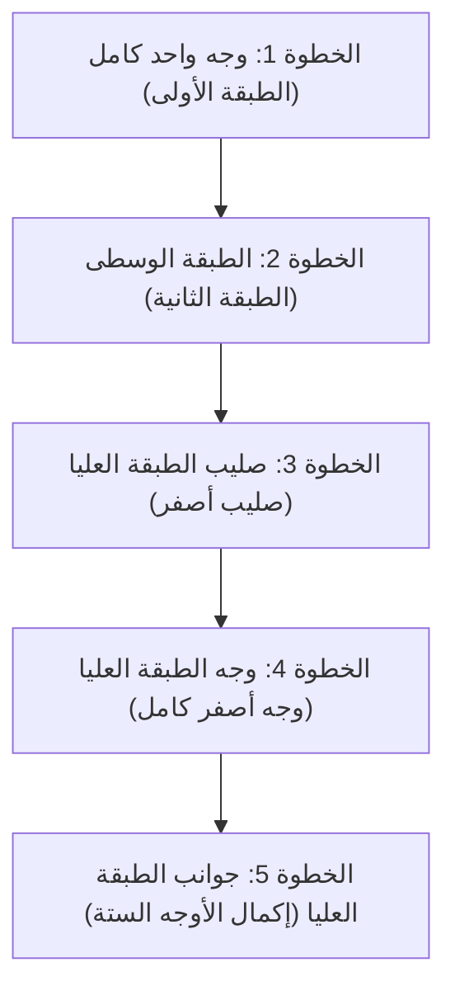

## 1. لغز ثلاثي الأبعاد يستنتج الإجابة الصحيحة من بين 43 كوينتيليون احتمال

اخترع عالم الهندسة المعمارية المجري إرنو روبيك "مكعب روبيك" في عام 1974. وهو اللغز الثلاثي الأبعاد الأكثر شهرة في العالم، حيث تقوم بتدوير كل وجه من أوجه المكعب ذو الأبعاد 3×3×3 لترتيب ألوان الأوجه الستة المبعثرة.

من المستحيل تماماً أن يُحل هذا اللغز صدفةً عن طريق التدوير العشوائي. وذلك لأن هناك **"حوالي 43 كوينتيليون (43,252,003,274,489,856,000) احتمال"** لمجموعة حالات مكعب روبيك 3×3×3.

ومع ذلك، يستطيع المتنافسون الذين يُطلق عليهم اسم لاعبي المكعب السريع استنتاج الإجابة الصحيحة (إكمال الأوجه الستة) في ثوانٍ معدودة من هذه المتاهة التي لا نهاية لها. فهل يقومون بالحسابات بعقول عبقرية؟ 
في الواقع ليس الأمر كذلك، فهم يحفظون **"الخوارزميات (الخطوات)"** ويجعلون عضلات أيديهم تتذكرها فقط.

## 2. فهم هيكل المكعب

قبل حفظ كيفية حله، تحتاج أولاً إلى فهم هيكل المكعب (أنواع القطع) بدقة. إذا أسأت فهم هذا الجزء، فلن تتمكن أبداً من حله بغض النظر عن الوقت الذي تقضيه.

لا يتكون المكعب من "27 نردًا صغيرًا (مكعبات صغيرة) مجمعة معًا". بل هو هيكل تتعلق فيه الأنواع الثلاثة التالية من القطع بمحور داخلي على شكل صليب.

1. **القطع المركزية (6 قطع)**: قطع ذات لون واحد فقط توجد في وسط كل وجه. **وهي مثبتة على المحور ولا يتغير موقعها النسبي أبدًا** (خلف الأبيض دائماً أصفر، وخلف الأزرق دائماً أخضر، وما إلى ذلك). يحدد لون هذه القطعة المركزية اللون النهائي لذلك الوجه.
2. **قطع الحواف (12 قطعة)**: قطع ذات لونين توجد على حواف الأوجه.
3. **قطع الزوايا (8 قطع)**: قطع ذات ثلاثة ألوان توجد في الزوايا.

إن المفتاح لاختراق الحاجز الأول هو إدراك أن اللعبة ليست "ترتيب ألوان الأوجه"، بل **"لعبة تحريك قطع الحواف والزوايا إلى المكان الصحيح (اللون الذي تشير إليه القطعة المركزية)"**.

## 3. للمبتدئين: خطوات طريقة LBL (طبقة بطبقة)

حاليًا، طريقة الحل الأكثر استخدامًا من قبل المبتدئين في جميع أنحاء العالم هي **"طريقة LBL (الحل حسب الطبقات)"**.
وهي طريقة لترتيب الطبقات الثلاث بالتتابع، تمامًا مثل بناء مبنى طبقة تلو الأخرى من الأسفل.

### الطبقة الأولى والثانية (الحدس والقليل من الأنماط)

يمكنك إكمال الطبقة الأولى (الطبقة السفلية) بالاعتماد على الحدس فقط بعد القليل من التدريب. أولاً، اصنع "صليباً أبيض" في القاعدة، ثم أدخل قطع الزوايا في مكانها.
بالنسبة للطبقة الثانية (الطبقة الوسطى) التالية، يمكنك إدخال كل القطع بمجرد حفظ نمطين من الخوارزميات: "خطوات إسقاط القطعة إلى اليمين" أو "خطوات إسقاط القطعة إلى اليسار".

### الطبقة الثالثة: دور الخوارزميات

أصعب جزء هو الطبقة الثالثة (الطبقة العليا) الأخيرة. هنا، ستحتاج إلى عملية سحرية لتبديل الطبقة الثالثة فقط دون إفساد الطبقتين الأولى والثانية المرتبتين بالفعل. هنا نستخدم **"الخوارزميات (خطوات محددة برموز التدوير)"**.
على سبيل المثال، عند إجراء تسلسل تدوير محدد مثل "R U R' U R U2 R'"، تحدث ظاهرة حيث "تدور أجزاء معينة فقط من الوجه العلوي مع الحفاظ على الطبقتين السفليتين في حالتهما الأصلية". بمجرد حفظ بضعة أنواع من هذه الخوارزميات، يمكن لأي شخص إكمال الأوجه الستة بنجاح بالتأكيد.

## 4. طريقة CFOP: عالم لاعبي المكعب السريع

بمجرد إتقانك لطريقة LBL، ستتمكن من إكمال الأوجه الستة في غضون دقيقتين إلى ثلاث دقائق حتى لو قمت بتدويره ببطء.
ومع ذلك، يستخدم المتنافسون من المستوى الأعلى عالميًا الذين يكسرون حاجز الـ 10 ثوانٍ طريقة حل متقدمة تُسمى **"طريقة CFOP (المعروفة أيضًا باسم طريقة فريدريتش)"**، وهي تطوير لطريقة LBL.

في طريقة CFOP، ومن أجل اختصار الخطوات إلى أقصى حد، يقومون بحفظ ما مجموعه **78 خوارزمية: "57 نمطًا لـ OLL (خطوات جعل جميع ألوان الوجه العلوي صفراء)" و"21 نمطًا لـ PLL (خطوات مطابقة مواقع الجوانب)"** بالكامل، ويتدربون بحيث تتحرك أيديهم بشكل انعكاسي بمجرد إلقاء نظرة سريعة على المكعب.

## 5. رقم الله "20" ونظرية الزمر

ترتبط متعة مكعب روبيك ارتباطًا وثيقًا بالرياضيات (خاصة "نظرية الزمر").
كان السؤال: "من أي حالة مبعثرة بشدة، من الناحية النظرية، إذا تم اتباع أفضل الخطوات، 'ما هو أقصى عدد من الحركات' التي يمكن من خلالها إكمال الأوجه الستة؟" موضوعًا درسه علماء الرياضيات لسنوات عديدة.

ونتيجة للعمليات الحسابية الضخمة باستخدام أجهزة الكمبيوتر العملاقة من Google وغيرها، تم إثبات ذلك أخيرًا في عام 2010. الإجابة هي **"20 حركة"**.
من أي حالة من بين الـ 43 كوينتيليون حالة الممكنة، إذا كان لديك عقل مثالي كعقل الإله، فيمكنك دائمًا الوصول إلى الحالة المكتملة في غضون 20 حركة. يُطلق على هذا الرقم اسم "رقم الله (God's Number)" في مجتمع المكعب.

## 6. الخلاصة

مكعب روبيك ليس "لغزًا لا يمكن إلا للعباقرة حله"، بل هو **لغز يمكن لأي شخص حله بالتأكيد** من خلال "فهم هيكله وتنفيذ بعض الخوارزميات (الصيغ)".
حاليًا، يتوفر العديد من مقاطع الفيديو التعليمية السهلة الفهم على YouTube وغيرها من المنصات. إذا كان لديك مكعب قديم ينام في خزانتك بعد أن استسلمت ولم تتمكن من حله في الماضي، فيرجى تجربة التحدي مرة أخرى باستخدام قوة الخوارزميات. إن متعة تدوير المكعب واللحظة التي تترتب فيها جميع الأجزاء في مكانها في النهاية هي تجربة لا يمكن استبدالها بأي شيء آخر.
