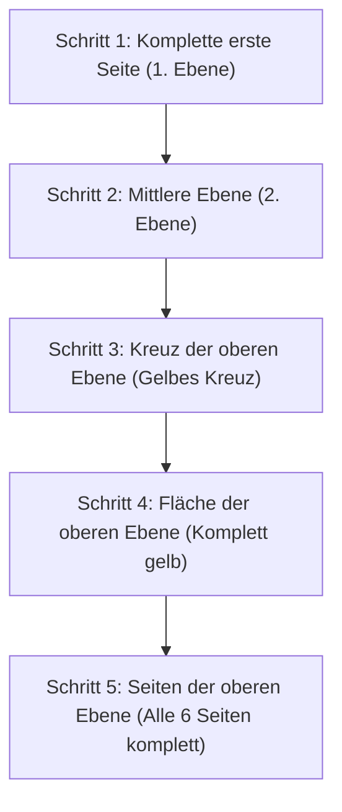

## 1. Ein 3D-Puzzle, das aus 43 Trillionen Möglichkeiten die richtige Antwort findet

Der "Zauberwürfel" (Rubik's Cube) wurde 1974 vom ungarischen Architekturprofessor Ernő Rubik erfunden. Es ist das berühmteste 3D-Puzzle der Welt, bei dem man die Seiten eines 3×3×3-Würfels dreht, um die Farben der vermischten 6 Seiten wieder in Einklang zu bringen.

Es ist absolut unmöglich, dieses Puzzle zufällig zu drehen und durch Zufall zu lösen. Das liegt daran, dass es **"ungefähr 43 Trillionen (43.252.003.274.489.856.000)"** mögliche Kombinationen für den Zustand eines 3×3×3-Zauberwürfels gibt.
Jedoch leiten Wettkämpfer, sogenannte Speedcuber, aus diesem endlosen Labyrinth in nur wenigen Sekunden die richtige Antwort (6 vollständig gelöste Seiten) ab. Rechnen sie das mit genialem Verstand aus? 
Tatsächlich nicht, sie merken sich lediglich "**Algorithmen (Schritte)**" und lassen ihre Handmuskeln diese auswendig lernen.

## 2. Die Struktur des Würfels verstehen

Bevor man lernt, wie man ihn löst, muss man zunächst die Struktur (Arten der Teile) des Würfels genau verstehen. Wenn man dies missversteht, wird man ihn niemals lösen können.

Der Würfel ist nicht einfach eine "Ansammlung von 27 kleinen Würfeln (Cubies)". Es ist eine Struktur, bei der die folgenden 3 Arten von Teilen an einer inneren kreuzförmigen Achse hängen:

1. **Mittelsteine (Center-Teile) (6 Stück)**: Die Teile in der Mitte jeder Seite, die nur eine Farbe haben. **Diese sind an der Achse befestigt und ihre relative Position ändert sich niemals** (die Rückseite von Weiß ist immer Gelb, die Rückseite von Blau ist immer Grün usw.). Die Farbe dieses Mittelsteins bestimmt die endgültige Farbe der jeweiligen Seite.
2. **Kantensteine (Edge-Teile) (12 Stück)**: Die Teile an den Kanten zwischen den Seiten, die 2 Farben haben.
3. **Ecksteine (Corner-Teile) (8 Stück)**: Die Teile an den Ecken, die 3 Farben haben.

Der Schlüssel zum Durchbrechen der ersten Hürde besteht darin, zu erkennen, dass es nicht darum geht, "die Farben der Seiten anzugleichen", sondern dass es sich um ein "**Spiel handelt, bei dem Kanten- und Ecksteine an den richtigen Ort (die durch den Mittelstein vorgegebene Farbe) bewegt werden**".

## 3. Für Anfänger: Die Schritte der LBL-Methode (Layer By Layer)

Die Methode, die derzeit von den meisten Anfängern weltweit verwendet wird, ist die "**LBL-Methode (Ebenen-Methode)**".
Dies ist eine Methode, bei der die drei Ebenen (Schichten) nacheinander gelöst werden, so als würde man ein Gebäude von unten nach oben bauen.

### 1. und 2. Ebene (Intuition und ein paar Muster)
Die erste Ebene (untere Ebene) kann nach ein wenig Übung rein intuitiv gelöst werden. Zuerst bildet man ein "weißes Kreuz" auf der Unterseite und fügt dann die Eckteile ein.
Bei der anschließenden 2. Ebene (mittlere Ebene) muss man sich nur zwei Muster von Algorithmen merken, um bestimmte Teile "nach rechts einzufügen" oder "nach links einzufügen", um alle Teile an ihren Platz zu bringen.

### 3. Ebene: Der Einsatz von Algorithmen
Am schwierigsten ist die letzte 3. Ebene (obere Ebene). Hier ist eine magische Operation erforderlich, bei der nur die 3. Ebene vertauscht wird, ohne die bereits gelösten 1. und 2. Ebenen zu zerstören. Hier verwenden wir "**Algorithmen (festgelegte Schritte von Drehsymbolen)**".
Wenn man beispielsweise eine bestimmte Zugfolge wie "R U R' U R U2 R'" ausführt, tritt das Phänomen auf, dass "die unteren zwei Ebenen in ihrem ursprünglichen Zustand bleiben, während sich nur bestimmte Teile der oberen Seite drehen". Indem man sich nur wenige dieser Zugfolgen merkt, kann jeder mit Sicherheit alle 6 Seiten vervollständigen.

## 4. CFOP-Methode: Die Welt der Speedcuber

Wenn man die LBL-Methode beherrscht, kann man selbst beim langsamen Drehen alle 6 Seiten in 2 bis 3 Minuten lösen.
Die weltbesten Wettkämpfer, die Zeiten von unter 10 Sekunden erreichen, verwenden jedoch eine fortgeschrittene Methode namens "**CFOP-Methode** (auch als Fridrich-Methode bekannt)", die eine Weiterentwicklung der LBL-Methode ist.

Bei der CFOP-Methode werden zur extremen Abkürzung der Schritte **insgesamt 78 Algorithmen komplett auswendig gelernt: "57 Muster für OLL (Schritte, um die gesamte Oberseite gelb zu machen)" und "21 Muster für PLL (Schritte, um die Positionen an den Seiten anzupassen)"**. Sie trainieren sich so, dass sich ihre Hände reflexartig bewegen, nachdem sie das Spielfeld nur für einen kurzen Moment betrachtet haben.

## 5. Die Zahl Gottes "20" und Gruppentheorie

Die Faszination des Zauberwürfels ist auch tief mit der Mathematik (insbesondere der "Gruppentheorie") verbunden.
Die Frage, "Was ist die 'maximale Anzahl von Zügen', die theoretisch bei Anwendung der optimalen Schritte benötigt wird, um alle 6 Seiten aus jedem noch so stark vermischten Zustand zu vervollständigen?", war ein langjähriges Thema für Mathematiker.

Als Ergebnis gewaltiger Berechnungen mithilfe der Supercomputer von Google und anderen wurde 2010 endlich der Beweis erbracht. Die Antwort lautet "**20 Züge**".
Egal, aus welchem der 43 Trillionen möglichen Zustände man startet: Mit einem perfekten, gottgleichen Verstand kann man den gelösten Zustand immer in maximal 20 Zügen erreichen. Diese Zahl wird in der Würfel-Community die "Zahl Gottes (God's Number)" genannt.

## 6. Zusammenfassung

Der Zauberwürfel ist kein "Puzzle, das nur Genies lösen können", sondern ein **Puzzle, das jeder lösen kann**, indem er "die Struktur versteht und ein paar Algorithmen (Formeln) anwendet".
Heutzutage gibt es viele leicht verständliche Erklärvideos auf YouTube und anderswo. Wenn Sie einen Würfel haben, den Sie früher nicht lösen konnten und der aus Frustration im Schrank gelandet ist, versuchen Sie es bitte noch einmal mit der Kraft der Algorithmen. Das befriedigende Gefühl, wenn man den Würfel hin und her dreht und das Puzzle am Ende perfekt zusammenpasst, ist durch nichts zu ersetzen.
