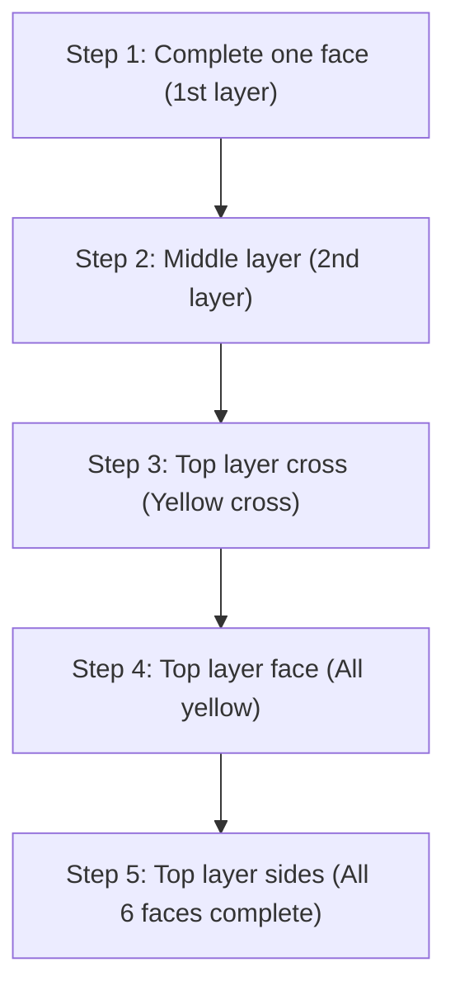

## 1. A 3D Puzzle with a 1 in 43 Quintillion Solution

Invented in 1974 by Hungarian architecture professor Ernő Rubik, the "Rubik's Cube" is the world's most famous 3D puzzle, where you rotate each face of a 3x3x3 cube to align the colors of its scrambled six faces.

This puzzle will absolutely never be solved by random turning. This is because there are **"approximately 43 quintillion (43,252,003,274,489,856,000)"** possible states for a 3x3x3 Rubik's Cube.
However, competitors known as speedcubers can deduce the correct answer (solving all six faces) from this endless labyrinth in just a few seconds. Are they calculating with genius brains? 
Actually, no. They simply memorize **"algorithms (sequences)"** and engrain them into their muscle memory.

## 2. Understanding the Cube's Structure

Before learning how to solve it, you first need to accurately understand the structure of the cube (the types of parts). If you misunderstand this, you will never be able to solve it.

The cube is not "a collection of 27 small dice (cubies)." It is structured such that the following three types of parts are hooked onto an internal cross-shaped core.

1. **Center Parts (6 pieces)**: The single-colored parts in the center of each face. **These are fixed to the core and their relative positions absolutely never change** (the opposite of white is always yellow, the opposite of blue is always green, etc.). The color of this center part determines the final color of that face.
2. **Edge Parts (12 pieces)**: The two-colored parts located on the edges between faces.
3. **Corner Parts (8 pieces)**: The three-colored parts located at the corners.

Recognizing that this is not a game of "aligning the colors of the faces," but rather a "**game of moving the edge and corner parts to their correct locations (the colors indicated by the center parts)**" is the key to breaking through the first wall.

## 3. For Beginners: Layer By Layer (LBL) Method Steps

Currently, the most common solving method used by beginners worldwide is the **"LBL (Layer By Layer) Method."**
This is a method of solving the three layers in order, like building a building one floor at a time from the bottom up.

### 1st and 2nd Layers (Intuition and a few patterns)
The first layer (bottom layer) can be solved purely by intuition with a little practice. First, create a "white cross" on the bottom face, and then insert the corner parts.
For the following 2nd layer (middle layer), you can insert everything just by memorizing two patterns of algorithms: a "sequence to drop it to the right" and a "sequence to drop it to the left."

### 3rd Layer: Enter Algorithms
The most difficult part is the final 3rd layer (top layer). Here, a magical operation is required to swap only the 3rd layer without destroying the already solved 1st and 2nd layers. This is where you use **"algorithms (fixed sequences of rotation notation)."**
For example, if you perform a specific sequence of turns like "R U R' U R U2 R'", a phenomenon occurs where "only specific parts of the top face rotate while the bottom two layers remain in their original state." By memorizing just a few of these, anyone can reliably complete all 6 faces.

## 4. CFOP Method: The World of Speedcubers

Once you master the LBL method, you will be able to solve all 6 faces in 2 to 3 minutes even if you turn slowly.
However, world-class competitors who can break the 10-second barrier use an advanced solving method developed from the LBL method called the **"CFOP Method"** (also known as the Fridrich Method).

In the CFOP method, to minimize the number of steps to the absolute limit, they memorize a total of **78 algorithms: "57 patterns for OLL (Orientation of the Last Layer, to make the top face all yellow)" and "21 patterns for PLL (Permutation of the Last Layer, to align the side locations)."** They train so that their hands move reflexively the moment they glance at the cube's state.

## 5. God's Number "20" and Group Theory

The fascination with the Rubik's Cube is also deeply connected to mathematics (especially "group theory").
The question of "No matter how scrambled the state is, theoretically, what is the 'maximum number of moves' required to complete all 6 faces if you take the most optimal sequence?" had been a long-standing theme for mathematicians.

As a result of massive calculations using Google's supercomputers and other resources, the proof was finally established in 2010. The answer is **"20 moves."**
From any of the 43 quintillion states, with a perfect, god-like brain, you can always reach the completed state in 20 moves or less. This number is referred to in the cubing community as "God's Number."

## 6. Conclusion

The Rubik's Cube is not "a puzzle only geniuses can solve," but rather a **puzzle that absolutely anyone can solve** through "an understanding of its structure and the execution of a few algorithms (formulas)."
Nowadays, there are many easy-to-understand explanation videos available on YouTube and elsewhere. If you have a cube sleeping in your closet from when you got frustrated and couldn't solve it in the past, please try challenging it again using the power of algorithms. The exhilarating feeling of clicking it around and finally having the puzzle snap perfectly into place is an experience like no other.
