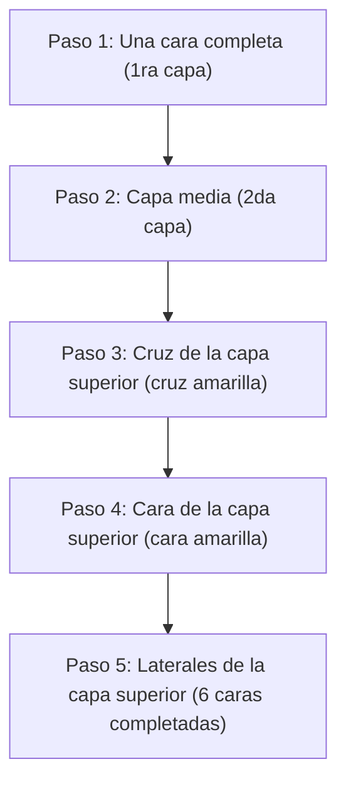

## 1. El rompecabezas 3D con 1 entre 43 trillones de combinaciones correctas

Inventado en 1974 por el profesor de arquitectura húngaro Ernő Rubik, el "Cubo de Rubik" es el rompecabezas 3D más famoso del mundo. Consiste en girar cada cara de un cubo de 3×3×3 para alinear los colores de las 6 caras desordenadas.

Nunca lograrás resolver este rompecabezas girándolo al azar. Esto se debe a que existen **"aproximadamente 43 trillones (43.252.003.274.489.856.000) de combinaciones"** posibles en un Cubo de Rubik de 3×3×3.
Sin embargo, los competidores conocidos como "speedcubers" pueden encontrar la solución (completar las 6 caras) de este laberinto infinito en tan solo unos segundos. ¿Acaso calculan con cerebros de genio? 
En realidad no; simplemente memorizan "**algoritmos (secuencias)**" y dejan que su memoria muscular haga el resto.

## 2. Entendiendo la estructura del cubo

Antes de aprender a resolverlo, debes comprender con precisión la estructura del cubo (los tipos de piezas). Si te equivocas en esto, nunca podrás resolverlo.

El cubo no es simplemente "un conjunto de 27 dados pequeños (cubies)". Su estructura consiste en tres tipos de piezas que se enganchan en un eje central en forma de cruz:

1. **Piezas centrales (6 piezas)**: Piezas de un solo color ubicadas en el centro de cada cara. **Estas están fijadas al eje y su posición relativa nunca cambia** (lo opuesto al blanco siempre es amarillo, lo opuesto al azul siempre es verde, etc.). El color de esta pieza central determina el color final de esa cara.
2. **Piezas de arista (12 piezas)**: Piezas de dos colores ubicadas en los bordes entre las caras.
3. **Piezas de esquina (8 piezas)**: Piezas de tres colores ubicadas en las esquinas.

La clave para superar el primer obstáculo es darse cuenta de que no es un juego de "alinear los colores de las caras", sino "**un juego de mover las piezas de arista y esquina al lugar correcto (indicado por el color de la pieza central)**".

## 3. Para principiantes: Los pasos del método LBL (Layer By Layer)

Actualmente, el método de resolución más utilizado por principiantes en todo el mundo es el "**método LBL (resolución por capas)**".
Este es un método en el que se resuelven tres capas en orden, una a la vez, como construir un edificio desde abajo hacia arriba.

### 1ra y 2da capa (Intuición y algunos patrones)
La primera capa (capa inferior) se puede resolver solo con intuición después de un poco de práctica. Primero, haces una "cruz blanca" en la base, y luego insertas las piezas de las esquinas.
Para la segunda capa (capa media), puedes encajar todas las piezas memorizando solo dos patrones de algoritmos: una "secuencia de caída a la derecha" o una "secuencia de caída a la izquierda".

### 3ra capa: El momento de los algoritmos
La última capa (capa superior) es la más difícil. Aquí necesitarás realizar una operación mágica que intercambia solo la tercera capa sin destruir la 1ra y 2da capa ya resueltas. Es aquí donde utilizas los "**algoritmos (secuencias establecidas de notación de giros)**".
Por ejemplo, si realizas una secuencia fija como "R U R' U R U2 R'", ocurrirá el fenómeno de que "las dos capas inferiores mantienen su estado original mientras que solo piezas específicas de la cara superior rotan". Con solo memorizar algunos de estos, cualquiera puede completar de manera confiable las 6 caras.

## 4. Método CFOP: El mundo de los speedcubers

Si dominas el método LBL, podrás resolver las 6 caras en 2 o 3 minutos incluso girando lentamente.
Sin embargo, los competidores de nivel superior mundial que bajan de los 10 segundos utilizan un método de resolución avanzado llamado "**método CFOP** (también conocido como método de Fridrich)", que es una evolución del método LBL.

En el método CFOP, para omitir los pasos al límite, **se memorizan un total de 78 algoritmos, que consisten en "57 patrones para OLL (secuencias para que toda la cara superior sea amarilla)" y "21 patrones para PLL (secuencias para alinear las ubicaciones laterales)"**, entrenándose para mover las manos por reflejo con solo un vistazo a la posición de las piezas.

## 5. El número de Dios "20" y la teoría de grupos

La fascinación por el Cubo de Rubik también está profundamente ligada a las matemáticas (especialmente a la "teoría de grupos").
"No importa cuán desordenado esté el cubo, ¿cuál es el 'número máximo de movimientos' requeridos teóricamente para completar las 6 caras si se siguen los mejores pasos?" fue un tema de investigación de los matemáticos durante mucho tiempo.

Como resultado de cálculos masivos utilizando supercomputadoras como las de Google, finalmente se comprobó en 2010. La respuesta es "**20 movimientos**".
No importa en cuál de los 43 trillones de estados se encuentre, con un cerebro perfecto como el de un dios, siempre se puede alcanzar el estado completo en 20 movimientos o menos. Este número es conocido como "El Número de Dios (God's Number)" dentro de la comunidad del cubo.

## 6. Conclusión

El Cubo de Rubik no es "un rompecabezas que solo los genios pueden resolver", sino **un rompecabezas que cualquiera puede resolver siempre** "comprendiendo su estructura y ejecutando algunos algoritmos (fórmulas)".
Hoy en día, hay muchos videos explicativos fáciles de entender disponibles en YouTube y plataformas similares. Si tienes un cubo acumulando polvo en tu armario porque te rendiste en el pasado al no poder resolverlo, asegúrate de volver a intentarlo utilizando el poder de los algoritmos. La sensación estimulante de girarlo, clac, clac, y de que el rompecabezas finalmente encaje a la perfección en el último momento, es una experiencia insustituible.
