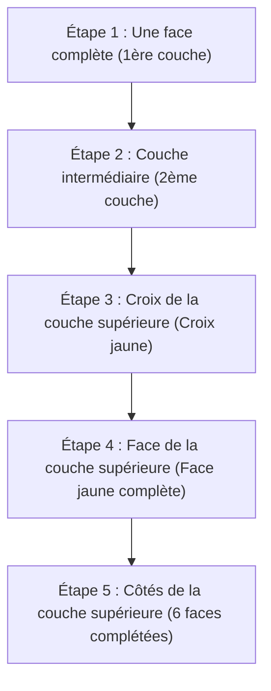

## 1. Un puzzle en 3D avec 1 chance sur 43 milliards de milliards de trouver la solution

Inventé en 1974 par le professeur d'architecture hongrois Ernő Rubik, le "Rubik's Cube" est le puzzle 3D le plus célèbre au monde, où l'on tourne les faces d'un cube 3×3×3 pour aligner les couleurs des six faces mélangées.

Il est absolument impossible que ce puzzle soit résolu par hasard en le tournant au hasard. En effet, il existe **environ 43 milliards de milliards (43 252 003 274 489 856 000)** de combinaisons possibles pour un Rubik's Cube 3×3×3.
Cependant, les compétiteurs appelés "speedcubers" parviennent à trouver la solution (compléter les 6 faces) de cet immense labyrinthe en quelques secondes seulement. Calculent-ils avec un cerveau de génie ? 
En réalité non, ils mémorisent simplement des "**algorithmes (séquences)**" et les font assimiler par leur mémoire musculaire.

## 2. Comprendre la structure du cube

Avant d'apprendre comment le résoudre, il est d'abord nécessaire de comprendre précisément la structure du cube (les types de pièces). Si vous vous trompez sur ce point, vous ne pourrez jamais le résoudre, peu importe le temps passé.

Le cube n'est pas "un assemblage de 27 petits dés (cubies)". C'est une structure où les trois types de pièces suivants sont accrochés à un axe central en forme de croix à l'intérieur.

1. **Pièces centrales (6 pièces)** : Les pièces d'une seule couleur situées au centre de chaque face. **Elles sont fixées à l'axe et leurs positions relative ne changent absolument jamais** (l'opposé du blanc est toujours le jaune, l'opposé du bleu est toujours le vert, etc.). La couleur de cette pièce centrale détermine la couleur finale de cette face.
2. **Pièces d'arête (12 pièces)** : Les pièces bicolores situées sur les bords entre les faces.
3. **Pièces de coin (8 pièces)** : Les pièces tricolores situées dans les coins.

Reconnaître qu'il ne s'agit pas d'aligner "les couleurs des faces", mais d'un "**jeu consistant à déplacer les pièces d'arête et de coin au bon endroit (la couleur indiquée par la pièce centrale)**", est la clé pour surmonter le premier obstacle.

## 3. Pour les débutants : Les étapes de la méthode LBL (Layer By Layer)

Actuellement, la méthode de résolution la plus utilisée par les débutants du monde entier est la "**méthode LBL (résolution par couches)**".
Il s'agit d'une méthode consistant à résoudre les 3 couches (layers) dans l'ordre, comme si l'on construisait un bâtiment étage par étage en partant du bas.

### 1ère et 2ème couches (Intuition et un peu de modèles)
La première couche (la couche inférieure) peut être résolue uniquement à l'intuition avec un peu de pratique. D'abord, on crée une "croix blanche" sur la face inférieure, puis on y insère les pièces de coin.
Pour la 2ème couche (la couche intermédiaire) qui suit, il suffit d'apprendre deux modèles d'algorithmes : "la séquence pour faire descendre une pièce à droite" ou "la séquence pour faire descendre une pièce à gauche", pour pouvoir toutes les insérer.

### 3ème couche : L'entrée en scène des algorithmes
La plus difficile est la 3ème couche (la couche supérieure). Ici, une manipulation magique est nécessaire pour intervertir uniquement la 3ème couche sans détruire les 1ère et 2ème couches déjà résolues. C'est là que l'on utilise des "**algorithmes (séquences définies de symboles de rotation)**".
Par exemple, en effectuant une série de mouvements définie comme "R U R' U R U2 R'", il se produit un phénomène où "les deux couches inférieures gardent leur état initial tandis que seules certaines pièces de la face supérieure tournent". En apprenant simplement quelques-unes de ces séquences, n'importe qui peut résoudre les 6 faces à coup sûr.

## 4. La méthode CFOP : Le monde des speedcubers

Une fois que vous maîtrisez la méthode LBL, vous serez capable de résoudre les 6 faces en 2 à 3 minutes, même en tournant lentement.
Cependant, les compétiteurs de niveau mondial qui passent sous la barre des 10 secondes utilisent une méthode de résolution avancée appelée "**méthode CFOP** (également connue sous le nom de méthode Fridrich)", qui est une évolution de la méthode LBL.

Dans la méthode CFOP, afin d'omettre les étapes à l'extrême, ils s'entraînent à mémoriser **un total de 78 algorithmes, dont "57 modèles d'OLL (séquence pour rendre toute la face supérieure jaune)" et "21 modèles de PLL (séquence pour aligner les positions des faces latérales)"**, afin que leurs mains bougent par réflexe en regardant le cube pendant un instant.

## 5. Le nombre de Dieu "20" et la théorie des groupes

L'intérêt du Rubik's Cube est également profondément lié aux mathématiques (en particulier à la "théorie des groupes").
"Depuis n'importe quel état mélangé, quel est le nombre maximum de mouvements nécessaires en théorie pour compléter les 6 faces en utilisant la meilleure séquence possible ?" Cette question a longtemps été un thème d'étude pour les mathématiciens.

En 2010, grâce à des calculs massifs effectués par les superordinateurs de Google et d'autres, la preuve a finalement été établie. La réponse est "**20 mouvements**".
Peu importe l'état de départ parmi les 43 trillions de combinaisons, avec un cerveau parfait semblable à celui de Dieu, il est toujours possible d'atteindre l'état complet en 20 mouvements maximum. Ce nombre est appelé "Le nombre de Dieu (God's Number)" dans la communauté du cube.

## 6. Conclusion

Le Rubik's Cube n'est pas "un puzzle que seuls les génies peuvent résoudre", mais un puzzle que **n'importe qui peut assurément résoudre** grâce à "la compréhension de sa structure et l'exécution de quelques algorithmes (formules)".
Aujourd'hui, de nombreuses vidéos explicatives faciles à comprendre sont disponibles sur YouTube et ailleurs. Si vous avez un cube qui dort au fond d'un placard parce que vous avez abandonné sans pouvoir le résoudre dans le passé, essayez de relever le défi à nouveau en utilisant le pouvoir des algorithmes. Le plaisir de tourner avec des petits clics et de voir le puzzle s'aligner parfaitement à la fin est une expérience irremplaçable.
