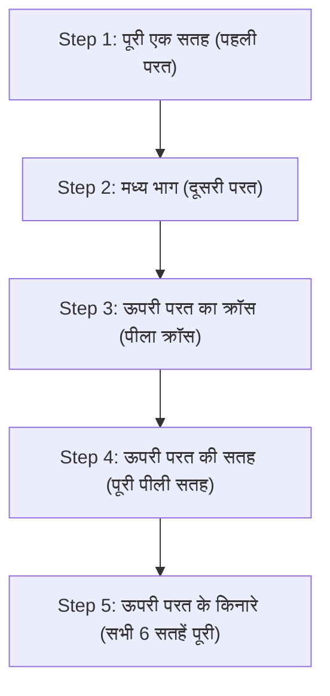

## 1. 43.25 क्विंटिलियन में से 1 सही समाधान निकालने वाली 3D पहेली

1974 में हंगरी के वास्तुकार एर्नो रूबिक द्वारा आविष्कार किया गया 'रूबिक क्यूब'। यह दुनिया की सबसे प्रसिद्ध 3D पहेली है जहाँ आप 3×3×3 क्यूब की प्रत्येक सतह को घुमाते हैं और बिखरे हुए 6 सतहों के रंगों का मिलान करते हैं।

यह पहेली कभी भी बेतरतीब ढंग से घुमाकर संयोग से हल नहीं होती है। ऐसा इसलिए है क्योंकि 3×3×3 रूबिक क्यूब की स्थिति के संयोजनों की संख्या **"लगभग 43.25 क्विंटिलियन (43,252,003,274,489,856,000) तरीके"** हैं।

हालाँकि, स्पीडक्यूबर्स कहलाने वाले प्रतियोगी इस अंतहीन भूलभुलैया से कुछ ही सेकंड में सही समाधान (6 सतहों को पूरा करना) निकाल लेते हैं। क्या वे अपने प्रतिभाशाली दिमाग से इसकी गणना कर रहे हैं? 
वास्तव में ऐसा नहीं है, वे केवल "**एल्गोरिदम (कदमों)**" को याद करते हैं और अपनी हाथों की मांसपेशियों को इसे याद रखने का अभ्यास कराते हैं।

## 2. क्यूब की संरचना को समझना

इसे हल करने का तरीका याद करने से पहले, आपको सबसे पहले क्यूब की संरचना (पार्ट्स के प्रकार) को सही ढंग से समझना होगा। यदि आप यहाँ गलतफहमी में हैं, तो आप इसे कभी भी हल नहीं कर पाएंगे।

क्यूब "27 छोटे पासों (क्यूब्स) का संग्रह" नहीं है। इसकी एक संरचना है जिसमें निम्न 3 प्रकार के हिस्से आंतरिक क्रॉस-आकार की धुरी पर लगे होते हैं:

1. **सेंटर पार्ट्स (6 पीस)**: प्रत्येक सतह के केंद्र में केवल एक रंग वाला हिस्सा। **ये धुरी पर स्थिर होते हैं और इनकी स्थिति कभी नहीं बदलती है** (सफेद के पीछे हमेशा पीला, नीले के पीछे हमेशा हरा आदि)। इस सेंटर पार्ट का रंग उस सतह का अंतिम रंग निर्धारित करता है।
2. **एज पार्ट्स (12 पीस)**: सतहों के किनारों पर स्थित दो रंगों वाले हिस्से।
3. **कॉर्नर पार्ट्स (8 पीस)**: कोनों पर स्थित तीन रंगों वाले हिस्से।

"सतहों के रंगों का मिलान करने" के बजाय इसे "**एक ऐसा खेल जहाँ आपको एज और कॉर्नर के पार्ट्स को सही जगह (सेंटर पार्ट द्वारा दर्शाया गया रंग) पर ले जाना है**" के रूप में पहचानना, पहली बाधा को पार करने की कुंजी है।

## 3. शुरुआती लोगों के लिए: LBL विधि (लेयर बाय लेयर) के चरण

वर्तमान में, दुनिया भर में शुरुआती लोगों द्वारा सबसे अधिक इस्तेमाल की जाने वाली हल करने की विधि "**LBL विधि (लेयर बाय लेयर)**" है।
यह एक ऐसी विधि है जहाँ आप नीचे से एक-एक करके 3 परतों (लेयर्स) को क्रम से पूरा करते हैं, ठीक वैसे ही जैसे नीचे से एक-एक मंजिल करके इमारत बनाई जाती है।

### पहली और दूसरी परत (अंतर्ज्ञान और थोड़ा सा पैटर्न)
पहली परत (निचली परत) को थोड़े अभ्यास के साथ केवल अंतर्ज्ञान (intuition) से हल किया जा सकता है। सबसे पहले निचले हिस्से में एक "सफेद क्रॉस" बनाएं, और फिर कोने के हिस्सों को उसमें फिट करें।
इसके बाद दूसरी परत (मध्य परत) के लिए, आप किसी विशेष हिस्से को "दाईं ओर गिराने की प्रक्रिया" या "बाईं ओर गिराने की प्रक्रिया" के केवल 2 पैटर्न वाले एल्गोरिदम को याद करके उन सभी को फिट कर सकते हैं।

### तीसरी परत: एल्गोरिदम का समय
सबसे कठिन अंतिम तीसरी परत (ऊपरी परत) है। यहाँ एक जादुई ऑपरेशन की आवश्यकता होती है जो पहले से ही पूरी हो चुकी पहली और दूसरी परतों को बिना बिगाड़े केवल तीसरी परत को बदल देती है। यहीं पर आप "**एल्गोरिदम (रोटेशन प्रतीकों का एक निश्चित क्रम)**" का उपयोग करते हैं।
उदाहरण के लिए, "R U R' U R U2 R'" जैसे एक निश्चित तरीके से घुमाने पर, एक ऐसी घटना होती है जहाँ "नीचे की 2 परतें अपनी मूल स्थिति में रहती हैं, और केवल ऊपरी सतह के विशिष्ट हिस्से घूमते हैं"। केवल कुछ ऐसे प्रकारों को याद करके, कोई भी निश्चित रूप से सभी 6 सतहों को पूरा कर सकता है।

## 4. CFOP विधि: स्पीडक्यूबर्स की दुनिया

यदि आप LBL विधि में महारत हासिल कर लेते हैं, तो आप धीरे-धीरे घुमाते हुए भी 2-3 मिनट में सभी 6 सतहों को पूरा करने में सक्षम होंगे।
हालाँकि, 10 सेकंड से कम समय लेने वाले विश्व के शीर्ष स्तर के प्रतियोगी "**CFOP विधि** (जिसे फ्रिड्रिच विधि भी कहा जाता है)" नामक एक उन्नत समाधान विधि का उपयोग সুইস करते हैं, जो LBL विधि का एक विकसित रूप है।

CFOP विधि में, कदमों को चरम सीमा तक कम करने के लिए, **"OLL (ऊपरी सतह को पूरी तरह से पीला बनाने की प्रक्रिया) के 57 पैटर्न" और "PLL (साइड के स्थानों का मिलान करने की प्रक्रिया) के 21 पैटर्न", यानी कुल 78 एल्गोरिदम** याद किए जाते हैं, और वे इस तरह से प्रशिक्षित होते हैं कि बोर्ड पर एक नज़र डालते ही उनके हाथ स्वचालित रूप से चलने लगते हैं।

## 5. ईश्वर का नंबर "20" और समूह सिद्धांत

रूबिक क्यूब का मज़ा गणित (विशेष रूप से "समूह सिद्धांत (Group Theory)") से भी गहराई से जुड़ा हुआ है।
"चाहे इसे कितनी भी बुरी तरह से शफ़ल किया गया हो, सैद्धांतिक रूप से, यदि आप सबसे अच्छे कदम उठाते हैं तो 'अधिकतम कितनी चालों' में सभी 6 सतहों को पूरा किया जा सकता है?" - यह समस्या लंबे समय से गणितज्ञों के लिए एक विषय रही है।

Google के सुपर कंप्यूटर का उपयोग करके की गई व्यापक गणनाओं के परिणामस्वरूप, 2010 में अंततः यह सिद्ध हो गया। उत्तर "**20 चालें**" है।
43.25 क्विंटिलियन स्थितियों में से किसी भी स्थिति से, यदि आपके पास ईश्वर जैसा परिपूर्ण दिमाग है, तो आप निश्चित रूप से 20 चालों के भीतर पूरा करने की स्थिति तक पहुँच सकते हैं। इस संख्या को क्यूबिंग समुदाय में "ईश्वर का नंबर (God's Number)" कहा जाता है।

## 6. निष्कर्ष

रूबिक क्यूब एक ऐसी पहेली नहीं है जिसे "केवल जीनियस ही हल कर सकते हैं", बल्कि यह एक ऐसी पहेली है जिसे "संरचना को समझकर और कुछ एल्गोरिदम (सूत्रों) को लागू करके" **कोई भी निश्चित रूप से हल कर सकता है**।
आजकल, YouTube आदि पर बहुत सारे आसानी से समझ में आने वाले व्याख्यात्मक वीडियो उपलब्ध हैं। यदि आपके पास कोई क्यूब है जो अतीत में हल न कर पाने के कारण निराशा में अलमारी में पड़ा हुआ है, तो कृपया एल्गोरिदम की शक्ति का उपयोग करके इसे फिर से आज़माएँ। क्लिक-क्लाक करके घुमाने और अंत में पहेली के पूरी तरह से हल हो जाने के क्षण का आनंद एक ऐसा अनुभव है जिसे किसी और चीज़ से नहीं बदला जा सकता।
