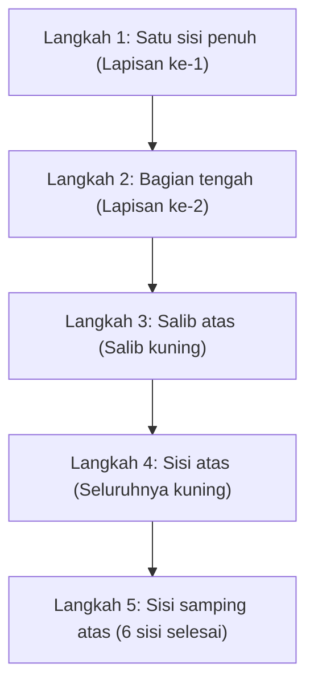

## 1. Teka-teki Tiga Dimensi yang Menemukan 1 Jawaban Benar dari 43 Quintillion

Ditemukan pada tahun 1974 oleh profesor arsitektur asal Hungaria, Ernő Rubik, "Kubus Rubik" adalah teka-teki tiga dimensi paling terkenal di dunia, di mana Anda harus memutar setiap sisi kubus 3×3×3 untuk mencocokkan warna yang berantakan di 6 sisinya.

Tidak mungkin menyelesaikan teka-teki ini secara kebetulan hanya dengan memutarnya sembarangan. Hal ini karena kubus Rubik 3×3×3 memiliki kemungkinan status kombinasi hingga **"sekitar 43 quintillion (43.252.003.274.489.856.000) cara"**.
Namun, para pesaing yang disebut *speedcuber* dapat menemukan jawaban yang benar (menyelesaikan 6 sisi) dari labirin tanpa akhir ini hanya dalam beberapa detik. Apakah mereka menghitung menggunakan otak yang jenius? 
Sebenarnya tidak, mereka hanya mengingat **"algoritma (langkah-langkah)"** dan membiasakan otot-otot tangan mereka dengan gerakan tersebut.

## 2. Memahami Struktur Kubus

Sebelum mempelajari cara menyelesaikannya, Anda harus terlebih dahulu memahami struktur kubus (jenis bagian-bagiannya) dengan akurat. Jika Anda salah paham tentang hal ini, Anda tidak akan pernah bisa menyelesaikannya sampai kapan pun.

Kubus ini bukanlah "kumpulan 27 dadu kecil (cubies)". Strukturnya terdiri dari sumbu berbentuk salib di bagian dalam, dengan 3 jenis bagian berikut yang terpasang padanya.

1. **Bagian Tengah (6 buah)**: Bagian dengan hanya 1 warna yang berada di tengah setiap sisi. **Bagian-bagian ini menempel pada sumbu, dan posisi relatifnya tidak akan pernah berubah** (belakang putih pasti kuning, belakang biru pasti hijau, dll.). Warna bagian tengah inilah yang akan menentukan warna akhir dari sisi tersebut.
2. **Bagian Tepi (12 buah)**: Bagian dengan 2 warna yang berada di pinggiran antara sisi-sisi.
3. **Bagian Sudut (8 buah)**: Bagian dengan 3 warna yang berada di sudut-sudut kubus.

Alih-alih "mencocokkan warna pada sebuah sisi", menganggapnya sebagai permainan memindahkan bagian tepi dan sudut ke **"tempat yang benar (warna yang ditunjukkan oleh bagian tengah)"** adalah kunci untuk menembus rintangan pertama.

## 3. Untuk Pemula: Langkah-langkah Metode LBL (Layer By Layer)

Saat ini, metode penyelesaian yang paling banyak digunakan oleh pemula di seluruh dunia adalah **"metode LBL (penyelesaian per lapisan)"**.
Ini adalah metode untuk mencocokkan 3 lapisan (layer) secara berurutan, seperti membangun gedung lapis demi lapis dari bawah.

### Lapisan ke-1 dan ke-2 (Intuisi dan sedikit pola)
Lapisan pertama (bawah) dapat diselesaikan hanya dengan intuisi setelah sedikit berlatih. Pertama-tama buat "salib putih" di bagian bawah, kemudian pasang bagian sudutnya.
Pada lapisan kedua (tengah) selanjutnya, Anda hanya perlu menghafal 2 pola algoritma, yaitu "langkah menjatuhkan ke kanan" atau "langkah menjatuhkan ke kiri" untuk bagian-bagian tertentu, dan semuanya dapat dipasang.

### Lapisan ke-3: Waktunya algoritma beraksi
Bagian tersulit adalah lapisan ketiga (atas) yang terakhir. Di sini, Anda memerlukan operasi ajaib untuk menukar bagian di lapisan ketiga saja tanpa merusak lapisan ke-1 dan ke-2 yang sudah selesai. Inilah saatnya Anda menggunakan **"algoritma (urutan tetap dari notasi putaran)"**.
Misalnya, jika Anda melakukan putaran tetap seperti "R U R' U R U2 R'", akan terjadi fenomena di mana "hanya bagian tertentu di sisi atas yang berputar, sementara 2 lapisan di bawahnya tetap pada kondisi semula". Hanya dengan menghafal beberapa jenis pola ini, siapa pun pasti bisa menyelesaikan keenam sisinya.

## 4. Metode CFOP: Dunia Speedcuber

Jika Anda telah menguasai metode LBL, Anda akan dapat menyelesaikan 6 sisi dalam 2 hingga 3 menit, bahkan jika Anda memutarnya dengan perlahan.
Namun, para pesaing tingkat dunia yang dapat menyelesaikannya dalam waktu kurang dari 10 detik menggunakan metode lanjutan dari LBL yang disebut **"Metode CFOP"** (juga dikenal sebagai metode Fridrich).

Dalam metode CFOP, untuk menyingkat langkah secara maksimal, mereka menghafal **total 78 algoritma, yaitu 57 pola untuk "OLL (langkah membuat seluruh sisi atas berwarna kuning)" dan 21 pola untuk "PLL (langkah menyamakan posisi sisi samping)"**, serta melatih tangan mereka untuk bergerak secara refleks hanya dengan melihat sekilas kondisi kubus.

## 5. Angka Tuhan "20" dan Teori Grup

Daya tarik Kubus Rubik juga sangat berkaitan erat dengan matematika (terutama "teori grup").
Pertanyaan "dari kondisi teracak seperti apa pun, secara teoritis, jika Anda mengambil langkah terbaik, 'berapa jumlah langkah maksimal' yang dibutuhkan untuk menyelesaikan keenam sisinya?" telah menjadi topik bahasan para matematikawan selama bertahun-tahun.

Berdasarkan hasil dari perhitungan ekstensif menggunakan superkomputer Google dan lainnya, pada tahun 2010 hal ini akhirnya terbukti. Jawabannya adalah **"20 langkah"**.
Dari kondisi mana pun di antara 43 quintillion kombinasi, jika Anda memiliki otak yang sempurna seperti Tuhan, Anda pasti dapat mencapai status selesai dalam 20 langkah atau kurang. Angka ini dikenal di kalangan penggemar kubus Rubik sebagai "Angka Tuhan (God's Number)".

## 6. Kesimpulan

Kubus Rubik bukanlah "teka-teki yang hanya bisa diselesaikan oleh seorang jenius", melainkan teka-teki yang **pasti bisa diselesaikan oleh siapa pun** melalui "pemahaman struktur dan penerapan beberapa algoritma (rumus)".
Saat ini, terdapat banyak video penjelasan yang mudah dipahami di YouTube dan sejenisnya. Jika dulu Anda memiliki kubus yang tidak dapat Anda selesaikan, merasa frustrasi, dan menyimpannya di dalam lemari, cobalah gunakan kekuatan algoritma dan tantang kembali diri Anda. Kenikmatan saat memutar-mutarnya dan melihat teka-teki tersebut tersusun sempurna pada akhirnya adalah pengalaman yang tak tergantikan oleh apa pun.
