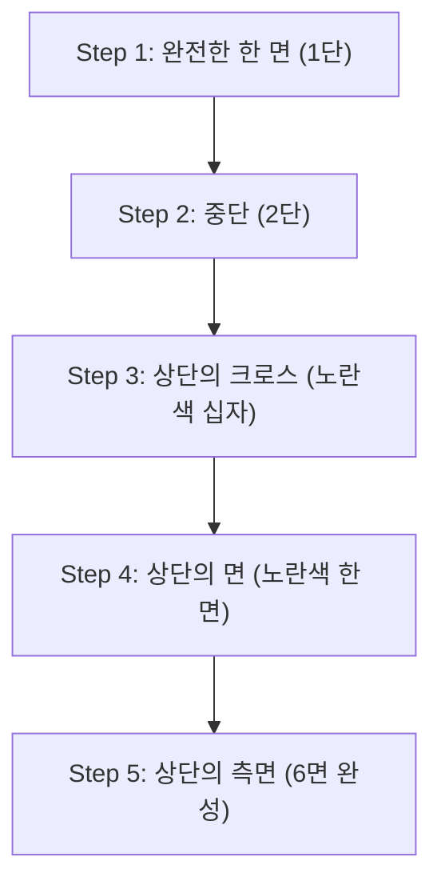

## 1. 4325경 분의 1의 정답을 이끌어내는 입체 퍼즐

1974년에 헝가리의 건축학자 에르뇌 루빅에 의해 발명된 '루빅스 큐브'. 3×3×3 입방체의 각 면을 회전시켜, 뒤죽박죽이 된 6면의 색을 맞추는 세계에서 가장 유명한 입체 퍼즐입니다.

이 퍼즐이 적당히 돌려서 우연히 맞춰지는 일은 절대 없습니다. 왜냐하면, 3×3×3 루빅스 큐브 상태의 조합은 **'약 4325경(43,252,003,274,489,856,000)가지'** 나 존재하기 때문입니다.
하지만, 스피드 큐버라고 불리는 경기자들은, 이 끝없는 미궁에서 불과 수 초 만에 정답(6면 완성)을 이끌어냅니다. 그들은 천재적인 두뇌로 계산하고 있는 것일까요? 
사실은 그렇지 않으며, 그들은 **'알고리즘(순서)'** 을 기억하고, 그것을 손 근육에 기억시키고 있을 뿐입니다.

## 2. 큐브의 구조를 이해하기

맞추는 법을 외우기 전에, 먼저 큐브의 구조(부품의 종류)를 정확하게 이해할 필요가 있습니다. 이것을 착각하고 있으면, 언제까지나 맞출 수 없습니다.

큐브는 '작은 주사위(큐비)가 27개 모여있는' 것이 아닙니다. 내부의 십자 모양의 축에, 다음의 3종류의 부품이 걸려있는 구조입니다.

1. **센터 부품(6개)**: 각 면의 중심에 있는, 1가지 색의 부품. **이것들은 축에 고정되어 있으며, 절대 위치 관계가 변하지 않습니다**(흰색의 뒷면은 반드시 노란색, 파란색의 뒷면은 반드시 초록색 등). 이 센터 부품의 색이, 그 면의 최종적인 색을 결정합니다.
2. **엣지 부품(12개)**: 면과 면의 모서리에 있는, 2가지 색의 부품.
3. **코너 부품(8개)**: 모서리에 있는, 3가지 색의 부품.

'면의 색을 맞춘다'는 것이 아니라, **'올바른 위치(센터 부품이 나타내는 색)에, 엣지와 코너 부품을 이동시키는 게임'** 이라고 인식하는 것이, 첫 번째 벽을 돌파하는 열쇠입니다.

## 3. 초보자용: LBL법(Layer By Layer)의 스텝

현재, 전 세계의 초보자가 가장 많이 사용하고 있는 맞추는 법이 **'LBL법(계층별 해법)'** 입니다.
이것은, 밑에서부터 1단씩 건물을 짓듯이, 3개의 층(레이어)을 순서대로 맞춰가는 방법입니다.

### 1단과 2단(직관과 약간의 패턴)
첫 번째 1단(하단)은, 조금만 연습하면 직관만으로 맞출 수 있습니다. 먼저 바닥면에 '흰색 십자'를 만들고, 그 후에 모서리 부품을 끼워 넣습니다.
이어서 2단(중단)은, 특정 부품을 '오른쪽으로 떨어뜨리는 순서' 또는 '왼쪽으로 떨어뜨리는 순서'의 2패턴의 알고리즘을 외우는 것만으로, 모두 끼워 넣을 수 있습니다.

### 3단: 알고리즘의 차례
가장 어려운 것이 마지막 3단(상단)입니다. 여기서는, 이미 맞춰져 있는 1·2단을 부수지 않고, 3단만을 교체하는 마법과 같은 조작이 필요해집니다. 여기서 **'알고리즘(회전 기호가 정해진 순서)'** 을 사용합니다.
예를 들어, "R U R' U R U2 R'"과 같이 정해진 회전법을 수행하면, '아래의 2단은 원래 상태를 유지한 채, 윗면의 특정 부품만이 회전하는' 현상이 일어납니다. 이것들을 몇 종류 외우는 것만으로, 누구나 확실하게 6면을 완성할 수 있는 것입니다.

## 4. CFOP법: 스피드 큐버의 세계

LBL법을 마스터하면, 천천히 돌려도 2~3분 안에 6면을 맞출 수 있게 됩니다.
하지만, 10초를 밑도는 세계 최고 수준의 경기자들은, **'CFOP법**(별명 프리드리히 메서드)'이라고 불리는, LBL법을 발전시킨 고도의 해법을 사용하고 있습니다.

CFOP법에서는, 순서를 극한까지 생략하기 위해, **'OLL(윗면의 색을 모두 노란색으로 만드는 순서)'로 57패턴, 'PLL(옆면의 위치를 맞추는 순서)'로 21패턴, 총 78개나 되는 알고리즘** 을 모두 암기하고, 반면을 한순간 보는 것만으로 반사적으로 손이 움직이도록 훈련하고 있습니다.

## 5. 신의 숫자 '20'과 군론

루빅스 큐브의 재미는 수학(특히 '군론')과도 깊게 맺어져 있습니다.
'아무리 뒤죽박죽으로 섞인 상태에서라도, 이론상, 최선의 순서를 밟으면 "최대 몇 수" 만에 6면을 완성시킬 수 있을까?'라는 문제는, 수학자들의 오랜 테마였습니다.

Google의 슈퍼컴퓨터 등을 이용한 방대한 계산 결과, 2010년에 마침내 증명이 이루어졌습니다. 답은 **'20수'** 입니다.
4325경 가지나 되는 어느 상태에서라도, 신과 같은 완벽한 두뇌가 있다면, 반드시 20수 이내에 완성 상태에 도달할 수 있는 것입니다. 이 숫자는 큐브계에서 '신의 숫자 (God's Number)'라고 불리고 있습니다.

## 6. 정리

루빅스 큐브는, '천재만 풀 수 있는 퍼즐'이 아니라, '구조의 이해와, 몇 가지 알고리즘(공식)의 실행'에 의해 **누구나 반드시 풀 수 있는 퍼즐** 입니다.
현재는 YouTube 등에서 알기 쉬운 해설 동영상이 다수 공개되어 있습니다. 옛날에, 맞추지 못하고 좌절해서 벽장에 잠들어 있는 큐브가 있다면, 부디 알고리즘의 힘을 사용하여 다시 한번 도전해 보세요. 달그락달그락 돌리며, 마지막에 퍼즐이 딱 맞게 완성되는 순간의 쾌감은, 그 무엇과도 바꿀 수 없는 체험입니다.
