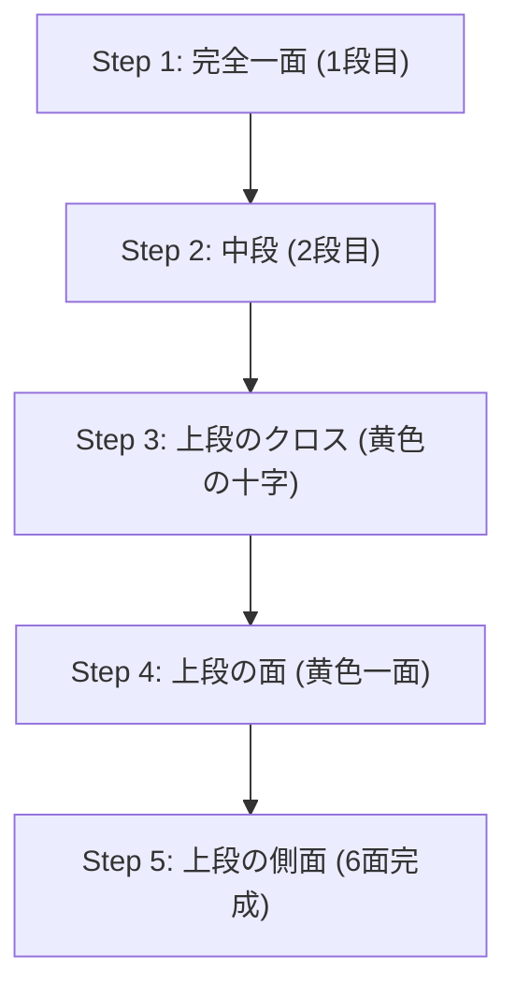

## 1. 4325京分の1の正解を導き出す立体パズル

1974年にハンガリーの建築学者エルノー・ルービックによって発明された「ルービックキューブ」。3×3×3の立方体の各面を回転させ、バラバラになった6面の色を揃える世界で最も有名な立体パズルです。

このパズルが適当に回して偶然揃うことは絶対にありません。なぜなら、3×3×3のルービックキューブの状態の組み合わせは**「約4325京（43,252,003,274,489,856,000）通り」**も存在するからです。
しかし、スピードキューバーと呼ばれる競技者たちは、この果てしない迷宮からわずか数秒で正解（6面完成）を導き出します。彼らは天才的な頭脳で計算しているのでしょうか？ 
実はそうではなく、彼らは「**アルゴリズム（手順）**」を記憶し、それを手の筋肉に覚え込ませているだけなのです。

## 2. キューブの構造を理解する

揃え方を覚える前に、まずはキューブの構造（パーツの種類）を正確に理解する必要があります。ここを勘違いしていると、いつまで経っても揃えることはできません。

キューブは「小さなサイコロ（キュービー）が27個集まっている」わけではありません。内部のクロス状の軸に、以下の3種類のパーツが引っかかっている構造です。

1. **センターパーツ（6個）**: 各面の中心にある、1色だけのパーツ。**これらは軸に固定されており、絶対に位置関係が変わりません**（白の裏は必ず黄色、青の裏は必ず緑など）。このセンターパーツの色が、その面の最終的な色を決定します。
2. **エッジパーツ（12個）**: 面と面の辺にある、2色のパーツ。
3. **コーナーパーツ（8個）**: カドにある、3色のパーツ。

「面の色を揃える」のではなく、「**正しい場所（センターパーツが示す色）に、エッジとコーナーのパーツを移動させるゲーム**」と認識することが、最初の壁を突破する鍵です。

## 3. 初心者向け：LBL法（Layer By Layer）のステップ

現在、世界中の初心者が最も多く用いている揃え方が「**LBL法（階層別解法）**」です。
これは、下から1段ずつ建物を建てるように、3つの層（レイヤー）を順番に揃えていく方法です。

### 1段目と2段目（直感と少しのパターン）
最初の1段目（下段）は、少し練習すれば直感だけで揃えることができます。まず底面に「白色の十字」を作り、その後に角のパーツをはめ込みます。
続く2段目（中段）は、特定のパーツを「右に落とす手順」か「左に落とす手順」の2パターンのアルゴリズムを覚えるだけで、すべてはめ込むことができます。

### 3段目：アルゴリズムの出番
最も難しいのが最後の3段目（上段）です。ここでは、すでに揃っている1・2段目を壊さずに、3段目だけを入れ替えるという魔法のような操作が必要になります。ここで「**アルゴリズム（回転記号の決まった手順）**」を使います。
例えば、「R U R' U R U2 R'」のような決まった回し方を行うと、「下の2段は元の状態を保ったまま、上の面の特定のパーツだけが回転する」という現象が起きます。これらを数種類覚えるだけで、誰でも確実に6面を完成させることができるのです。

## 4. CFOP法：スピードキューバーの世界

LBL法をマスターすれば、ゆっくり回しても2〜3分で6面を揃えられるようになります。
しかし、10秒を切るような世界トップレベルの競技者たちは、「**CFOP法**（別名フリドリッヒ・メソッド）」と呼ばれる、LBL法を発展させた高度な解法を使っています。

CFOP法では、手順を極限まで省略するために、**「OLL（上面の色をすべて黄色にする手順）で57パターン」「PLL（側面の場所を合わせる手順）で21パターン」の、合計78個ものアルゴリズム**をすべて暗記し、盤面を一瞬見ただけで反射的に手が動くように訓練しています。

## 5. 神の数字「20」と群論

ルービックキューブの面白さは数学（特に「群論」）とも深く結びついています。
「どんなにバラバラにシャッフルされた状態からでも、理論上、最善の手順を踏めば『最大何手』で6面を完成させることができるか？」という問題は、数学者たちの長年のテーマでした。

Googleのスーパーコンピュータなどを用いた膨大な計算の結果、2010年についに証明がなされました。答えは「**20手**」です。
4325京通りあるどの状態からでも、神のような完璧な頭脳があれば、必ず20手以内で完成状態に到達できるのです。この数字はキューブ界隈で「神の数字 (God's Number)」と呼ばれています。

## 6. まとめ

ルービックキューブは、「天才しか解けないパズル」ではなく、「構造の理解と、いくつかのアルゴリズム（公式）の実行」によって**誰でも必ず解けるパズル**です。
現在ではYouTubeなどで分かりやすい解説動画が多数公開されています。昔、揃えられずに挫折して押し入れに眠っているキューブがあれば、ぜひアルゴリズムの力を使ってもう一度挑戦してみてください。カチャカチャと回し、最後にパズルがピタリと揃う瞬間の快感は、何物にも代えがたい体験です。
