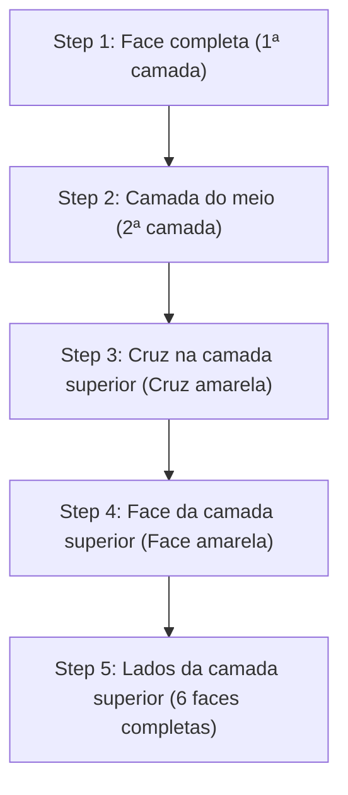

## 1. O Quebra-Cabeça 3D que Exige a Resposta Certa Entre 43 Quintilhões

Inventado em 1974 pelo arquiteto húngaro Ernő Rubik, o "Cubo de Rubik" (Cubo Mágico) é o quebra-cabeça tridimensional mais famoso do mundo. O objetivo é girar as faces do cubo 3x3x3 e alinhar as cores embaralhadas de suas 6 faces.

É absolutamente impossível que este quebra-cabeça seja resolvido girando-o aleatoriamente. Isso ocorre porque existem **"cerca de 43 quintilhões (43.252.003.274.489.856.000) de combinações"** possíveis para o estado de um Cubo Mágico 3x3x3.
No entanto, competidores conhecidos como *speedcubers* (velocistas do cubo) encontram a resposta correta (completando as 6 faces) nesse labirinto sem fim em apenas alguns segundos. Eles estão calculando com mentes geniais? 
Na verdade não, eles simplesmente memorizam "**algoritmos (sequências)**" e treinam sua memória muscular para executá-los.

## 2. Compreendendo a Estrutura do Cubo

Antes de aprender a resolvê-lo, você precisa primeiro entender corretamente a estrutura do cubo (os tipos de peças). Se você não entender isso direito, nunca conseguirá resolvê-lo, não importa quanto tempo passe.

O cubo não é "uma coleção de 27 pequenos dados (cubinhos)". É uma estrutura onde os 3 seguintes tipos de peças estão presos a um eixo interno em forma de cruz.

1. **Peças Centrais (6 peças)**: As peças no centro de cada face, com apenas uma cor. **Elas são fixadas ao eixo e suas posições relativas nunca mudam** (a parte de trás do branco é sempre amarela, a parte de trás do azul é sempre verde, etc.). A cor dessa peça central determina a cor final daquela face.
2. **Peças de Meio / Arestas (12 peças)**: As peças nas bordas entre as faces, com duas cores.
3. **Peças de Canto / Quinas (8 peças)**: As peças nos cantos, com três cores.

Reconhecer que não é um jogo de "combinar as cores das faces", mas sim um "**jogo de mover as peças de meio e canto para o lugar certo (a cor indicada pelas peças centrais)**" é a chave para superar a primeira barreira.

## 3. Para Iniciantes: O Método LBL (Layer By Layer / Camada por Camada)

Atualmente, o método de resolução mais comum usado por iniciantes em todo o mundo é o "**Método LBL (Resolução por Camadas)**".
Este é um método de resolver as 3 camadas em ordem, construindo-as de baixo para cima, como se estivesse construindo um prédio.

### 1ª e 2ª Camadas (Intuição e Alguns Padrões)
A primeira camada (inferior) pode ser resolvida puramente por intuição, com um pouco de prática. Primeiro você cria uma "cruz branca" na base e, em seguida, encaixa as peças de canto.
A 2ª camada (meio) que se segue pode ser totalmente encaixada apenas memorizando dois padrões de algoritmo: uma "sequência para soltar à direita" ou uma "sequência para soltar à esquerda" para peças específicas.

### 3ª Camada: É a Vez dos Algoritmos
A última 3ª camada (superior) é a mais difícil. Aqui, você precisará realizar a operação mágica de trocar apenas a 3ª camada sem destruir a 1ª e a 2ª camadas que já estão resolvidas. É aqui que usamos "**algoritmos (sequências fixas de notações de rotação)**".
Por exemplo, se você realizar uma rotação fixa como "R U R' U R U2 R'", ocorrerá um fenômeno onde "apenas peças específicas na face superior giram, mantendo o estado original das duas camadas inferiores". Simplesmente memorizando alguns desses, qualquer pessoa pode completar de forma confiável todas as 6 faces.

## 4. Método CFOP: O Mundo dos Speedcubers

Assim que você dominar o método LBL, conseguirá resolver as 6 faces em 2 a 3 minutos, mesmo girando devagar.
No entanto, os competidores de alto nível mundial, que resolvem em menos de 10 segundos, usam um método de resolução avançado, que é uma evolução do método LBL, chamado "**Método CFOP**" (também conhecido como Método Fridrich).

No método CFOP, para minimizar os passos ao máximo extremo, os competidores memorizam um total de **78 algoritmos inteiros: "57 padrões para OLL (a sequência para tornar toda a face superior amarela)" e "21 padrões para PLL (a sequência para alinhar as posições laterais)"**, e treinam-se para que as mãos se movam por reflexo em um instante apenas olhando para a configuração.

## 5. O Número de Deus "20" e a Teoria dos Grupos

O fascínio do Cubo Mágico também está profundamente ligado à matemática (particularmente à "teoria dos grupos").
"Teoricamente, a partir de qualquer estado perfeitamente embaralhado, se você seguir os melhores passos, 'qual é o número máximo de movimentos' necessários para resolver as 6 faces?" tem sido o tema de longa data de matemáticos.

Como resultado de cálculos massivos usando os supercomputadores do Google e outras máquinas, a prova foi finalmente estabelecida em 2010. A resposta é "**20 movimentos**".
A partir de qualquer um dos 43 quintilhões de estados, se você tiver uma mente perfeita como a de Deus, pode sempre alcançar o estado resolvido em 20 movimentos ou menos. Este número é conhecido na comunidade do cubo mágico como "Número de Deus (God's Number)".

## 6. Conclusão

O Cubo Mágico não é um "quebra-cabeça que só gênios conseguem resolver", mas sim um quebra-cabeça que **qualquer um pode definitivamente resolver** "entendendo sua estrutura e executando alguns algoritmos (fórmulas)".
Hoje em dia, muitos vídeos explicativos fáceis de entender estão disponíveis no YouTube. Se você tem um cubo mágico guardado no armário por frustração do passado, não deixe de tentar novamente usando o poder dos algoritmos. O prazer giratório acompanhado do som característico e, finalmente, a emoção quando o quebra-cabeça se encaixa perfeitamente no lugar, é uma experiência verdadeiramente insubstituível.
