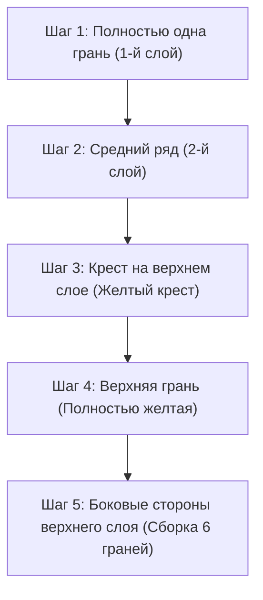

## 1. Трехмерная головоломка, где нужно найти 1 правильное решение из 43 квинтиллионов

Изобретенный в 1974 году венгерским профессором архитектуры Эрнё Рубиком «кубик Рубика» — это самая известная в мире трехмерная головоломка. В ней нужно вращать грани куба 3×3×3, чтобы собрать цвета всех 6 перемешанных граней.

Случайное вращение никогда не приведет к случайной сборке этой головоломки. Все потому, что количество возможных состояний кубика Рубика 3×3×3 составляет **«около 43 квинтиллионов (43 252 003 274 489 856 000) вариантов»**.
Однако участники соревнований, называемые спидкуберами, находят правильное решение (сборка 6 граней) из этого бесконечного лабиринта всего за несколько секунд. Высчитывают ли они это в своем гениальном уме? 
На самом деле нет. Они просто запоминают **«алгоритмы (последовательности)»** и тренируют мышечную память своих рук.

## 2. Понимание структуры кубика

Прежде чем учиться собирать кубик, вам нужно точно понять его структуру (типы деталей). Если вы не поймете этого, вы никогда не сможете его собрать.

Кубик не состоит из «27 маленьких кубиков (кубиков), сложенных вместе». Это конструкция, в которой к внутренней крестообразной оси прикреплены 3 следующих типа деталей:

1. **Центральные элементы (6 штук)**: Одноцветные элементы, расположенные в центре каждой грани. **Они зафиксированы на оси, и их взаимное расположение никогда не меняется** (напротив белого всегда желтый, напротив синего всегда зеленый и т.д.). Цвет этого центрального элемента определяет итоговый цвет грани.
2. **Реберные элементы (12 штук)**: Двухцветные элементы, расположенные на ребрах между гранями.
3. **Угловые элементы (8 штук)**: Трехцветные элементы, расположенные по углам.

Осознание того, что это не игра на «собирание цветов на грани», а **«игра, в которой вы перемещаете реберные и угловые элементы в правильные места (на цвета, которые показывают центральные элементы)»**, — это ключ к преодолению первого препятствия.

## 3. Для начинающих: Шаги метода LBL (Layer By Layer / Послойная сборка)

В настоящее время наиболее распространенным методом сборки среди новичков по всему миру является **«метод LBL (послойный метод)»**.
Это метод, при котором вы собираете 3 слоя (уровня) по очереди, подобно тому, как строится здание: снизу вверх, этаж за этажом.

### 1-й и 2-й слои (Интуиция и немного паттернов)
Первый (нижний) слой после небольшой практики можно собрать исключительно на интуиции. Сначала вы собираете на нижней грани «белый крест», а затем вставляете на места угловые элементы.
Следующий 2-й (средний) слой можно полностью собрать, просто запомнив 2 паттерна алгоритмов: «алгоритм перемещения элемента вправо» или «алгоритм перемещения элемента влево».

### 3-й слой: Время алгоритмов
Самым сложным является последний, 3-й (верхний) слой. Здесь требуется магическое действие: переместить элементы только 3-го слоя, не разрушая уже собранные 1-й и 2-й слои. Именно тут и применяются **«алгоритмы (строго определенные последовательности вращений)»**.
Например, если вы выполните определенную комбинацию движений вроде «R U R' U R U2 R'», произойдет следующее: «нижние два слоя останутся в исходном состоянии, а повернутся только определенные элементы верхней грани». Запомнив всего несколько подобных комбинаций, любой человек сможет гарантированно собрать все 6 граней.

## 4. Метод CFOP: Мир спидкуберов

Как только вы освоите метод LBL, вы сможете собирать 6 граней за 2–3 минуты даже при медленном вращении.
Однако соревнующиеся на мировом уровне спортсмены, собирающие кубик менее чем за 10 секунд, используют продвинутый метод сборки, развившийся из LBL, который называется **«метод CFOP** (также известный как метод Джессики Фридрих)».

В методе CFOP, чтобы максимально сократить количество ходов, спортсмены заучивают наизусть **в общей сложности 78 алгоритмов: «57 паттернов для OLL (ориентация последнего слоя, делая его полностью желтым)» и «21 паттерн для PLL (расстановка элементов последнего слоя по местам)»**, тренируясь так, чтобы руки двигались рефлекторно при одном лишь мимолетном взгляде на кубик.

## 5. «Число Бога» 20 и теория групп

Увлекательность кубика Рубика также глубоко связана с математикой (в частности, с «теорией групп»).
Вопрос: «За какое теоретически "максимальное количество ходов" можно собрать 6 граней из любого, даже самого запутанного состояния, если использовать оптимальный алгоритм?» — был давней темой исследований для математиков.

В результате масштабных вычислений с использованием суперкомпьютеров Google в 2010 году это наконец было доказано. Ответ: **«20 ходов»**.
Из любого из 43 квинтиллионов состояний, обладая совершенным, как у бога, разумом, можно гарантированно достичь собранного состояния не более чем за 20 ходов. В сообществе спидкуберов это число получило название «Число Бога (God's Number)».

## 6. Заключение

Кубик Рубика — это не «головоломка, которую могут решить только гении», а **головоломка, которую абсолютно любой может решить** благодаря «пониманию ее структуры и применению нескольких алгоритмов (формул)».
В наши дни на YouTube и других платформах опубликовано множество понятных обучающих видео. Если у вас в шкафу пылится кубик, который вы когда-то не смогли собрать и бросили, обязательно попробуйте еще раз, используя силу алгоритмов. Удовольствие от момента, когда вы вращаете грани, и в самом конце головоломка идеально собирается воедино — это ни с чем не сравнимый опыт.
