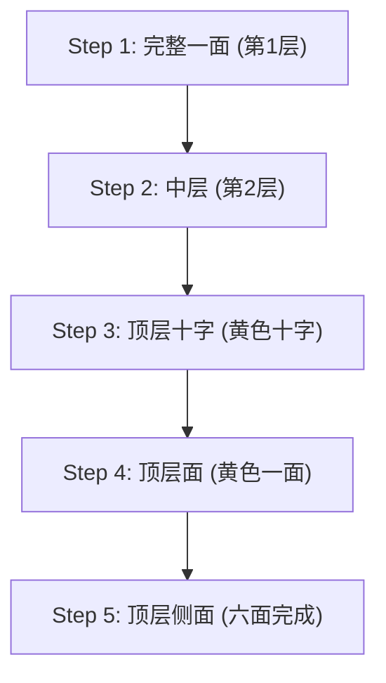

## 1. 寻找4325京分之一正确答案的立体谜题

1974年由匈牙利建筑学教授厄尔诺·鲁比克发明的“魔方”。通过旋转3×3×3立方体的各个面，将打乱的六面颜色还原，这是世界上最著名的立体谜题。

这个谜题绝对不可能通过随便转动而偶然还原。因为3×3×3魔方的状态组合多达 **“约4325京（43,252,003,274,489,856,000）种”** 。
然而，被称为魔方速拧选手（Speedcuber）的竞技者们，却能在这无尽的迷宫中仅用几秒钟就找出正确答案（完成六面还原）。他们是在用天才般的大脑进行计算吗？ 
其实并非如此，他们只是记忆了“ **算法（步骤）** ”，并让手部肌肉形成了记忆而已。

## 2. 理解魔方的结构

在学习还原方法之前，首先需要正确理解魔方的结构（零件的种类）。如果在这个环节产生误解，无论过多久都无法完成还原。

魔方并不是“由27个小骰子（方块）聚集而成”的。它的结构是在内部十字形的轴上，挂着以下3种零件：

1. **中心块（6个）**: 位于各个面中心，只有一种颜色的零件。 **它们固定在轴上，相对位置绝对不会改变** （白色的对面一定是黄色，蓝色的对面一定是绿色等）。这个中心块的颜色，决定了该面最终的颜色。
2. **棱块（12个）**: 位于面与面交界边上，有两种颜色的零件。
3. **角块（8个）**: 位于角落，有三种颜色的零件。

不要将其理解为“还原面的颜色”，而是将其视为“ **将棱块和角块移动到正确位置（中心块所指示的颜色）的游戏** ”，这是突破第一道难关的关键。

## 3. 面向初学者：LBL法（层先法）的步骤

目前，全世界初学者最常使用的还原方法是“ **LBL法（层先法）** ”。
这是一种像建楼一样从下往上一层一层，依次还原3个层（Layer）的方法。

### 第1层和第2层（直觉与少量公式）
最初的第1层（底层），只要稍加练习就能仅凭直觉进行还原。首先在底面做一个“白色十字”，然后将角块嵌入。
接下来的第2层（中层），只需记住将特定零件“向右落下的步骤”或“向左落下的步骤”这两种模式的算法，就能将所有零件嵌入。

### 第3层：算法的登场
最困难的是最后的第3层（顶层）。在这里，需要一种如同魔法般的操作——在不破坏已经还原的第1、2层的前提下，只替换第3层的零件。此时就要用到“ **算法（由旋转记号组成的固定步骤）** ”。
例如，执行“R U R' U R U2 R'”这样固定的转动方式，就会出现“下面的2层保持原状，只有顶面的特定零件发生旋转”的现象。只要记住几种这样的算法，任何人都能确实地完成六面还原。

## 4. CFOP法：速拧选手的世界

只要掌握了LBL法，即使慢慢转动也能在2到3分钟内完成六面还原。
然而，那些用时不到10秒的世界顶尖竞技者们，使用的是一种名为“ **CFOP法** （又称弗雷德里奇法）”的高级解法，它是LBL法的进阶版本。

在CFOP法中，为了将步骤省略到极限，需要将 **“OLL（使顶面颜色全部变为黄色的步骤）的57种模式”和“PLL（使侧面位置对齐的步骤）的21种模式”，总计多达78个算法** 全部记下，并进行训练，以达到只需看一眼盘面就能反射性地做出手部动作的程度。

## 5. 上帝之数“20”与群论

魔方的趣味性与数学（尤其是“群论”）也有着极深的渊源。
“从任何被彻底打乱的状态开始，理论上只要采取最优步骤，‘最多几步’就能完成六面还原？”这个问题是数学家们多年来的研究主题。

经过使用Google超级计算机等进行的庞大计算，2010年终于得出了证明。答案是“ **20步** ”。
在多达4325京种状态中，无论是哪一种状态，只要拥有如神一般完美的大脑，都必定能在20步以内达到还原状态。这个数字在魔方界被称为“上帝之数 (God's Number)”。

## 6. 总结

魔方并不是“只有天才才能解开的谜题”，而是通过“理解结构并执行几个算法（公式）”， **任何人必定都能解开的谜题** 。
现在，YouTube等平台上已经发布了大量易懂的解说视频。如果以前曾因为无法还原而受到挫折，导致魔方被闲置在壁橱里，请务必借助算法的力量再次进行挑战。伴随着咔嚓咔嚓的转动声，在最后谜题严丝合缝地还原的那一瞬间，这种快感是任何事物都无法替代的体验。
