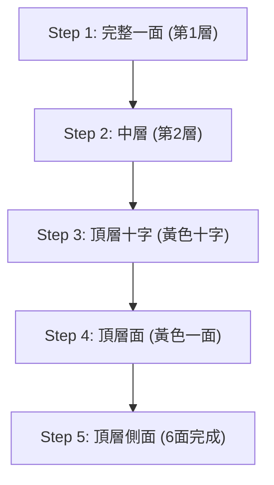

## 1. 從4325京分之一的機率中找出正確答案的立體益智玩具

「魔術方塊」由匈牙利建築學者厄爾諾·魯比克於1974年發明。這是一款將 3×3×3 的立方體各面旋轉，使打亂的六面顏色恢復一致的立體益智玩具，也是世界上最著名的立體益智玩具。

這款益智玩具絕對不可能隨便轉轉就碰巧解開。因為 3×3×3 的魔術方塊狀態組合高達 **「約4325京（43,252,003,274,489,856,000）種」** 。
然而，被稱為「競速玩家（Speedcuber）」的參賽者們，卻能從這無盡的迷宮中，僅用短短幾秒就導出正確答案（完成六面）。他們難道是用天才般的頭腦在計算嗎？ 
其實並非如此，他們只是記住了 **「演算法（步驟）」** ，並將其深深烙印在手部肌肉記憶中而已。

## 2. 了解方塊的構造

在學習解法之前，必須先正確了解方塊的構造（零件的種類）。如果對此有所誤解，無論過多久都無法將其復原。

魔術方塊並不是「由27個小骰子（小方塊）組合而成」。它的構造是在內部十字形的軸上，掛著以下3種零件：

1. **中心塊（6個）** ：位於各面中心，只有1種顏色的零件。 **它們固定在軸上，位置關係絕對不會改變** （白色的對面一定是黃色，藍色的對面一定是綠色等）。這個中心塊的顏色將決定該面最終的顏色。
2. **邊塊（12個）** ：位於面與面交界處，有2種顏色的零件。
3. **角塊（8個）** ：位於角落，有3種顏色的零件。

不要認為是「把面的顏色湊齊」，而是要體認到這是一個 **「將邊塊和角塊移動到正確位置（中心塊所指示的顏色）的遊戲」** ，這才是突破第一道難關的關鍵。

## 3. 適合初學者：LBL法（Layer By Layer）的步驟

目前，全世界初學者最常使用的解法就是 **「LBL法（層先法）」** 。
這就像是從下而上一層層蓋房子一樣，依序完成3個層（Layer）的方法。

### 第1層與第2層（直覺與少許的模式）

最初的第1層（底層），只要稍微練習就能完全靠直覺完成。首先在底面做出「白色十字」，接著再將角塊嵌入。
接下來的第2層（中層），只需記住將特定零件「往右放下的步驟」或「往左放下的步驟」這2種模式的演算法，就能將所有零件嵌入。

### 第3層：演算法登場

最困難的是最後的第3層（頂層）。在這裡，必須在不破壞已完成的第1、2層的情況下，僅替換第3層，需要進行如同魔法般的操作。這時就要使用 **「演算法（旋轉代號的固定步驟）」** 。
例如，執行「R U R' U R U2 R'」這樣固定的轉法，就會出現「下方2層保持原狀，只有頂面特定零件旋轉」的現象。只要記住幾種這類公式，任何人都能確實完成6面。

## 4. CFOP法：競速玩家的世界

只要精通LBL法，即使慢慢轉，也能在2到3分鐘內完成6面。
然而，能在10秒內解完的世界頂尖參賽者們，使用的是被稱為 **「CFOP法」** （又稱Fridrich Method），由LBL法發展而來的高階解法。

在CFOP法中，為了將步驟省略到極致，必須將 **「OLL（將頂面顏色全變為黃色的步驟）共57種模式」與「PLL（對齊側面位置的步驟）共21種模式」，合計多達78個的演算法** 全部背下，並訓練到只要一瞥盤面，手就會反射性地動起來的程度。

## 5. 上帝的數字「20」與群論

魔術方塊的趣味性也與數學（特別是「群論」）有著很深的關聯。
「不管被隨機打亂到什麼狀態，理論上若採取最佳步驟，『最多需要幾步』就能完成6面？」這個問題，長年以來都是數學家們探討的主題。

透過Google超級電腦等進行龐大計算的結果，終於在2010年得到了證明。答案是 **「20步」** 。
無論是從4325京種之中的哪一種狀態開始，只要擁有如神一般完美的頭腦，一定能在20步以內達到完成狀態。這個數字在魔術方塊界被稱為「上帝的數字（God's Number）」。

## 6. 總結

魔術方塊並非「只有天才才能解開的益智玩具」，而是只要透過「了解構造與執行幾個演算法（公式）」， **任何人一定都能解開的益智玩具** 。
現在在YouTube等平台上有許多淺顯易懂的解說影片。如果以前曾因為解不開而感到挫折，將方塊塵封在壁櫥裡，請務必借助演算法的力量再次挑戰看看。轉動著喀喀作響的方塊，最後完美拼齊那一瞬間的快感，是無法用任何事物取代的體驗。
