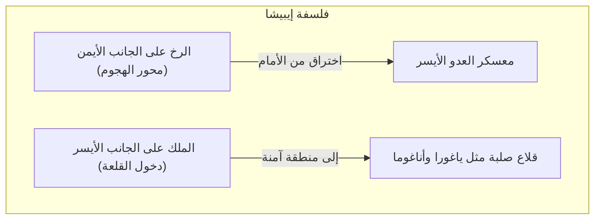
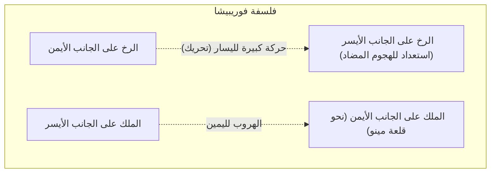

## 1. التطور الفريد للعبة اللوحية المطلقة في اليابان

الشوغي (本将棋) هي لعبة لوحية تطورت بشكل فريد في اليابان، على الرغم من أن أصولها تعود إلى اللعبة الهندية القديمة "شطورنجا" تمامًا مثل الشطرنج والشطرنج الصيني (شانغتشي).

الميزة الأكثر تميزًا تكمن في قاعدة " **إعادة استخدام القطع الملتقطة** ".
في الشطرنج، يتم إزالة قطع الخصم الملتقطة من اللوحة، ومع اقتراب نهاية اللعبة، يقل عدد القطع وتصبح اللوحة أبسط. لكن في الشوغي، يمكنك إسقاط (وضع) قطع الخصم الملتقطة في أي مكان تريده على اللوحة كـ "قواتك الخاصة (قطع في اليد)".
ونتيجة لذلك، كلما اقتربت نهاية اللعبة، زاد عدد القطع، وأصبحت اللوحة معقدة للغاية ولا يمكن التنبؤ بها، مما يمنحها عمقًا لا مثيل له في العالم.

## 2. مراجعة القواعد الأساسية

تُلعب الشوغي على لوحة مكونة من 81 مربعًا، 9 مربعات طولاً و 9 مربعات عرضًا.

- **شرط الفوز**: وضع ملك الخصم (أوشو أو غيوشو) في حالة "كش مات" (حالة سيتم فيها التقاطه في النقلة التالية بغض النظر عن كيفية هروبه).
- **أنواع القطع وحركاتها**: 
  - **البيدق (فو)**: يتحرك مربعًا واحدًا للأمام. وهي القطعة الأكثر عددًا وتعمل كجدار في الخطوط الأمامية.
  - **الرمح (كيو)**: يمكنه التقدم للأمام لأي عدد من المربعات، لكنه لا يستطيع الرجوع للخلف أو التحرك للجانبين.
  - **الفارس (كي)**: يقفز للأمام بشكل قطري، على غرار حركة الحصان في الشطرنج.
  - **الجنرال الفضي (غين)**: يتحرك للأمام، أو بشكل قطري للأمام، أو بشكل قطري للخلف. وهو القوة الهجومية الرئيسية.
  - **الجنرال الذهبي (كين)**: يتحرك للأمام، أو بشكل قطري للأمام، أو للجانبين، أو للخلف (لا يمكنه التحرك بشكل قطري للخلف). وهو أساس الدفاع.
  - **الرخ (هي)**: أقوى قطعة هجومية يمكنها التحرك عموديًا وأفقيًا لأي مسافة (تعادل القلعة في الشطرنج).
  - **الفيل (كاكو)**: قطعة قوية يمكنها التحرك قطريًا لأي مسافة (تعادل الفيل في الشطرنج).
  - **الملك (غيو / أو)**: يتحرك مربعًا واحدًا في جميع الاتجاهات. التقاطه يعني الخسارة.
- **الترقية (ناري)**: عند دخول منطقة الخصم (الصفوف الثلاثة الأبعد)، يمكن ترقية القطعة (يتم قلبها) لتصبح أقوى. يصبح الرخ "تنيناً"، ويصبح الفيل "حصاناً"، بينما تأخذ قطع الفضة والفارس والرمح والبيدق نفس حركة "الجنرال الذهبي".

## 3. الاستراتيجيتان الرئيسيتان في الشوغي: "إيبيشا" و "فوريبيشا"

تنقسم تكتيكات الشوغي (الافتتاحيات) بشكل رئيسي إلى مدرستين حسب " **أين يتم استخدام الرخ** "، وهو أقوى قطعة هجومية. وهما "إيبيشا" (الرخ الثابت) و "فوريبيشا" (الرخ المتحرك).

### إيبيشا: الطريق الملكي للاختراق الأمامي

"إيبيشا" هو تكتيك يُترك فيه الرخ في موضعه الأصلي على الجانب الأيمن (العمود الثاني) منذ البداية، ويتم اختراق معسكر العدو بشكل مباشر من هناك.

- **المميزات**: يعمل على اختراق دفاع الخصم من الأمام بتنسيق بين الرخ والفيل والفضة، وغيرها. تتسم العديد من الهجمات بالمنطقية والمباشرة، ويُعتبر "التكتيك الملكي" الذي يعتمده الكثير من لاعبي الشوغي المحترفين.
- **القلاع النموذجية (حماية الملك)**:
  - **ياغورا**: دفاع تقليدي وجميل للإيبيشا، يحيط بالملك بثلاث قطع من الذهب والفضة.
  - **أناغوما**: يخبئ الملك في زاوية (حافة) اللوحة، ويغلق عليه بالذهب والفضة، ويتميز بكونه أقوى دفاع في الشوغي الحديث.

### فوريبيشا: جماليات الهجوم المضاد

"فوريبيشا" هو تكتيك يتم فيه تحريك الرخ الموجود على الجانب الأيمن بشكل كبير إلى الجانب الأيسر (أو الوسط) من اللوحة في المراحل الأولى من اللعبة.

- **المميزات**: تكتيك يتغلب فيه اللين على القوة، حيث يتم استخدام الرخ المنقول لليسار والفيل لشن "هجوم مضاد" عندما يبادر الخصم بالهجوم. يهرب الملك إلى الجانب الأيمن حيث كان الرخ لتعزيز الدفاع. يتطلب إحساسًا بـ "تسليم الدور" (مراقبة حركة الخصم)، ويحظى بشعبية كبيرة بين الهواة.
- **التكتيكات النموذجية**:
  - **شيكينبيشا**: تحريك الرخ إلى العمود الرابع من اليسار، وهو التكتيك الأكثر توازنًا ويُنصح به للمبتدئين.
  - **ناكابيشا**: تحريك الرخ إلى مركز اللوحة تمامًا (العمود الخامس)، وهو فوريبيشا هجومي يهدف لاختراق الوسط.
- **القلاع النموذجية**:
  - **قلعة مينو**: قلعة جميلة مخصصة للفوريبيشا، يمكن بناؤها بسرعة ولا تتطلب حركات كثيرة، ومع ذلك فهي صلبة جدًا ضد الهجمات الجانبية.

## 4. "البداية، الوسط، والنهاية" في الشوغي

تنقسم مراحل لعب الشوغي بشكل رئيسي إلى ثلاث مراحل.

1. **البداية (بناء التشكيلات)**: فترة الاستعداد حيث يقوم كلا اللاعبين بتطويق الملك (تعزيز الدفاع) وبناء التشكيلة الهجومية (إيبيشا أو فوريبيشا).
2. **الوسط (صراع القطع)**: يبدأ القتال عندما يبادر أحدهما بالهجوم. هنا يتبادل اللاعبون القطع ويجمعون "القطع المحمولة (قطع في اليد)" تحضيراً لإنهاء اللعبة (الضربة القاضية).
3. **النهاية (الإغلاق والكش مات)**: صراع على نزع دفاعات ملك الخصم، وتصبح مسألة سرعة حسابية (حرب النقلة الواحدة) لمعرفة من يستطيع وضع ملك الآخر في كش مات أولاً. يتطلب الأمر قراءة قصوى للحركات مثل "هل ملكي في أمان؟" و "كم عدد النقلات المتبقية لعمل كش مات لملك الخصم؟".

## 5. الخلاصة

الشوغي ليست مجرد لعبة لتبادل القطع. بل هي رياضة فكرية تتطلب الرؤية الاستراتيجية في اختيار "القلعة والتكتيك" في البداية، وحس التوازن في "مكاسب وخسائر القطع والرؤية الشاملة" في الوسط، والقدرة الحسابية الساحقة نحو "الكش مات" في النهاية.

في البداية، لمَ لا تخطو خطوتك الأولى في عالم الشوغي العميق باختيار "هل تفضل الهجوم المباشر بإيبيشا، أم الهجوم المضاد بفوريبيشا؟" وتعلم قلعة واحدة مفضلة لديك.
