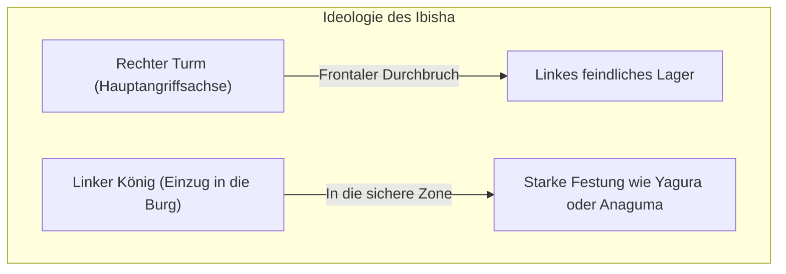
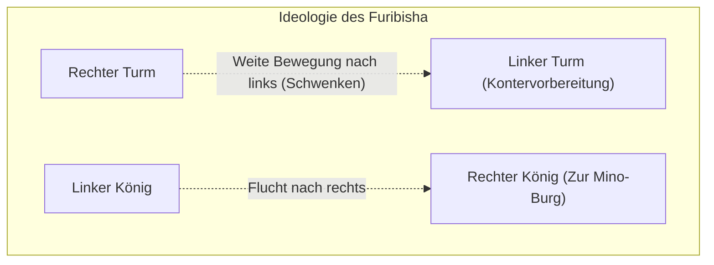

## 1. Das ultimative Brettspiel mit einzigartiger Entwicklung in Japan

Shogi (Hon-Shogi) ist ein Brettspiel, das sich in Japan auf einzigartige Weise entwickelt hat und dabei wie Schach und Xiangqi (chinesisches Schach) auf das alte indische Spiel „Chaturanga“ zurückgeht.

Die größte Besonderheit liegt in der Regel der „**Wiederverwendung geschlagener Figuren**“.
Beim Schach werden die geschlagenen Figuren des Gegners vom Brett entfernt, und je näher das Endspiel rückt, desto weniger Figuren gibt es und desto einfacher wird das Brett. Beim Shogi können Sie jedoch die geschlagenen Figuren des Gegners als „Ihre eigenen Truppen (Figuren auf der Hand)“ an einer beliebigen Stelle auf dem Brett einsetzen.
Dies führt dazu, dass die Anzahl der Figuren gegen Ende des Spiels zunimmt und das Brett extrem komplex und unberechenbar wird, was ihm eine weltweit beispiellose Tiefe verleiht.

## 2. Wiederholung der Grundregeln

Shogi wird auf einem Brett mit 81 Feldern gespielt, 9 vertikal und 9 horizontal.

- **Siegbedingungen**: Den König des Gegners (Osho oder Gyokusho) in einen „Schachmatt“-Zustand (Tsumi) versetzen (ein Zustand, in dem er beim nächsten Zug geschlagen wird, egal wie er flieht).
- **Arten von Figuren und ihre Bewegungen**:
  - **Bauer (Fuhyo / Fu)**: Rückt nur ein Feld vor. Die zahlreichste Figur, die als Mauer an der vordersten Front dient.
  - **Lanze (Kyosha / Kyo)**: Kann beliebig weit vorrücken, aber nicht rückwärts oder seitwärts gehen.
  - **Springer (Keima / Kei)**: Springt diagonal nach vorne, ähnlich wie der Springer im Schach.
  - **Silbergeneral (Ginsho / Gin)**: Kann nach vorne, diagonal nach vorne und diagonal nach hinten ziehen. Die Hauptangriffskraft.
  - **Goldgeneral (Kinsho / Kin)**: Kann nach vorne, diagonal nach vorne, seitwärts und nach hinten ziehen (nicht diagonal nach hinten). Der Dreh- und Angelpunkt der Verteidigung.
  - **Turm (Hisha / Hi)**: Die stärkste Angriffsfigur, die sich beliebig weit vertikal und horizontal bewegen kann (entspricht dem Turm im Schach).
  - **Läufer (Kakugyo / Kaku)**: Eine mächtige Figur, die sich beliebig weit diagonal bewegen kann (entspricht dem Läufer im Schach).
  - **König (Osho / Gyokusho / Gyoku)**: Kann ein Feld in jede Richtung ziehen. Wenn er geschlagen wird, verliert man das Spiel.
- **Beförderung (Nari)**: Wenn eine Figur in das gegnerische Lager (innerhalb der hintersten drei Reihen) eindringt, kann sie aufgewertet (umgedreht) werden. Der Turm wird zum „Drachenkönig“ (Ryu), der Läufer zum „Drachenpferd“ (Uma) und Silber, Springer, Lanze und Bauer bewegen sich genauso wie der „Goldgeneral“ (Kin).

## 3. Die zwei großen Strategien des Shogi: „Ibisha“ und „Furibisha“

Die Eröffnungsstrategien (Senpo) im Shogi werden grob in zwei Denkschulen unterteilt, je nachdem, „**wo der Turm, die stärkste Angriffsfigur, eingesetzt wird**“. Dies sind „Ibisha“ (Statischer Turm) und „Furibisha“ (Schwenkturm).

### Ibisha (Statischer Turm): Der königliche Weg des Frontaldurchbruchs

„Ibisha“ ist eine Strategie, bei der der Turm in seiner ursprünglichen Position auf der rechten Seite (2. Linie) belassen wird und von dort aus direkt in das feindliche Lager einbricht.

- **Merkmale**: Durchbricht die gegnerische Verteidigung von vorne, indem Turm, Läufer, Silber usw. koordiniert werden. Es gibt viele logische und geradlinige Angriffe, und es gilt als die „königliche Strategie“, die von vielen professionellen Shogi-Spielern übernommen wird.
- **Typische Burgen (Verteidigung des Königs)**:
  - **Yagura**: Die traditionelle und schöne Verteidigung des Ibisha, bei der der König mit drei Gold- und Silberfiguren umschlossen wird.
  - **Anaguma (Bärenhöhle)**: Die stärkste Verteidigung im modernen Shogi, bei der der König in der Ecke des Brettes versteckt und vollständig mit Gold und Silber abgedeckt wird.

### Furibisha (Schwenkturm): Die Ästhetik des Konters

„Furibisha“ ist eine Strategie, bei der der Turm auf der rechten Seite in der Anfangsphase des Spiels weit auf die linke Seite (oder in die Mitte) des Brettes verschoben (geschwenkt) wird.

- **Merkmale**: Eine Strategie, bei der das Weiche das Harte besiegt, indem man den gegnerischen Angriff mit einem „Konter“ unter Verwendung des nach links geschwenkten Turms und des Läufers abwehrt. Der König flieht auf die rechte Seite, wo sich der Turm befand, und festigt die Verteidigung. Es erfordert ein Gespür für das Passen (die Züge des Gegners abwarten) und ist bei Amateuren sehr beliebt.
- **Typische Strategien**:
  - **Shikenbisha (Vierte-Linie-Turm)**: Den Turm auf die 4. Linie von links schwenken. Die ausgewogenste Strategie, die auch Anfängern empfohlen wird.
  - **Nakabisha (Zentraler Turm)**: Eine offensive Furibisha-Strategie, die auf einen Durchbruch in der Mitte abzielt, indem der Turm in die Mitte des Brettes (5. Linie) bewegt wird.
- **Typische Burg**:
  - **Mino-Burg (Mino-gakoi)**: Eine schöne Burg exklusiv für Furibisha, die schnell und mit wenigen Zügen aufgebaut werden kann und dennoch extrem stark gegen Angriffe von der Seite ist.

## 4. „Eröffnung, Mittelspiel und Endspiel“ im Shogi

Der Spielablauf im Shogi wird grob in drei Phasen unterteilt.

1. **Eröffnung (Aufbau der Formation)**: Eine Vorbereitungsphase, in der beide Spieler ihren König einschließen (die Verteidigung festigen) und ihre Angriffsformation aufbauen (ob Ibisha oder Furibisha).
2. **Mittelspiel (Aufeinandertreffen der Figuren)**: Einer der Spieler greift an und der Kampf beginnt. Hier tauschen die Spieler Figuren aus und sammeln „Figuren auf der Hand (Tegoma)“, um sich auf das Yose (den finalen Angriff) im Endspiel vorzubereiten.
3. **Endspiel (Yose und Schachmatt)**: Es ist eine Geschwindigkeitsberechnung (ein Kampf um einen Zug Differenz), bei der die Spieler die Verteidigung des gegnerischen Königs abreißen und versuchen, den gegnerischen König zuerst schachmatt zu setzen. Es erfordert extremes Vorausdenken: „Ist mein eigener König sicher?“ und „In wie vielen Zügen ist der gegnerische König schachmatt?“.

## 5. Zusammenfassung

Shogi ist nicht nur ein einfaches Schlagen von Figuren. Es ist ein intellektueller Sport, der alles erfordert: strategische Vorstellungskraft bei der „Wahl von Burg und Strategie“ in der Eröffnung, einen Sinn für das Gleichgewicht zwischen „Gewinn und Verlust von Figuren und der Gesamtperspektive“ im Mittelspiel und überwältigende Rechenleistung auf dem Weg zum „Schachmatt“ im Endspiel.

Wie wäre es, wenn Sie den ersten Schritt in die tiefe Welt des Shogi machen, indem Sie zunächst entscheiden, ob Sie „Ibisha mögen, das direkt angreift, oder Furibisha, das auf Konter abzielt“, und eine Ihrer Lieblingsburgen lernen?
