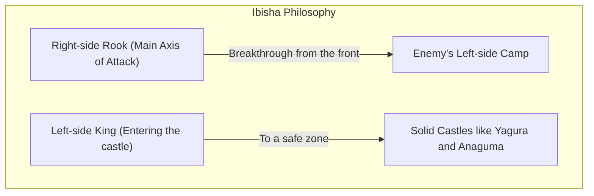
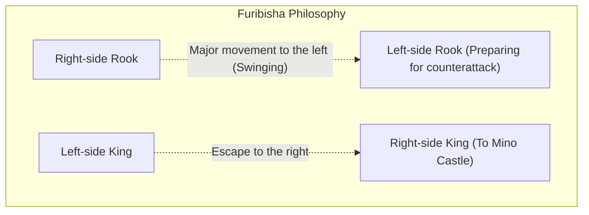

## 1. The Ultimate Board Game that Evolved Uniquely in Japan

Shogi (Japanese chess), while sharing its origins with chess and Xiangqi (Chinese chess) in the ancient Indian game "Chaturanga", is a board game that has undergone its own unique evolution in Japan.

Its greatest uniqueness lies in the rule of "**reusing captured pieces**".
In chess, the opponent's pieces that you capture are removed from the board, and as the endgame approaches, the number of pieces decreases and the board becomes simpler. In shogi, however, you can drop the opponent's captured pieces anywhere on the board as your own "military force (pieces in hand)".
Because of this, the closer it gets to the endgame, the more the number of pieces in play increases, making the board extremely complex and unpredictable—giving it a profound depth unparalleled anywhere in the world.

## 2. Review of the Basic Rules

Shogi is played on a board with 9 vertical and 9 horizontal squares, totaling 81 squares.

- **Victory Condition**: To put the opponent's King (Osho or Gyokusho) into a state of "Tsumi" (checkmate: a state where it will be captured on the next turn no matter how it escapes).
- **Types of Pieces and Their Movements**: 
  - **Pawn (Fuhyo/Fu)**: Moves forward only one square. The most numerous, serving as a wall on the front lines.
  - **Lance (Kyosha/Kyo)**: Can move forward any number of squares, but cannot go backward or sideways.
  - **Knight (Keima/Kei)**: Jumps diagonally forward, similar to a Knight in chess.
  - **Silver General (Ginsho/Gin)**: Can move forward, diagonally forward, or diagonally backward. The main force of attack.
  - **Gold General (Kinsho/Kin)**: Can move forward, diagonally forward, sideways, or backward (cannot go diagonally backward). The cornerstone of defense.
  - **Rook (Hisha/Hi)**: The strongest attacking piece that can move vertically and horizontally any number of squares (equivalent to a Rook in chess).
  - **Bishop (Kakugyo/Kaku)**: A powerful piece that can move diagonally any number of squares (equivalent to a Bishop in chess).
  - **King (Osho/Gyokusho/Gyoku)**: Can move one square in all directions. You lose if this is captured.
- **Promotion (Nari)**: When a piece enters the opponent's territory (within the top three ranks), it can power up (flip over). A Rook becomes a "Dragon", a Bishop becomes a "Horse", and Silver, Knight, Lance, and Pawn become the same movement as a "Gold".

## 3. The Two Major Strategies in Shogi: "Ibisha" and "Furibisha"

Shogi openings (tactics) are broadly divided into two schools depending on "**where to use the Rook**", the strongest attacking piece. These are "Ibisha" (Static Rook) and "Furibisha" (Ranging Rook).

### Ibisha (Static Rook): The Royal Road of Frontal Breakthrough

"Ibisha" is a tactic where the Rook is left in its initial position on the right side (2nd file), and from there it breaks straight through the enemy camp.

- **Characteristics**: It coordinates the Rook, Bishop, Silver, etc., to break the opponent's defense from the front. It involves many logical, straight-line attacks and is considered the "orthodox tactic" adopted by many professional players.
- **Typical Castles (King's Defense)**:
  - **Yagura**: A traditional and beautiful defense of Ibisha, enclosing the King with three Golds and Silvers.
  - **Anaguma**: Hiding the King in the corner (edge) of the board and completely covering it with Golds and Silvers, it boasts the strongest solidity in modern shogi.

### Furibisha (Ranging Rook): The Aesthetics of Counterattack

"Furibisha" is a tactic in which the Rook on the right side is moved widely (ranged) to the left side (or center) of the board during the opening stage.

- **Characteristics**: It is a tactic where "softness overcomes hardness", intercepting the opponent's attack with a "counter" using the Rook and Bishop swung to the left. The King escapes to the right side where the Rook used to be to solidify the defense. It requires a sense of waiting (seeing what the opponent does) and is extremely popular among amateurs.
- **Typical Tactics**:
  - **Shikenbisha (Fourth File Rook)**: Swinging the Rook to the fourth file from the left. It is the most balanced tactic and recommended for beginners.
  - **Nakabisha (Central Rook)**: Moving the Rook to the very center of the board (5th file), an aggressive Furibisha aiming for a central breakthrough.
- **Typical Castles**:
  - **Mino Castle**: A beautiful castle exclusively for Furibisha that can be built quickly with few moves, yet is extremely solid against sideways attacks.

## 4. The "Opening, Middle Game, and Endgame" of Shogi

The progression of a shogi game is broadly divided into three phases.

1. **Opening (Formation Building)**: A preparation period where both players enclose their Kings (solidify their defenses) and build their attacking formations (whether Ibisha or Furibisha).
2. **Middle Game (Clash of Pieces)**: One side initiates the attack, and the battle begins. Here, pieces are exchanged, and "pieces in hand (captured pieces)" are accumulated to prepare for the final checkmate (delivering the finishing blow) in the endgame.
3. **Endgame (Closing In and Checkmate)**: Stripping away each other's King defenses, it becomes a speed calculation (offense and defense with a one-move difference) of who can checkmate the opponent's King first. Extreme reading is required, such as "Is my King safe?" and "In how many moves will the opponent's King be checkmated?".

## 5. Conclusion

Shogi is not just about capturing pieces. It is an intellectual sport that demands everything: the strategic conceptual ability in the "choice of castle and tactic" in the opening, the sense of balance in the "gain and loss of pieces and the grand perspective" in the middle game, and the overwhelming calculation power towards "checkmate" in the endgame.

First, why not take your first step into the profound world of shogi by choosing whether "you prefer Ibisha for attacking straight ahead, or Furibisha for aiming at counterattacks," and learning one of your favorite castles?
