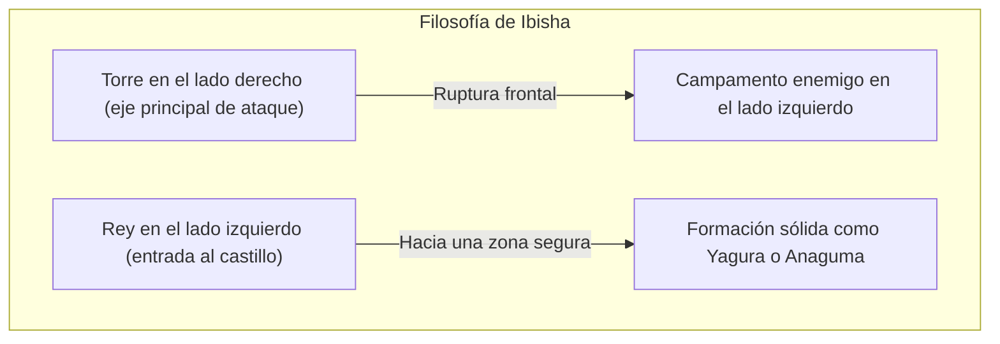
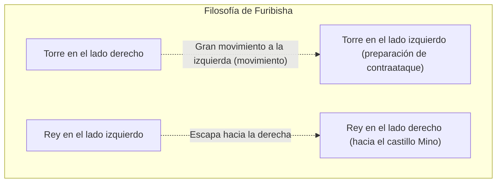

## 1. El juego de tablero definitivo con una evolución única en Japón

El shogi (hon-shogi), aunque tiene su origen en el "chaturanga", un antiguo juego de la India que también es el antepasado del ajedrez y del xiangqi (ajedrez chino), es un juego de mesa que ha tenido una evolución única en Japón.

Su mayor particularidad reside en la regla de la "**reutilización de las piezas capturadas**".
En el ajedrez, las piezas capturadas al oponente se retiran del tablero, por lo que el número de piezas disminuye hacia el final del juego y el tablero se vuelve más simple. Sin embargo, en el shogi, puedes colocar las piezas que has capturado al oponente como tus propias "fuerzas (piezas en mano)" en cualquier lugar que desees del tablero.
Debido a esto, a medida que se acerca el final de la partida, el número de piezas en juego aumenta, haciendo que el tablero se vuelva extremadamente complejo e impredecible, dándole una profundidad sin parangón en el mundo.

## 2. Repaso de las reglas básicas

El shogi se juega en un tablero de 9 casillas de largo por 9 de ancho, con un total de 81 casillas.

- **Condición de victoria**: Poner al rey (Osho o Gyokusho) del oponente en estado de "jaque mate" (tsumi, una situación en la que será capturado en el próximo turno sin importar a dónde escape).
- **Tipos de piezas y sus movimientos**: 
  - **Peón (Fuhyo / Fu)**: Avanza una sola casilla hacia adelante. Son los más numerosos y actúan como un muro en primera línea.
  - **Lancero (Kyosha / Kyo)**: Puede avanzar hacia adelante tantas casillas como desee, pero no puede moverse hacia atrás ni hacia los lados.
  - **Caballero (Keima / Kei)**: Salta hacia adelante en diagonal, similar al movimiento del caballo en el ajedrez.
  - **General de Plata (Ginsho / Gin)**: Puede avanzar hacia adelante, o en diagonal hacia adelante o hacia atrás. Es la fuerza principal de ataque.
  - **General de Oro (Kinsho / Kin)**: Puede avanzar hacia adelante, en diagonal hacia adelante, a los lados y hacia atrás (no puede moverse en diagonal hacia atrás). Es la clave de la defensa.
  - **Torre (Hisha / Hi)**: La pieza de ataque más fuerte, que puede moverse cualquier número de casillas vertical y horizontalmente (equivalente a la torre del ajedrez).
  - **Alfil (Kakugyo / Kaku)**: Una poderosa pieza que puede moverse cualquier número de casillas en diagonal (equivalente al alfil del ajedrez).
  - **Rey (Osho / Gyokusho / Gyoku)**: Puede moverse una casilla en cualquier dirección. Si es capturado, pierdes.
- **Coronación (Nari)**: Cuando una pieza entra en la zona enemiga (dentro de las 3 últimas filas), puede aumentar su poder (darse la vuelta). La torre se convierte en "Dragón" (Ryu), el alfil en "Caballo" (Uma), y la plata, el caballero, el lancero y el peón adquieren los mismos movimientos que un "General de Oro" (Kin).

## 3. Las dos grandes estrategias del shogi: "Ibisha" y "Furibisha"

Las tácticas (aperturas) del shogi se dividen a grandes rasgos en dos escuelas dependiendo de "**dónde utilizar la torre**", que es la pieza de ataque más fuerte. Estas son "Ibisha" (torre estática) y "Furibisha" (torre móvil).

### Ibisha (Torre estática): El camino real del ataque frontal

"Ibisha" es una táctica en la que la torre se mantiene en su posición original en el lado derecho (columna 2) y desde allí rompe la formación enemiga de frente.

- **Características**: Rompe la defensa del oponente desde el frente coordinando la torre, el alfil, la plata, etc. Implica muchos ataques lógicos y directos, y se considera la "táctica real" adoptada por muchos jugadores profesionales.
- **Castillos representativos (defensa del rey)**:
  - **Yagura**: Una defensa hermosa y tradicional de Ibisha que rodea al rey con tres piezas: oros y platas.
  - **Anaguma**: Esconde al rey en una esquina del tablero y lo cubre por completo con oros y platas, presumiendo de ser la defensa más sólida en el shogi moderno.

### Furibisha (Torre móvil): La estética del contraataque

"Furibisha" es una táctica en la que la torre del lado derecho se desplaza (se mueve) significativamente hacia el lado izquierdo (o el centro) del tablero durante la fase de apertura.

- **Características**: Es una táctica en la que "lo suave controla a lo duro", donde interceptas el ataque del oponente con un "contraataque" utilizando la torre movida hacia la izquierda y el alfil. El rey escapa hacia el lado derecho donde solía estar la torre para consolidar la defensa. Requiere un sentido de "pasar el turno" (esperar a ver qué hace el oponente) y es muy popular entre los aficionados.
- **Tácticas representativas**:
  - **Shikenbisha (Torre en la cuarta columna)**: Mueve la torre a la cuarta columna desde la izquierda. Es la táctica mejor equilibrada y también recomendada para principiantes.
  - **Nakabisha (Torre central)**: Mueve la torre al centro exacto del tablero (columna 5) para apuntar a un ataque por el centro. Es un Furibisha agresivo.
- **Castillos representativos**:
  - **Mino-gakoi (Castillo Mino)**: A pesar de que se puede formar rápidamente en pocos movimientos, es extremadamente sólido contra los ataques laterales. Es un castillo hermoso y exclusivo de Furibisha.

## 4. Las tres fases del shogi: "Apertura, Medio juego y Final"

El desarrollo de una partida de shogi se divide a grandes rasgos en tres fases:

1. **Apertura (Construcción de la formación)**: Período de preparación donde ambos jugadores encastillan sus reyes (consolidan su defensa) y construyen su formación de ataque (ya sea Ibisha o Furibisha).
2. **Medio juego (Choque de piezas)**: Comienza la batalla cuando uno de los dos ataca. Aquí se intercambian piezas para acumular "piezas en mano" (reserva) y prepararse para el acorralamiento final (el remate).
3. **Final (Acorralamiento y jaque mate)**: Consiste en desmantelar mutuamente la defensa del rey del oponente y entra en juego el cálculo de la velocidad de quién logrará dar jaque mate primero (una batalla de un solo movimiento de diferencia). Se exige una lectura extrema de situaciones como: "¿Está a salvo mi propio rey?" y "¿En cuántos movimientos estará el rey del oponente en jaque mate?".

## 5. Resumen

El shogi no es simplemente un juego de capturar piezas. Es un deporte intelectual que requiere todo lo siguiente: la capacidad de concepción estratégica en la "elección del castillo y la táctica" durante la apertura, el sentido de equilibrio entre "ganancia y pérdida de piezas y la visión global" en el medio juego, y la abrumadora capacidad de cálculo hacia el "jaque mate" en el final de la partida.

En primer lugar, ¿por qué no dar tu primer paso en el profundo mundo del shogi eligiendo si "te gusta Ibisha, que ataca de frente, o Furibisha, que busca el contraataque" y aprendiendo tu castillo favorito?
