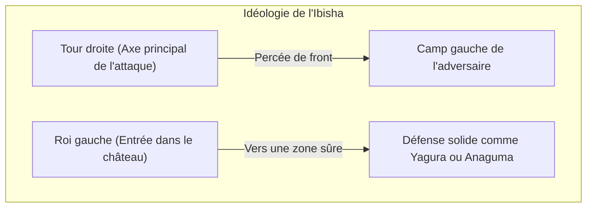
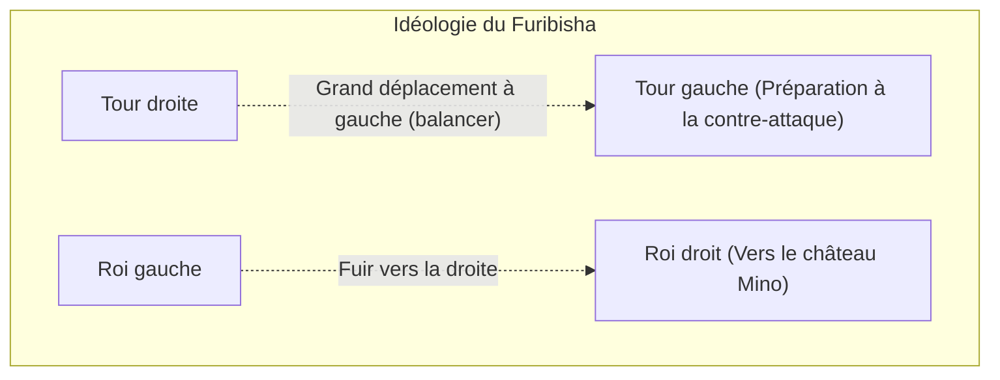

## 1. Le jeu de plateau ultime ayant connu une évolution unique au Japon

Le Shogi (échecs japonais) a pour origine le jeu indien ancien « Chaturanga », tout comme les échecs et le Xiangqi (échecs chinois), mais c'est un jeu de plateau qui a évolué de manière unique au Japon.

Son plus grand trait distinctif réside dans la règle de « **la réutilisation des pièces capturées** ».
Aux échecs, les pièces capturées de l'adversaire sont retirées du plateau, et plus on approche de la fin de la partie, plus les pièces diminuent, simplifiant ainsi le plateau. Cependant, au Shogi, vous pouvez utiliser les pièces capturées à votre adversaire comme « votre propre force militaire (pièces en main) » en les parachutant (les posant) n'importe où sur le plateau.
Grâce à cela, plus on s'approche de la fin de la partie, plus le nombre de pièces augmente, rendant le plateau extrêmement complexe et imprévisible, ce qui lui confère une profondeur inégalée dans le monde.

## 2. Rappel des règles de base

Le Shogi se joue sur un plateau de 81 cases, composé de 9 cases verticales et 9 cases horizontales.

- **Condition de victoire** : Mettre le roi adverse (Osho ou Gyokusho) en état de « Mat » (Tsumi), c'est-à-dire dans une position où il sera pris au prochain coup, peu importe où il s'échappe.
- **Types de pièces et mouvements** : 
  - **Pion (Fuhyo / Fu)** : Avance d'une seule case vers l'avant. C'est la pièce la plus nombreuse, servant de mur en première ligne.
  - **Lancier (Kyosha / Kyo)** : Peut avancer de n'importe quel nombre de cases, mais ne peut pas reculer ou aller sur les côtés.
  - **Cavalier (Keima / Kei)** : Comme le cavalier aux échecs, il saute par-dessus les autres pour se déplacer en diagonale vers l'avant.
  - **Général d'argent (Ginsho / Gin)** : Peut avancer devant, en diagonale avant, et en diagonale arrière. C'est la force principale de l'attaque.
  - **Général d'or (Kinsho / Kin)** : Peut avancer devant, en diagonale avant, sur les côtés, et en arrière (il ne peut pas aller en diagonale arrière). C'est le pilier de la défense.
  - **Tour (Hisha / Hi)** : La pièce d'attaque la plus puissante pouvant se déplacer de n'importe quel nombre de cases verticalement ou horizontalement (équivalent de la tour aux échecs).
  - **Fou (Kakugyo / Kaku)** : Une pièce puissante pouvant se déplacer de n'importe quel nombre de cases en diagonale (équivalent du fou aux échecs).
  - **Roi (Osho / Gyokusho / Gyoku)** : Peut avancer d'une case dans toutes les directions. Si cette pièce est prise, c'est la défaite.
- **Promotion (Nari)** : Lorsqu'une pièce pénètre dans le camp adverse (dans les 3 dernières rangées du fond), elle peut gagner en puissance (se retourner). La Tour devient « Dragon » (Ryu), le Fou devient « Cheval » (Uma), et l'Argent, le Cavalier, le Lancier et le Pion adoptent les mêmes mouvements que le « Général d'or » (Kin).

## 3. Les deux grandes stratégies du Shogi : « Ibisha » et « Furibisha »

Les tactiques d'ouverture au Shogi se divisent en deux grands styles, en fonction de « **l'endroit où utiliser la Tour** », la pièce d'attaque la plus puissante. Ce sont l'« Ibisha » (Tour fixe) et le « Furibisha » (Tour mobile).

### Ibisha : La voie royale de la percée frontale

L'« Ibisha » est une stratégie où la Tour reste à sa position initiale sur le côté droit (2ème colonne), à partir de laquelle on cherche à percer directement le camp adverse.

- **Caractéristiques** : En coordonnant la Tour, le Fou, l'Argent, etc., on brise la défense de l'adversaire de front. Avec ses attaques souvent logiques et rectilignes, c'est considéré comme la « stratégie royale » adoptée par de nombreux joueurs professionnels.
- **Châteaux représentatifs (Protection du Roi)** :
  - **Yagura** : Une défense belle et traditionnelle de l'Ibisha, où le Roi est protégé par trois généraux (Or et Argent).
  - **Anaguma** : Le Roi est caché dans un coin (extrémité) du plateau et complètement recouvert par les généraux d'Or et d'Argent. C'est la défense réputée pour être la plus solide dans le Shogi moderne.

### Furibisha : L'esthétique de la contre-attaque

Le « Furibisha » est une stratégie consistant à déplacer grandement (balancer) la Tour située à droite vers le côté gauche (ou le centre) du plateau dès le début de la partie.

- **Caractéristiques** : C'est une stratégie où l'on intercepte l'attaque de l'adversaire avec une « contre-attaque » en utilisant la Tour déplacée à gauche et le Fou, maîtrisant la force par la douceur. Le Roi s'échappe vers la droite, où se trouvait initialement la Tour, pour consolider la défense. Cela requiert un sens de la temporisation (observer l'adversaire) et est extrêmement populaire parmi les amateurs.
- **Stratégies représentatives** :
  - **Shikenbisha (Tour sur la 4ème colonne)** : La Tour est déplacée sur la 4ème colonne en partant de la gauche. C'est la stratégie la plus équilibrée, très recommandée aux débutants.
  - **Nakabisha (Tour centrale)** : Une forme offensive du Furibisha où la Tour est déplacée en plein milieu du plateau (5ème colonne) pour viser une percée centrale.
- **Châteaux représentatifs** :
  - **Mino-gakoi (Château Mino)** : Bien qu'il se construise rapidement avec peu de coups, il est extrêmement solide face aux attaques latérales. C'est un magnifique château exclusif au Furibisha.

## 4. « Début, milieu et fin » d'une partie de Shogi

Le déroulement d'une partie de Shogi se divise principalement en 3 phases.

1. **Début de partie (Construction de la formation)** : C'est la période de préparation où chaque joueur protège son Roi (consolide la défense) et construit sa formation d'attaque (Ibisha ou Furibisha).
2. **Milieu de partie (Affrontement des pièces)** : L'un des joueurs lance l'attaque et le combat commence. Ici, on échange des pièces pour accumuler des « pièces en main » (Tegoma) et se préparer à l'assaut final.
3. **Fin de partie (Assaut et Mat)** : Les joueurs se dépouillent mutuellement de la protection de leur Roi. Cela devient un calcul de vitesse pour savoir qui mettra le Roi adverse échec et mat en premier (un combat à un coup près). Des prévisions extrêmes sont exigées : « Mon propre Roi est-il en sécurité ? », « En combien de coups le Roi adverse sera-t-il mat ? ».

## 5. Résumé

Le Shogi n'est pas qu'un simple jeu de prise de pièces. Il exige une capacité de conception stratégique dans le « choix du château et de la stratégie » en début de partie, un sens de l'équilibre pour évaluer « les avantages et inconvénients des pièces et la vision globale » en milieu de partie, ainsi qu'une puissance de calcul écrasante pour mener au « Mat » en fin de partie. Tout cela en fait un sport intellectuel à part entière.

Pour commencer, pourquoi ne pas faire vos premiers pas dans le monde profond du Shogi en choisissant : « Est-ce que je préfère l'Ibisha qui attaque de front, ou le Furibisha qui vise la contre-attaque ? », puis en apprenant l'un de vos châteaux préférés.
