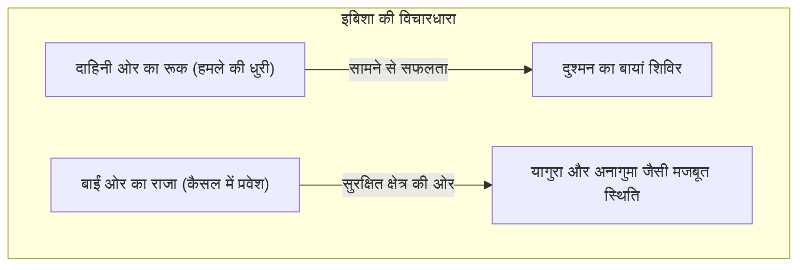
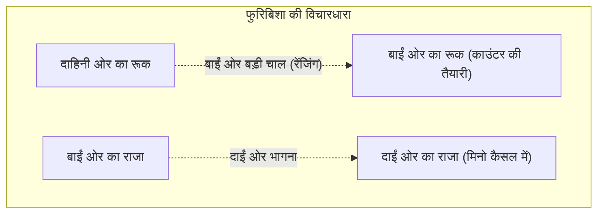

## 1. जापान में अद्वितीय रूप से विकसित हुआ अंतिम बोर्ड गेम

शोगी (होन-शोगी), शतरंज और जियांगकी (चीनी शतरंज) की तरह ही प्राचीन भारतीय खेल 'चतुरंग' से उत्पन्न हुआ है, लेकिन यह एक बोर्ड गेम है जिसने जापान में अपना एक अनूठा विकास किया है।

इसकी सबसे बड़ी विशिष्टता  **हाथ में मौजूद मोहरों का पुन: उपयोग**  करने के नियम में है।
शतरंज में, पकड़े गए प्रतिद्वंद्वी के मोहरों को बोर्ड से हटा दिया जाता है, और खेल के अंत तक मोहरों की संख्या कम होने के कारण बोर्ड सरल हो जाता है। हालाँकि, शोगी में, आप पकड़े गए प्रतिद्वंद्वी के मोहरों को 'अपनी सैन्य शक्ति (हाथ में मौजूद मोहरे)' के रूप में बोर्ड पर किसी भी खाली जगह पर रख सकते हैं।
इसके कारण, खेल जितना अंत की ओर बढ़ता है, मोहरों की संख्या उतनी ही बढ़ जाती है, जिससे बोर्ड बेहद जटिल और अप्रत्याशित हो जाता है। यह एक ऐसी गहराई है जो दुनिया में बेजोड़ है।

## 2. मूल नियमों की समीक्षा

शोगी 9 पंक्तियों और 9 स्तंभों वाले कुल 81 खानों के बोर्ड पर खेला जाता है।

- **जीत की शर्त**: प्रतिद्वंद्वी के राजा (ओशो या ग्योकुशो) को 'त्सुमी' (चेकमेट) की स्थिति में लाना (ऐसी स्थिति जहाँ चाहे वह कैसे भी भागे, अगले चाल में पकड़ लिया जाएगा)।
- **मोहरों के प्रकार और उनकी चाल**: 
  - **प्यादा (फू)**: केवल एक खाना आगे बढ़ता है। यह संख्या में सबसे अधिक होते हैं और अग्रिम पंक्ति में एक दीवार का काम करते हैं।
  - **लांस (क्यो)**: आगे की ओर कितनी भी दूर जा सकता है, लेकिन पीछे या बगल में नहीं जा सकता।
  - **नाइट (केई)**: शतरंज के नाइट की तरह, यह आगे की ओर तिरछे कूदकर चलता है।
  - **सिल्वर जनरल (गिन)**: आगे, तिरछे आगे, और तिरछे पीछे जा सकता है। यह हमले की मुख्य शक्ति है।
  - **गोल्ड जनरल (किन)**: आगे, तिरछे आगे, बगल में, और पीछे जा सकता है (तिरछे पीछे नहीं जा सकता)। यह रक्षा की कुंजी है।
  - **रूक (हिशा)**: लंबवत और क्षैतिज रूप से कितनी भी दूर जा सकता है। यह सबसे मजबूत हमलावर मोहरा है (शतरंज के रूक के बराबर)।
  - **बिशप (काकू)**: तिरछे रूप से कितनी भी दूर जा सकता है। यह एक शक्तिशाली मोहरा है (शतरंज के बिशप के बराबर)।
  - **राजा (ओशो/ग्योकुशो)**: किसी भी दिशा में एक खाना जा सकता है। यदि इसे पकड़ लिया जाए, तो आप हार जाते हैं।
- **प्रमोशन (नारू)**: जब मोहरा प्रतिद्वंद्वी के क्षेत्र (पीछे से 3 पंक्तियों के भीतर) में प्रवेश करता है, तो मोहरा पावर अप (पलट) हो सकता है। रूक 'ड्रैगन' (रयू) बन जाता है, बिशप 'हॉर्स' (उमा) बन जाता है, और सिल्वर, नाइट, लांस, और प्यादा 'गोल्ड' के समान चाल चलने लगते हैं।

## 3. शोगी की दो प्रमुख रणनीतियाँ: 'इबिशा' और 'फुरिबिशा'

शोगी की रणनीति (ओपनिंग) मुख्य रूप से दो विचारधाराओं में विभाजित है, जो इस बात पर निर्भर करती है कि आप सबसे मजबूत हमलावर मोहरे,  **रूक का उपयोग कहाँ करते हैं**  । वे 'इबिशा' (स्टेटिक रूक) और 'फुरिबिशा' (रेंजिंग रूक) हैं।

### इबिशा (स्टेटिक रूक): सामने से सफलता का शाही मार्ग

'इबिशा' एक ऐसी रणनीति है जिसमें रूक को दाईं ओर की उसी स्थिति (दूसरी फ़ाइल) में छोड़ दिया जाता है जहाँ वह शुरू से रखा गया था, और वहाँ से वह सीधे दुश्मन के शिविर को भेदता है।

- **विशेषताएँ**: यह सामने से प्रतिद्वंद्वी की रक्षा को तोड़ने के लिए रूक, बिशप, सिल्वर आदि के समन्वय का उपयोग करता है। इसमें कई तार्किक और सीधे हमले शामिल हैं, और इसे 'शाही मार्ग की रणनीति' माना जाता है जिसे कई पेशेवर शोगी खिलाड़ी अपनाते हैं।
- **प्रतिनिधि कैसल (राजा की रक्षा)**:
  - **यागुरा**: 3 गोल्ड और सिल्वर मोहरों के साथ राजा को घेरने वाली, इबिशा की एक पारंपरिक और सुंदर रक्षा प्रणाली।
  - **अनागुमा (भालू का बिल)**: आधुनिक शोगी में सबसे मजबूत मानी जाने वाली रक्षा, जहाँ राजा बोर्ड के कोने (किनारे) में छिप जाता है और पूरी तरह से गोल्ड और सिल्वर से ढक जाता है।

### फुरिबिशा (रेंजिंग रूक): काउंटर की सुंदरता

'फुरिबिशा' एक ऐसी रणनीति है जिसमें दाईं ओर के रूक को शुरुआती चरण में ही बोर्ड के बाईं ओर (या मध्य में) एक बड़ी चाल (रेंजिंग) से ले जाया जाता है।

- **विशेषताएँ**: यह एक ऐसी रणनीति है जो कोमलता से कठोरता पर विजय प्राप्त करती है, जहाँ प्रतिद्वंद्वी के हमले को बाईं ओर ले जाए गए रूक और बिशप का उपयोग करके 'काउंटर' से रोका जाता है। राजा दाईं ओर भागकर अपनी रक्षा मजबूत करता है जहाँ रूक पहले था। इसके लिए 'टेवाताशी' (प्रतिद्वंद्वी को देखने के लिए अपनी बारी पास करने या प्रतीक्षा करने) की भावना की आवश्यकता होती है, और यह शौकीनों के बीच बहुत लोकप्रिय है।
- **प्रतिनिधि रणनीतियाँ**:
  - **शिकेनबिशा (चौथी फाइल रूक)**: रूक को बाईं ओर से चौथी फाइल में ले जाने की रणनीति। यह सबसे संतुलित रणनीति है और शुरुआती लोगों के लिए भी अनुशंसित है।
  - **नाकाबिशा (सेंट्रल रूक)**: एक आक्रामक फुरिबिशा रणनीति जहाँ रूक को बोर्ड के बिल्कुल मध्य (पांचवीं फाइल) में ले जाया जाता है, और मध्य से सफलता का लक्ष्य रखा जाता है।
- **प्रतिनिधि कैसल**:
  - **मिनो कैसल (मिनो गाकोई)**: एक सुंदर रक्षा जो विशेष रूप से फुरिबिशा के लिए है, जिसे बिना अधिक चालों के जल्दी बनाया जा सकता है, फिर भी यह बगल से होने वाले हमलों के खिलाफ बहुत मजबूत है।

## 4. शोगी का 'शुरुआती, मध्य और अंतिम चरण'

शोगी खेल की प्रगति मुख्य रूप से 3 चरणों में विभाजित है।

1. **शुरुआती चरण (गठन निर्माण)**: यह एक तैयारी की अवधि है जहाँ दोनों पक्ष अपने-अपने राजाओं को घेरते हैं (अपनी रक्षा मजबूत करते हैं) और हमला करने का गठन (चाहे वह इबिशा हो या फुरिबिशा) बनाते हैं।
2. **मध्य चरण (मोहरों का टकराव)**: कोई एक पक्ष हमला करता है और लड़ाई शुरू होती है। यहाँ, मोहरों का आदान-प्रदान किया जाता है और अंतिम चरण में 'योसे' (अंतिम प्रहार) की तैयारी के लिए 'हाथ में मौजूद मोहरे' जमा किए जाते हैं।
3. **अंतिम चरण (अंतिम प्रहार और चेकमेट)**: दोनों पक्ष एक-दूसरे के राजा की रक्षा को तोड़ते हैं, और यह गति की गणना (एक चाल का अंतर) बन जाती है कि कौन पहले प्रतिद्वंद्वी के राजा को चेकमेट करेगा। इसके लिए अत्यधिक दूरदर्शिता की आवश्यकता होती है, जैसे "क्या मेरा राजा सुरक्षित है?" और "प्रतिद्वंद्वी का राजा कितनी चालों में चेकमेट हो जाएगा?"

## 5. निष्कर्ष

शोगी केवल मोहरों पर कब्जा करने का खेल नहीं है। यह एक बौद्धिक खेल है जिसमें शुरुआती चरण में 'कैसल और रणनीति के चयन' की सामरिक कल्पना, मध्य चरण में 'मोहरों के लाभ और हानि तथा व्यापक दृष्टिकोण' का संतुलन, और अंतिम चरण में 'चेकमेट' की ओर ले जाने वाली भारी गणना शक्ति - इन सभी की आवश्यकता होती है।

सबसे पहले, यह चुनकर कि "क्या मुझे सीधे हमला करने वाला इबिशा पसंद है, या काउंटर का लक्ष्य रखने वाला फुरिबिशा," और एक पसंदीदा कैसल याद करके, शोगी की गहरी दुनिया में अपना पहला कदम क्यों न रखें?
