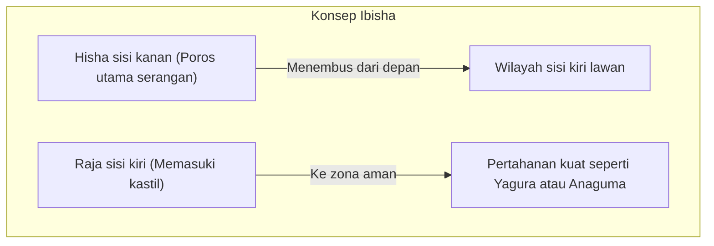
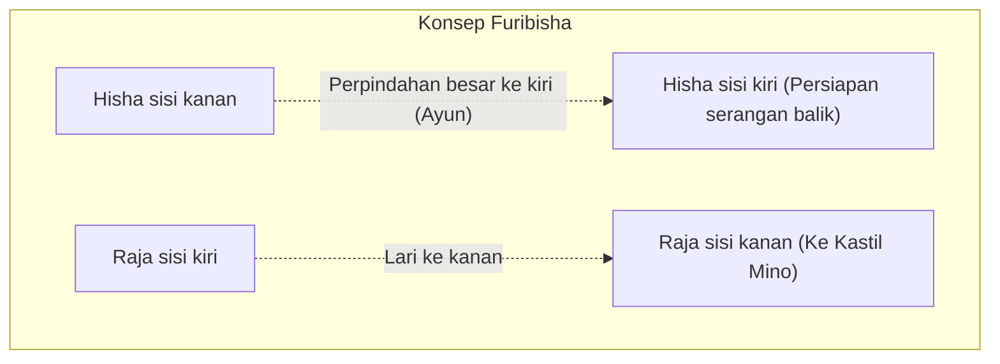

## 1. Evolusi Unik Jepang dalam Permainan Papan Pamungkas

Shogi (Hon Shogi) adalah permainan papan yang berasal dari permainan kuno India "Chaturanga", sama seperti catur dan Xiangqi (catur Tiongkok), namun mengalami evolusi yang unik di Jepang.

Keunikan terbesarnya terletak pada aturan **"penggunaan kembali bidak yang ditangkap"**.
Dalam catur, bidak lawan yang ditangkap akan disingkirkan dari papan, sehingga semakin menjelang akhir permainan, jumlah bidak akan berkurang dan kondisi papan menjadi semakin sederhana. Namun, dalam Shogi, Anda dapat menempatkan bidak lawan yang telah ditangkap sebagai "pasukan sendiri (bidak cadangan)" di tempat mana pun yang Anda inginkan di atas papan.
Oleh karena itu, semakin mendekati akhir permainan, jumlah bidak akan semakin banyak, dan kondisi papan menjadi sangat kompleks serta sulit diprediksi, memberikan kedalaman yang tak tertandingi di dunia.

## 2. Ulasan Aturan Dasar

Shogi dimainkan di atas papan dengan 9 kotak vertikal dan 9 kotak horizontal, dengan total 81 kotak.

- **Syarat Kemenangan**: Membuat Jenderal Raja (Osho atau Gyokusho) lawan berada dalam keadaan "Tsumi" (kondisi di mana ke mana pun ia lari, ia akan ditangkap pada langkah berikutnya).
- **Jenis dan Gerakan Bidak**: 
  - **Prajurit (Fuhyo/Fu)**: Maju 1 kotak ke depan. Jumlahnya paling banyak dan menjadi dinding di garis depan.
  - **Kereta Tombak (Kyosha/Kyo)**: Bisa maju lurus ke depan sejauh apa pun, tetapi tidak bisa mundur atau ke samping.
  - **Kuda (Keima/Kei)**: Seperti Ksatria (Knight) dalam catur, melompat secara diagonal ke depan.
  - **Jenderal Perak (Ginsho/Gin)**: Bisa maju ke depan, diagonal depan, dan diagonal belakang. Kekuatan utama dalam penyerangan.
  - **Jenderal Emas (Kinsho/Kin)**: Bisa maju ke depan, diagonal depan, samping, dan belakang (tidak bisa ke diagonal belakang). Kunci pertahanan.
  - **Kereta Terbang (Hisha/Hi)**: Bidak penyerang terkuat yang bisa bergerak sejauh apa pun secara vertikal dan horizontal (setara dengan Benteng/Rook dalam catur).
  - **Pelari Sudut (Kakugyo/Kaku)**: Bidak kuat yang bisa bergerak sejauh apa pun secara diagonal (setara dengan Menteri/Bishop dalam catur).
  - **Jenderal Raja (Osho/Gyokusho/Gyoku)**: Bergerak 1 kotak ke segala arah. Jika ini ditangkap, Anda kalah.
- **Promosi (Nari)**: Saat memasuki wilayah lawan (dalam 3 baris dari belakang), bidak bisa menjadi lebih kuat (dibalik). Hisha menjadi "Naga (Ryu)", Kaku menjadi "Kuda (Uma)", sedangkan Gin, Kei, Kyo, dan Fu akan memiliki gerakan yang sama dengan "Kin".

## 3. Dua Strategi Utama Shogi: "Ibisha" dan "Furibisha"

Taktik (pembukaan) Shogi terbagi menjadi dua aliran utama berdasarkan **"di mana Anda menggunakan Hisha"**, yang merupakan bidak penyerang terkuat. Aliran tersebut adalah "Ibisha" dan "Furibisha".

### Ibisha: Jalan Raja untuk Menembus dari Depan

"Ibisha" adalah taktik di mana Hisha tetap dibiarkan di posisi awalnya di sebelah kanan (jalur ke-2), dan kemudian menembus formasi lawan lurus dari sana.

- **Karakteristik**: Menghancurkan pertahanan lawan dari depan dengan mengoordinasikan Hisha, Kaku, Gin, dll. Terdapat banyak serangan yang logis dan linier, sehingga dianggap sebagai "taktik jalan raja" yang diadopsi oleh banyak pemain profesional.
- **Kastil (Pertahanan Raja) Utama**:
  - **Yagura**: Pertahanan tradisional dan indah dari Ibisha yang melindungi Raja dengan 3 bidak Kin dan Gin.
  - **Anaguma**: Pertahanan dengan kekuatan terkuat dalam Shogi modern, yang menyembunyikan Raja di pojok (ujung) papan dan sepenuhnya menutupnya dengan Kin dan Gin.

### Furibisha: Estetika Serangan Balik

"Furibisha" adalah taktik di mana Hisha yang berada di sisi kanan dipindahkan (diayun/furu) jauh ke sisi kiri (atau tengah) papan pada tahap awal permainan.

- **Karakteristik**: Taktik di mana kelembutan mengalahkan kekerasan, yang menyambut serangan lawan dengan "serangan balik" menggunakan Hisha dan Kaku yang diayun ke kiri. Raja melarikan diri ke sisi kanan, tempat Hisha sebelumnya berada, untuk memperkuat pertahanan. Ini membutuhkan intuisi untuk memberikan giliran (melihat reaksi lawan) dan sangat populer di kalangan amatir.
- **Taktik Utama**:
  - **Shikenbisha**: Mengayunkan Hisha ke jalur ke-4 dari kiri, merupakan taktik paling seimbang dan direkomendasikan untuk pemula.
  - **Nakabisha**: Memindahkan Hisha tepat ke tengah papan (jalur ke-5) dan mengincar tembusan di tengah, merupakan Furibisha yang agresif.
- **Kastil Utama**:
  - **Kastil Mino (Mino-gakoi)**: Kastil indah khusus untuk Furibisha yang dapat dibentuk dengan cepat tanpa memerlukan banyak langkah, namun sangat kuat terhadap serangan dari samping.

## 4. "Awal, Pertengahan, dan Akhir" dalam Shogi

Jalannya permainan Shogi secara garis besar dibagi menjadi 3 fase.

1. **Awal (Pembentukan Formasi)**: Periode persiapan di mana kedua belah pihak melindungi Raja mereka (memperkuat pertahanan) dan membangun formasi serangan (apakah Ibisha atau Furibisha).
2. **Pertengahan (Benturan Bidak)**: Salah satu pihak mengambil inisiatif dan pertempuran dimulai. Di sini, bidak-bidak ditukar dan "bidak cadangan (tegoma)" dikumpulkan untuk mempersiapkan dorongan akhir (yose) di tahap akhir permainan.
3. **Akhir (Dorongan dan Skakmat)**: Tahap saling mengupas pertahanan Raja lawan, yang menjadi perhitungan kecepatan (pertarungan selisih satu langkah) tentang siapa yang akan melakukan skakmat pada Raja lawan lebih dulu. Bacaan ekstrem seperti "Apakah Raja saya aman?" dan "Berapa langkah lagi hingga Raja lawan skakmat?" sangat diperlukan.

## 5. Kesimpulan

Shogi bukanlah sekadar permainan saling menangkap bidak. Dibutuhkan kemampuan konseptual strategis dalam "memilih kastil dan taktik" di awal permainan, keseimbangan intuisi antara "keuntungan/kerugian bidak dan visi gambaran besar" di pertengahan permainan, serta kemampuan perhitungan luar biasa yang mengarah pada "skakmat" di akhir permainan. Semua ini menjadikannya sebuah olahraga intelektual yang menuntut segalanya.

Sebagai langkah pertama, bagaimana jika Anda memulai dengan memilih "Apakah Anda menyukai Ibisha yang menyerang lurus ke depan, atau Furibisha yang mengincar serangan balik?", dan kemudian mengingat salah satu kastil favorit Anda untuk melangkah masuk ke dunia Shogi yang mendalam.
