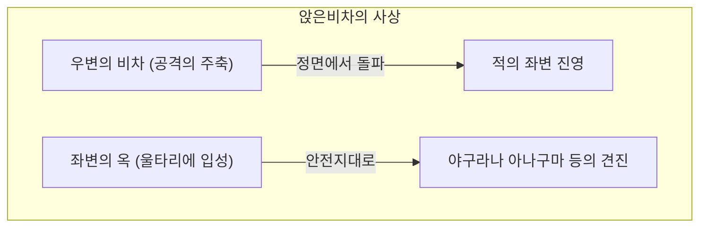
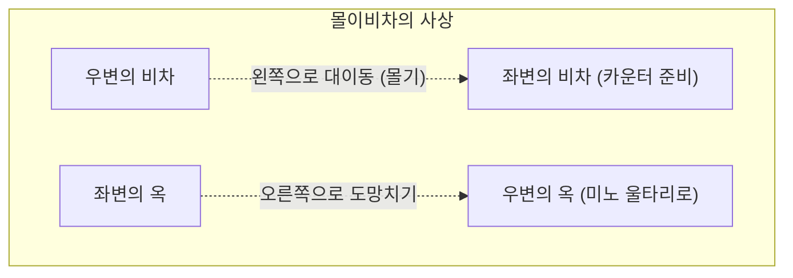

## 1. 일본 독자적으로 진화를 이룬 궁극의 반상 유희

쇼기(본쇼기)는 체스나 샹치(중국 장기)와 같은 고대 인도의 게임 '차투랑가'를 기원으로 하면서, 일본에서 독자적인 진화를 이룬 보드게임입니다.

가장 큰 독자성은 ' **잡은 말의 재사용** '이라는 규칙에 있습니다.
체스에서는 잡은 상대의 말은 반상에서 제거되며, 종반이 될수록 말이 줄어들어 국면이 단순해집니다. 하지만 쇼기에서는 잡은 상대의 말을 '자신의 병력(가진 말)'으로서 반상의 원하는 곳에 둘 수 있습니다.
이로 인해 종반이 되면 될수록 말의 수가 늘어나며, 국면이 극도로 복잡하고 예측 불가능해진다는 세계에서도 유례없는 깊이를 가지고 있습니다.

## 2. 기본 규칙 복습

쇼기는 세로 9칸·가로 9칸의 총 81칸의 반상 위에서 진행됩니다.

- **승리 조건**: 상대의 왕장(또는 옥장)을 '외통수(츠미)' 상태(어떻게 도망쳐도 다음에 잡히게 되는 상태)로 만드는 것.
- **말의 종류와 움직임**: 
  - **보병(보)**: 앞으로 1칸만 나아간다. 수가 가장 많으며, 최전선에서 방패가 된다.
  - **향차(향)**: 앞으로 어디까지든 나아갈 수 있지만, 뒤나 옆으로는 갈 수 없다.
  - **계마(계)**: 체스의 나이트처럼, 앞쪽으로 대각선을 건너뛰어 나아간다.
  - **은장(은)**: 앞, 대각선 앞, 대각선 뒤로 나아갈 수 있다. 공격의 주력.
  - **금장(금)**: 앞, 대각선 앞, 옆, 뒤로 나아갈 수 있다(대각선 뒤로는 갈 수 없다). 수비의 요충지.
  - **비차(비)**: 세로와 가로로 어디까지든 나아갈 수 있는 최강의 공격 말(체스의 룩에 해당).
  - **각행(각)**: 대각선으로 어디까지든 나아갈 수 있는 강력한 말(체스의 비숍에 해당).
  - **왕장·옥장(옥)**: 모든 방향으로 1칸 나아갈 수 있다. 이것을 잡히면 패배한다.
- **승격(나루)**: 상대의 진영(안쪽에서 3단 이내)에 들어가면, 말이 파워 업(뒤집힘)할 수 있습니다. 비차는 '용'이 되고, 각은 '말(마)'이 되며, 은·계·향·보는 '금'과 같은 움직임이 됩니다.

## 3. 쇼기의 양대 전략: '앉은비차'와 '몰이비차'

쇼기의 전법(오프닝)은 최강의 공격 말인 ' **비차를 어디에서 사용할 것인가** '에 따라 크게 두 가지 유파로 나뉩니다. 그것이 '앉은비차(이비샤)'와 '몰이비차(후리비샤)'입니다.

### 앉은비차(이비샤): 정면 돌파의 왕도

'앉은비차'는 처음부터 비차가 놓여 있는 오른쪽 위치(2번째 줄)에 그대로 두고, 거기서부터 일직선으로 적진을 돌파해 나가는 전법입니다.

- **특징**: 비차, 각, 은 등을 연계하여 정면에서 상대의 수비를 깨뜨립니다. 논리적이고 일직선적인 공격이 많으며, 프로 기사들의 다수가 채택하는 '왕도 전법'으로 여겨집니다.
- **대표적인 울타리(옥의 수비)**:
  - **야구라(矢倉)**: 금과 은 3장으로 옥을 둘러싸는, 앉은비차의 전통적이고 아름다운 수비.
  - **아나구마(穴熊)**: 옥을 반상의 구석(끝)에 숨기고, 금과 은으로 완전히 뚜껑을 덮어버리는, 현대 쇼기에서 최강의 견고함을 자랑하는 수비.

### 몰이비차(후리비샤): 카운터의 미학

'몰이비차'는 오른쪽에 있는 비차를 초반에 반상의 왼쪽(또는 중앙)으로 크게 이동시키는(모는) 전법입니다.

- **특징**: 상대가 공격해 오는 것을, 왼쪽으로 몬 비차와 각을 사용하여 '카운터'로 요격하는 부드러움이 강함을 제압하는 전법입니다. 옥은 비차가 있던 오른쪽으로 도망쳐 수비를 단단히 합니다. 패스(상대의 동태를 살핌)의 감각이 필요하여 아마추어에게 매우 인기가 있습니다.
- **대표적인 전법**:
  - **사간비차(시켄비샤)**: 왼쪽에서 4번째 줄로 비차를 모는, 가장 밸런스가 좋고 초보자에게도 추천하는 전법.
  - **중비차(나카비샤)**: 반상의 한가운데(5번째 줄)로 비차를 이동시켜, 중앙 돌파를 노리는 공격적인 몰이비차.
- **대표적인 울타리**:
  - **미노 울타리(美濃囲い)**: 수고가 들지 않아 빠르게 짤 수 있으면서도, 옆에서의 공격에 대해 매우 견고한, 몰이비차 전용의 아름다운 울타리.

## 4. 쇼기의 '초반·중반·종반'

쇼기의 게임 진행은 크게 3가지 단계로 나뉩니다.

1. **초반(진형 구축)**: 서로 옥을 둘러싸고(수비를 굳히고), 공격의 진형(앉은비차인지 몰이비차인지)을 구축하는 준비 기간.
2. **중반(말의 충돌)**: 어느 쪽인가가 장치를 걸어 싸움이 시작됩니다. 여기서 말을 서로 교환하고, '가진 말(수구)'을 축적하여 종반의 접근전(마무리)을 대비합니다.
3. **종반(접근전과 외통수)**: 서로의 옥의 수비를 벗겨내며, 누가 먼저 상대의 옥을 외통수로 만들 것인가의 속도 계산(한 수 차이의 공방)이 됩니다. '내 옥은 안전한가?', '상대의 옥은 앞으로 몇 수면 외통수인가?'라는 극한의 수읽기가 요구됩니다.

## 5. 요약

쇼기는 단순한 말의 쟁탈전이 아닙니다. 초반의 '울타리와 전법의 선택'에 있어서의 전략적 구상력, 중반의 '말의 손익과 대국관'의 밸런스 감각, 그리고 종반의 '외통수'를 향한 압도적인 계산력. 이 모든 것이 요구되는 지적 스포츠입니다.

우선은 '나는 똑바로 공격하는 앉은비차가 좋은가, 카운터를 노리는 몰이비차가 좋은가'를 선택하고, 마음에 드는 울타리를 하나 외우는 것부터 깊이 있는 쇼기의 세계로 첫걸음을 내디뎌 보는 것은 어떨까요?
