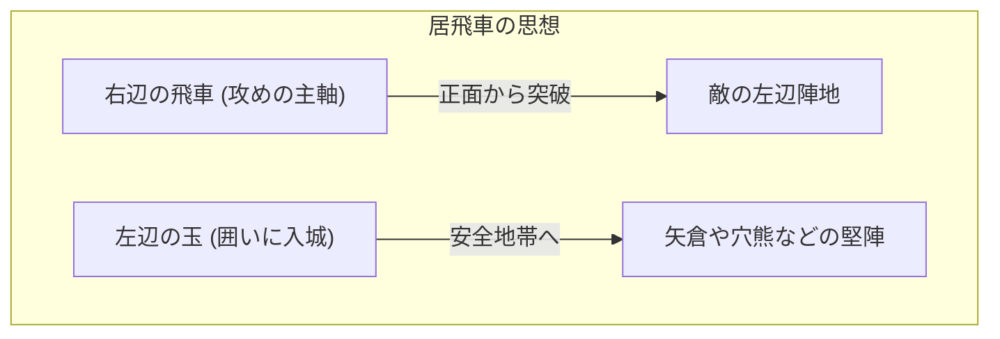

## 1. 日本独自の進化を遂げた究極の盤上遊戯

将棋（本将棋）は、チェスやシャンチー（中国象棋）と同じ古代インドのゲーム「チャトランガ」を起源としながら、日本において独自の進化を遂げたボードゲームです。

最大の独自性は「**持ち駒の再利用**」というルールにあります。
チェスでは取った相手の駒は盤上から取り除かれ、終盤になるほど駒が減って盤面がシンプルになっていきます。しかし将棋では、取った相手の駒を「自分の兵力（持ち駒）」として盤上の好きな場所に打つことができます。
これにより、終盤になればなるほど駒の数が増え、盤面が極めて複雑で予測不可能になるという、世界でも類を見ない奥深さを持っています。

## 2. 基本ルールのおさらい

将棋は、縦9マス・横9マスの計81マスの盤上で行われます。

- **勝利条件**: 相手の王将（または玉将）を「詰み」の状態（どう逃げても次に取られてしまう状態）にすること。
- **駒の種類と動き**: 
  - **歩兵（歩）**: 前に1マスだけ進む。最も数が多く、最前線で壁となる。
  - **香車（香）**: 前にどこまでも進めるが、後ろや横にはいけない。
  - **桂馬（桂）**: チェスのナイトのように、前方に斜めに飛び越えて進む。
  - **銀将（銀）**: 前、斜め前、斜め後ろに進める。攻めの主力。
  - **金将（金）**: 前、斜め前、横、後ろに進める（斜め後ろにはいけない）。守りの要。
  - **飛車（飛）**: 縦と横にどこまでも進める最強の攻め駒（チェスのルークに相当）。
  - **角行（角）**: 斜めにどこまでも進める強力な駒（チェスのビショップに相当）。
  - **王将・玉将（玉）**: 全方向に1マス進める。これを取られたら負け。
- **成る（成り）**: 相手の陣地（奥から3段目以内）に入ると、駒がパワーアップ（裏返る）できます。飛車は「竜」になり、角は「馬」になり、銀・桂・香・歩は「金」と同じ動きになります。

## 3. 将棋の二大戦略：「居飛車」と「振り飛車」

将棋の戦法（オープニング）は、最強の攻め駒である「**飛車をどこで使うか**」によって、大きく2つの流派に分かれます。それが「居飛車（いびしゃ）」と「振り飛車（ふりびしゃ）」です。

### 居飛車（いびしゃ）：正面突破の王道

「居飛車」は、最初から飛車が置かれている右側の位置（2筋）にそのまま据え置き、そこから真っ直ぐに敵陣を突破していく戦法です。



- **特徴**: 飛車、角、銀などを連携させて正面から相手の守りを打ち破ります。論理的で一直線な攻めが多く、プロ棋士の多くが採用する「王道の戦法」とされています。
- **代表的な囲い（玉の守り）**:
  - **矢倉（やぐら）**: 金銀3枚で玉を囲う、居飛車の伝統的で美しい守り。
  - **穴熊（あなぐま）**: 玉を盤の隅っこ（端）に隠し、金銀で完全に蓋をしてしまう、現代将棋で最強の堅さを誇る守り。

### 振り飛車（ふりびしゃ）：カウンターの美学

「振り飛車」は、右側にある飛車を、序盤のうちに盤の左側（または中央）へと大きく移動させる（振る）戦法です。

```mermaid
graph TD
    subgraph 振り飛車の思想
        RookStart["右辺の飛車"] -.-> |左へ大移動 (振る)| RookEnd["左辺の飛車 (カウンター準備)"]
        KingStart["左辺の玉"] -.-> |右へ逃げる| KingEnd["右辺の玉 (美濃囲いへ)"]
    end
```

- **特徴**: 相手が攻めてきたところを、左に振った飛車と角を使って「カウンター」で迎撃する柔能く剛を制す戦法です。玉は飛車がいた右側に逃げて守りを固めます。手渡し（相手の様子を見る）の感覚が必要で、アマチュアに非常に人気があります。
- **代表的な戦法**:
  - **四間飛車（しけんびしゃ）**: 左から4番目の筋に飛車を振る、最もバランスが良く初心者にもおすすめの戦法。
  - **中飛車（なかびしゃ）**: 盤のど真ん中（5筋）に飛車を移動させ、中央突破を狙う攻撃的な振り飛車。
- **代表的な囲い**:
  - **美濃囲い（みのがこい）**: 手数がかからず素早く組めるのに、横からの攻めに対して非常に堅い、振り飛車専用の美しい囲い。

## 4. 将棋の「序盤・中盤・終盤」

将棋のゲーム進行は、大きく3つのフェーズに分かれます。

1. **序盤（陣形構築）**: お互いに玉を囲い（守りを固め）、攻めの陣形（居飛車か振り飛車か）を構築する準備期間。
2. **中盤（駒のぶつかり合い）**: どちらかが仕掛けて戦いが始まります。ここで駒を交換し合い、「持ち駒（手駒）」を蓄えて終盤の寄せ（とどめ）に備えます。
3. **終盤（寄せと詰み）**: お互いの玉の守りを剥がし合い、どちらが先に相手の玉を詰ませるかの速度計算（一手違いの攻防）になります。「自玉は安全か？」「相手玉はあと何手で詰むか？」という極限の読みが要求されます。

## 5. まとめ

将棋は、単なる駒の取り合いではありません。序盤の「囲いと戦法の選択」における戦略的構想力、中盤の「駒の損得と大局観」のバランス感覚、そして終盤の「詰み」に向かう圧倒的な計算力。これらすべてが求められる知的スポーツです。

まずは「自分は真っ直ぐ攻める居飛車が好きか、カウンターを狙う振り飛車が好きか」を選び、お気に入りの囲いを一つ覚えるところから、奥深い将棋の世界への第一歩を踏み出してみてはいかがでしょうか。
