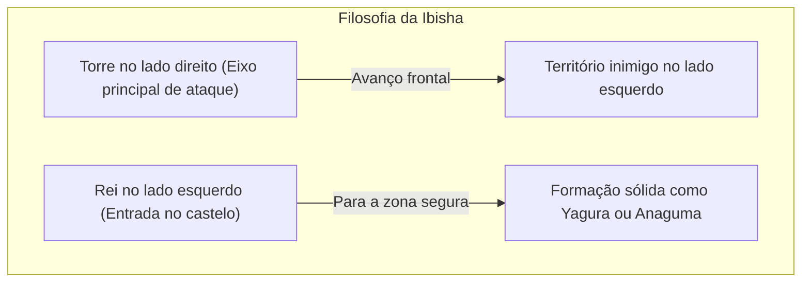
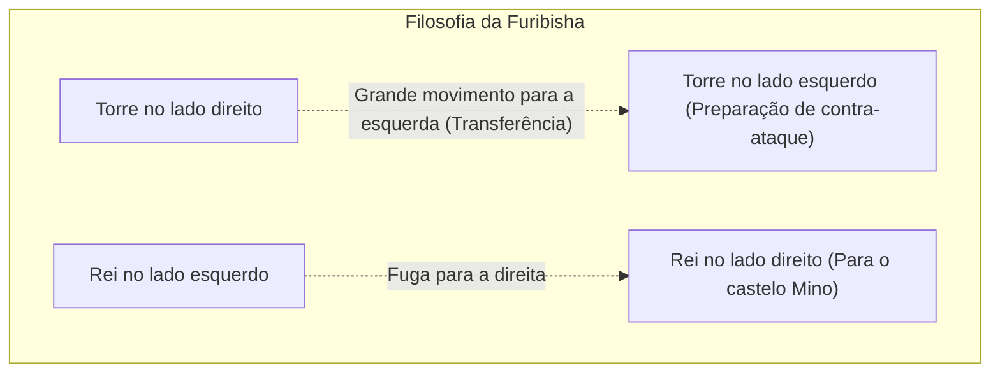

## 1. O Jogo de Tabuleiro Supremo que Evoluiu de Forma Única no Japão

O Shogi (Hon-shogi), assim como o Xadrez e o Xiangqi (Xadrez Chinês), tem suas origens no antigo jogo indiano "Chaturanga", mas é um jogo de tabuleiro que passou por uma evolução única no Japão.

A sua maior particularidade reside na regra de "**reutilização de peças capturadas**".
No Xadrez, as peças capturadas do oponente são removidas do tabuleiro, e à medida que o jogo se aproxima do fim, o número de peças diminui e o tabuleiro se torna mais simples. No entanto, no Shogi, você pode colocar as peças capturadas do oponente como "sua própria força militar (peça em mãos)" em qualquer lugar do tabuleiro.
Isso confere ao jogo uma profundidade incomparável no mundo, pois quanto mais perto do final do jogo, mais o número de peças aumenta e o tabuleiro se torna extremamente complexo e imprevisível.

## 2. Revisão das Regras Básicas

O Shogi é jogado em um tabuleiro de 81 casas, com 9 casas na vertical e 9 na horizontal.

- **Condição de vitória**: Colocar o Rei (Osho ou Gyokusho) do oponente em estado de "Xeque-mate" (Tsumi) (uma situação em que, não importa como tente escapar, será capturado na próxima jogada).
- **Tipos de peças e movimentos**:
  - **Peão (Fuhyou / Fu)**: Move-se apenas 1 casa para frente. São as mais numerosas e servem como parede na linha de frente.
  - **Lança (Kyousha / Kyou)**: Pode mover-se para frente o quanto quiser, mas não pode ir para trás ou para os lados.
  - **Cavaleiro (Keima / Kei)**: Assim como o cavalo no Xadrez, move-se saltando para frente na diagonal.
  - **General de Prata (Ginsho / Gin)**: Move-se para frente, diagonais frontais e diagonais traseiras. É a principal força de ataque.
  - **General de Ouro (Kinsho / Kin)**: Move-se para frente, diagonais frontais, lados e para trás (não pode ir nas diagonais traseiras). É o pilar da defesa.
  - **Torre (Hisha)**: A peça de ataque mais forte, que pode se mover o quanto quiser na vertical e na horizontal (equivalente à Torre no Xadrez).
  - **Bispo (Kakugyou / Kaku)**: Peça poderosa que pode se mover o quanto quiser nas diagonais (equivalente ao Bispo no Xadrez).
  - **Rei (Osho / Gyokusho / Gyoku)**: Move-se 1 casa em todas as direções. Se for capturado, você perde a partida.
- **Promoção (Nari)**: Ao entrar no território inimigo (dentro das 3 últimas fileiras a partir do oponente), a peça pode ganhar um poder extra (ser virada). A Torre torna-se "Rei Dragão" (Ryu), o Bispo torna-se "Cavalo Dragão" (Uma), e a Prata, o Cavaleiro, a Lança e o Peão passam a ter o mesmo movimento que o "Ouro".

## 3. As Duas Grandes Estratégias do Shogi: "Ibisha" e "Furibisha"

As táticas de abertura do Shogi se dividem principalmente em duas escolas, dependendo de "**onde usar a Torre**", que é a peça de ataque mais forte. Estas são a "Ibisha" (Torre Estática) e a "Furibisha" (Torre Móvel).

### Ibisha (Torre Estática): O Caminho Real de Avanço Frontal

A "Ibisha" é uma tática onde a Torre é mantida na sua posição original no lado direito (2ª coluna) e avança diretamente pelo território inimigo a partir dali.

- **Características**: Combina a Torre, o Bispo, a Prata, etc., para quebrar a defesa do oponente frontalmente. Possui muitos ataques lógicos e diretos, sendo considerada a "tática real" adotada pela maioria dos jogadores profissionais.
- **Castelos representativos (Defesa do Rei)**:
  - **Yagura**: A tradicional e bela defesa da Ibisha, que cerca o Rei com 3 peças (Ouro e Prata).
  - **Anaguma**: A defesa que ostenta a maior solidez no Shogi moderno, escondendo o Rei no canto do tabuleiro e cobrindo-o completamente com generais de Ouro e Prata.

### Furibisha (Torre Móvel): A Estética do Contra-ataque

A "Furibisha" é uma tática onde a Torre, localizada à direita, é amplamente movida (balançada ou transferida) para o lado esquerdo (ou centro) do tabuleiro durante a fase inicial do jogo.

- **Características**: É uma tática de subjugar a força com a suavidade, onde se intercepta o ataque do oponente com um "contra-ataque" usando a Torre movida para a esquerda e o Bispo. O Rei foge para o lado direito, onde a Torre estava inicialmente, para solidificar a defesa. Requer uma boa sensibilidade para observar a situação e o andamento do oponente, sendo muito popular entre os amadores.
- **Táticas representativas**:
  - **Shikenbisha (Torre na 4ª Coluna)**: Tática onde se move a Torre para a 4ª coluna a partir da esquerda. É a mais equilibrada e bastante recomendada para iniciantes.
  - **Nakabisha (Torre Central)**: Uma Furibisha ofensiva que visa o avanço central, movendo a Torre bem para o meio do tabuleiro (5ª coluna).
- **Castelos representativos**:
  - **Castelo Mino (Mino-gakoi)**: Um belo castelo exclusivo da Furibisha que é extremamente resistente a ataques laterais, apesar de poder ser montado rapidamente com poucas jogadas.

## 4. "Abertura, Meio de Jogo e Final de Jogo" no Shogi

O andamento do jogo no Shogi é dividido principalmente em 3 fases.

1. **Abertura (Construção da formação)**: Período de preparação onde ambos os jogadores protegem seus Reis (solidificam a defesa) e constroem suas formações de ataque (seja Ibisha ou Furibisha).
2. **Meio de jogo (Conflito das peças)**: A fase onde um dos jogadores inicia o ataque e a batalha começa. Aqui, trocam-se peças e acumulam-se "peças em mãos (tegoma)" para preparar a aproximação final (xeque-mate).
3. **Final de jogo (Aproximação e Xeque-mate)**: A fase de desmantelar a defesa do Rei um do outro, onde ocorre o cálculo de velocidade para ver quem consegue dar xeque-mate no Rei oponente primeiro (disputa decidida por uma jogada de diferença). Exige-se uma capacidade extrema de prever jogadas como "Meu Rei está seguro?" e "Em quantas jogadas o Rei oponente receberá xeque-mate?".

## 5. Conclusão

O Shogi não é apenas uma captura de peças. É um esporte intelectual que exige capacidade de visão estratégica na "escolha do castelo e da tática" na abertura, senso de equilíbrio entre a "vantagem/desvantagem de peças e a visão global" no meio de jogo, e um poder de cálculo avassalador em direção ao "xeque-mate" no final de jogo.

Primeiramente, que tal dar o seu primeiro passo neste mundo profundo do Shogi, escolhendo se "gosta da Ibisha para um ataque direto, ou da Furibisha para focar no contra-ataque", e aprendendo um de seus castelos favoritos?
