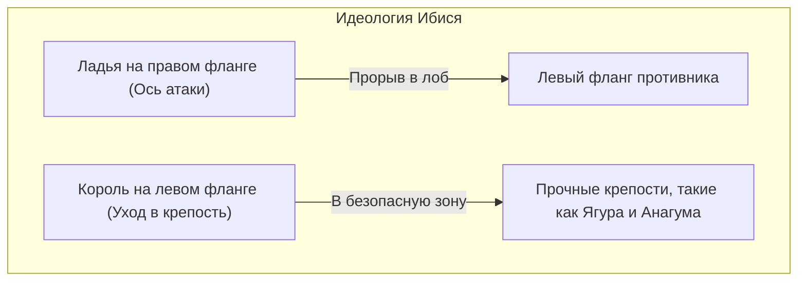
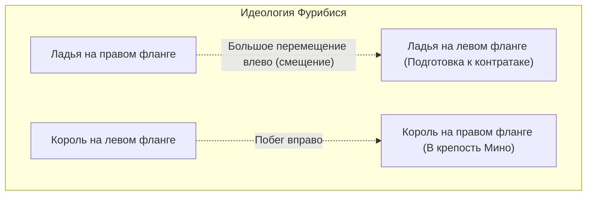

## 1. Уникальная настольная игра, эволюционировавшая в Японии

Сёги (настоящие сёги) — это настольная игра, которая берет свое начало от древнеиндийской игры «Чатуранга», как и шахматы или сянци (китайские шахматы), но получила свое уникальное развитие в Японии.

Ее главная особенность заключается в правиле **повторного использования захваченных фигур**.
В шахматах захваченные фигуры противника убираются с доски, и ближе к эндшпилю фигур становится меньше, а позиция на доске упрощается. Однако в сёги захваченные фигуры противника можно выставлять в любое место на доске как «свои войска (фигуры в руке)».
Благодаря этому, чем ближе конец игры, тем больше становится фигур, а ситуация на доске становится невероятно сложной и непредсказуемой. Это придает игре непревзойденную в мире глубину.

## 2. Повторение базовых правил

Игра в сёги проходит на доске размером 9 на 9 клеток, всего 81 клетка.

- **Условие победы**: Поставить Короля (Осё или Гёкусё) противника в состояние «цуми» (мат — ситуация, при которой фигура будет захвачена следующим ходом независимо от попытки сбежать).
- **Виды фигур и их ходы**: 
  - **Пешка (Фу)**: Ходит только на одну клетку вперед. Их больше всего, и они служат стеной на передовой.
  - **Копье (Кёся)**: Может двигаться вперед на любое количество клеток, но не может ходить назад или вбок.
  - **Конь (Кэйма)**: Как и шахматный конь, перепрыгивает вперед по диагонали.
  - **Серебряный генерал (Гин)**: Ходит вперед, по диагонали вперед и по диагонали назад. Основная атакующая сила.
  - **Золотой генерал (Кин)**: Ходит вперед, по диагонали вперед, вбок и назад (не может ходить по диагонали назад). Опора защиты.
  - **Ладья (Хися)**: Сильнейшая атакующая фигура, которая может ходить по вертикали и горизонтали на любое количество клеток (эквивалент шахматной ладьи).
  - **Слон (Каку)**: Мощная фигура, которая может ходить по диагонали на любое количество клеток (эквивалент шахматного слона).
  - **Король (Осё / Гёкусё)**: Ходит на одну клетку во всех направлениях. Если его захватят — вы проиграли.
- **Превращение (Нари)**: При входе в лагерь противника (3 дальних ряда) фигуры могут «усилиться» (переворачиваются). Ладья становится «Королевским драконом», слон — «Королевской лошадью», а серебро, конь, копье и пешка начинают ходить так же, как «Золотой генерал».

## 3. Две главные стратегии сёги: «Ибися» и «Фурибися»

Дебюты в сёги в основном делятся на две школы в зависимости от того, **где используется ладья**, сильнейшая атакующая фигура. Это «Ибися» (Статичная ладья) и «Фурибися» (Смещенная ладья).

### Ибися (Статичная ладья): Королевский путь лобового прорыва

«Ибися» — это стратегия, при которой ладья остается на своей первоначальной позиции справа (2-я вертикаль) и используется для прямого прорыва вражеского лагеря.

- **Особенности**: Взаимодействие ладьи, слона, серебра и других фигур для прорыва обороны противника спереди. Зачастую это логичные и прямолинейные атаки; считается «королевской стратегией», которую выбирают многие профессиональные игроки.
- **Типичные крепости (защита короля)**:
  - **Ягура**: Традиционная и красивая защита в стиле Ибися, где король окружен тремя генералами (золотом и серебром).
  - **Анагума**: Король прячется в самом углу (на краю) доски и полностью закрывается генералами. Это защита, которая считается самой надежной в современных сёги.

### Фурибися (Смещенная ладья): Эстетика контратаки

«Фурибися» — это стратегия, при которой ладья, изначально находящаяся справа, на ранней стадии игры далеко перемещается (смещается) на левую сторону доски (или в центр).

- **Особенности**: Стратегия, где мягкость побеждает жесткость. Когда противник идет в атаку, вы используете переведенную влево ладью и слона для «контратаки». Король убегает вправо, где раньше находилась ладья, и укрепляет оборону. Требует чувства выжидания (наблюдения за действиями противника) и очень популярна среди любителей.
- **Типичные стратегии**:
  - **Сикэнбися (Ладья на 4-й вертикали)**: Ладья переводится на четвертую вертикаль слева. Самая сбалансированная стратегия, которую рекомендуют новичкам.
  - **Накабися (Центральная ладья)**: Агрессивная смещенная ладья, при которой она переводится в самый центр доски (5-я вертикаль) с целью прорыва по центру.
- **Типичные крепости**:
  - **Крепость Мино**: Красивая крепость специально для Фурибися, которая строится быстро и с малым количеством ходов, но при этом невероятно прочна против атак сбоку.

## 4. «Дебют, Миттельшпиль и Эндшпиль» в сёги

Ход игры в сёги в основном делится на три фазы.

1. **Дебют (Построение формации)**: Период подготовки, в течение которого оба игрока прячут своих королей в крепости (укрепляют оборону) и строят атакующие построения (Ибися или Фурибися).
2. **Миттельшпиль (Столкновение фигур)**: Один из игроков начинает атаку, и завязывается битва. Здесь игроки разменивают фигуры и накапливают «фигуры в руке», готовясь к финальной атаке в эндшпиле.
3. **Эндшпиль (Окончание и цуми)**: Игроки разрушают оборону королей друг друга, и начинается расчет скорости (борьба за каждый ход), чтобы понять, кто первым поставит мат королю противника. Здесь требуется предельная глубина расчета: «В безопасности ли мой король?» и «Через сколько ходов королю противника будет поставлен мат?».

## 5. Заключение

Сёги — это не просто игра в захват фигур. Это [интеллектуальный спорт](/ru/p/game-poker-rules/), требующий стратегического видения при «выборе крепости и стратегии» в дебюте, чувства баланса «материального преимущества и глобального видения» в миттельшпиле и подавляющей способности к расчетам на пути к «цуми» в эндшпиле.

Почему бы не сделать первый шаг в глубокий мир сёги, начав с выбора того, что вам больше нравится: «Ибися, которая атакует в лоб, или Фурибися, нацеленная на контратаку», и выучив одну из понравившихся крепостей?
