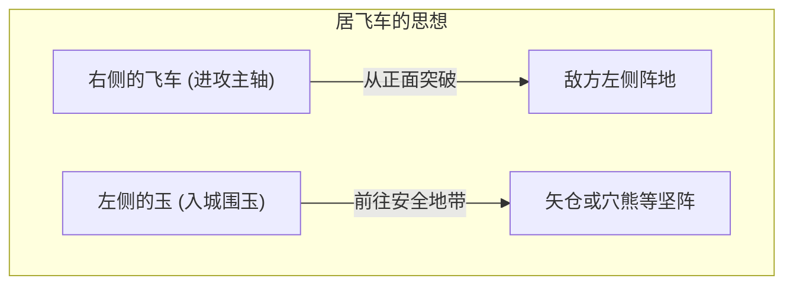
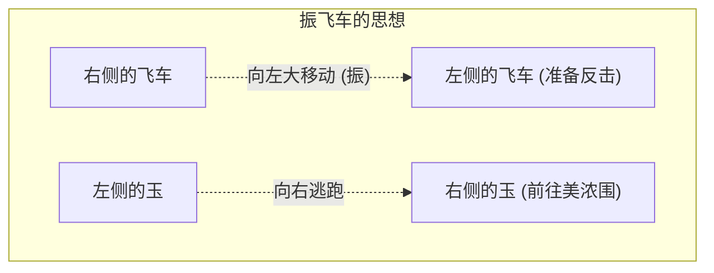

## 1. 独自在日本进化的终极盘上游戏

将棋（本将棋）与国际象棋、中国象棋一样，起源于古印度的游戏“恰图兰卡”，但却是在日本实现了独自进化的棋盘游戏。

最大的独特性在于“ **持驹的再利用** ”这一规则。
在国际象棋中，吃掉的对方棋子会被移出棋盘，越到残局棋子越少，盘面也越简单。然而在将棋中，可以将吃掉的对方棋子作为“自己的兵力（持驹）”，放置在棋盘上任意喜欢的位置。
因此，越到残局棋子数量反而越多，盘面变得极其复杂且难以预测，具有世界上独一无二的深奥之处。

## 2. 基本规则复习

将棋是在纵9格、横9格共计81格的棋盘上进行的。

- **胜利条件**: 将对方的王将（或玉将）置于“将死（詰み）”的状态（无论怎么逃，下一步都会被吃掉的状态）。
- **棋子种类与走法**: 
  - **步兵（步）**: 只能向前走1格。数量最多，在最前线作为屏障。
  - **香车（香）**: 可以一直向前走，但不能向后或向横走。
  - **桂马（桂）**: 像国际象棋的骑士一样，越过前方的棋子斜向跳跃前进。
  - **银将（银）**: 可以向前、左前、右前、左后、右后走1格。进攻的主力。
  - **金将（金）**: 可以向前、左前、右前、左、右、后走1格（不能向斜后走）。防守的关键。
  - **飞车（飞）**: 可以纵向或横向一直走的最强进攻棋子（相当于国际象棋的城堡）。
  - **角行（角）**: 可以斜向一直走的强力棋子（相当于国际象棋的主教）。
  - **王将・玉将（玉）**: 可以向所有方向走1格。被吃掉即为落败。
- **升级（成）**: 进入对方阵地（从最深处起算的前3段以内）后，棋子可以力量提升（翻面）。飞车变为“龙”，角行变为“马”，银、桂、香、步的走法将与“金”相同。

## 3. 将棋的两大战略：“居飞车”与“振飞车”

将棋的战法（开局）根据最强进攻棋子“ **飞车在哪里使用** ”，主要分为两大流派。那就是“居飞车”和“振飞车”。

### 居飞车：正面突破的王道

“居飞车”是将飞车保留在初始所在的右侧位置（第2筋），然后从那里径直突破敌阵的战法。

- **特征**: 配合飞车、角行、银将等，从正面突破对手的防守。多为符合逻辑且呈一条直线的进攻，被认为是许多职业棋手所采用的“王道战法”。
- **代表性围玉（保护玉将）**:
  - **矢仓（矢仓）**: 用3枚金银棋子包围玉将，居飞车传统且优美的防守阵型。
  - **穴熊（穴熊）**: 将玉藏在棋盘的角落（边缘），用金银完全盖住，是现代将棋中号称最坚固的防守阵型。

### 振飞车：反击的美学

“振飞车”是在开局阶段，将位于右侧的飞车大幅移动（振）到棋盘左侧（或中央）的战法。

- **特征**: 待对手攻来时，使用振至左侧的飞车和角行进行“反击”迎击，是以柔克刚的战法。玉将向飞车原来所在的右侧逃跑并巩固防守。需要有“交出先手（观察对手动向）”的感觉，在业余爱好者中非常受欢迎。
- **代表性战法**:
  - **四间飞车（四间飞车）**: 将飞车振至从左边数第4条筋，平衡性最好，也是最推荐给初学者的战法。
  - **中飞车（中飞车）**: 将飞车移动到棋盘正中央（第5筋），企图中央突破的攻击型振飞车。
- **代表性围玉**:
  - **美浓围（美浓围）**: 不需要花费太多步数就能迅速组建，而且面对来自侧面的进攻非常坚固，是振飞车专用的优美围玉。

## 4. 将棋的“序盘・中盘・终盘”

将棋的游戏进程，大致可以分为3个阶段。

1. **序盘（构筑阵型）**: 双方将玉围起（巩固防守），构筑进攻阵型（居飞车或振飞车）的准备阶段。
2. **中盘（棋子的交锋）**: 其中一方发起进攻，战斗开始。在这里互相交换棋子，积蓄“持驹（手牌）”以备终盘的逼近（绝杀）。
3. **终盘（逼近与将死）**: 互相剥离对方玉的防守，进行谁先将死对方玉的速度计算（一步之差的攻防）。要求具备“自己的玉安全吗？”“对方的玉还有几步将死？”这样极限的计算能力。

## 5. 总结

将棋并非单纯的吃子游戏。序盘在“围玉与战法的选择”上的战略构想力，中盘在“棋子的得失与大局观”上的平衡感，以及终盘迈向“将死”时的压倒性计算力。这些都是这项[智力运动](/zh-cn/p/game-poker-rules/)所要求的。

首先试着选择“自己是喜欢直接进攻的居飞车，还是喜欢伺机反击的振飞车”，并从记住一个自己喜欢的围玉开始，迈出通往深奥将棋世界的第一步如何呢？
