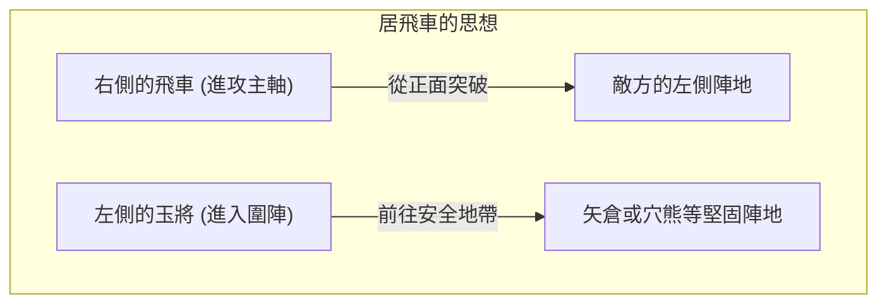
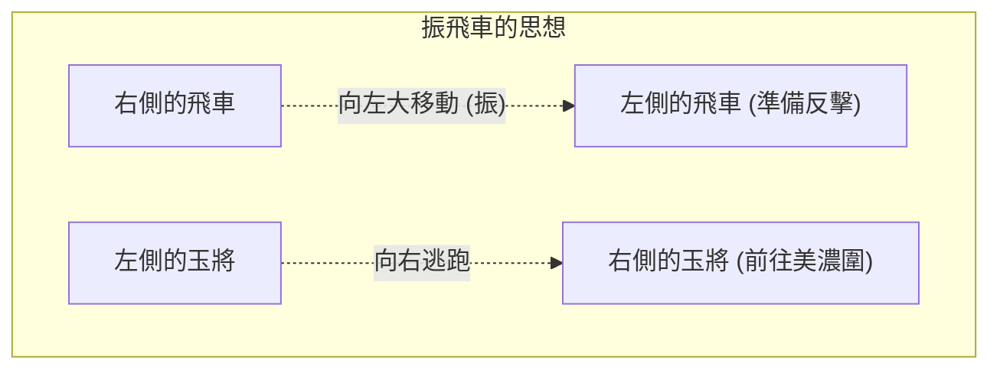

## 1. 獨自在日本發展出的終極棋盤遊戲

將棋（本將棋）與西洋棋、象棋（中國象棋）同樣起源於古印度的遊戲「恰圖蘭卡（Chaturanga）」，是在日本獨自發展出來的桌上遊戲。

最大的特色在於「 **保留棋子的再利用** 」這項規則。
在西洋棋中，被吃掉的對手棋子會從棋盤上移除，越到殘局棋子越少，盤面也會變得越單純。然而在將棋中，被吃掉的對手棋子會成為「自己的兵力（持駒）」，可以打入在棋盤上任何喜歡的位置。
因此，越到殘局棋子數量反而越多，盤面變得極其複雜且難以預測，這點賦予了將棋在世界上獨一無二的深奧之處。

## 2. 基本規則複習

將棋是在直9格、橫9格，總計81格的棋盤上進行。

- **勝利條件**: 將對手的王將（或玉將）逼入「將死（詰み）」的狀態（無論怎麼逃跑，下一步都會被吃掉的狀態）。
- **棋子種類與走法**: 
  - **步兵（步）**: 只能向前走1格。數量最多，在最前線作為屏障。
  - **香車（香）**: 可以向前走任意格數，但不能向後或向橫走。
  - **桂馬（桂）**: 像西洋棋的騎士（Knight）一樣，向斜前方跳躍前進。
  - **銀將（銀）**: 可以向前、斜前、斜後走。是進攻的主力。
  - **金將（金）**: 可以向前、斜前、橫、後走（不能向斜後走）。防守的樞紐。
  - **飛車（飛）**: 可以直向或橫向走任意格數，是最強的攻擊棋子（相當於西洋棋的城堡 Rook）。
  - **角行（角）**: 可以斜向走任意格數，是強力的棋子（相當於西洋棋的主教 Bishop）。
  - **王將・玉將（玉）**: 可以向所有方向走1格。被吃掉就算輸。
- **升變（成）**: 進入對手陣地（從深處算起前3排以內）時，棋子可以升級（翻面）。飛車會變成「龍（龍王）」，角行會變成「馬（龍馬）」，銀、桂、香、步則會變成與「金」相同的走法。

## 3. 將棋的兩大戰略：「居飛車」與「振飛車」

將棋的戰法（開局），根據最強攻擊棋子「 **飛車要用在哪裡** 」，主要分為兩大流派。這就是「居飛車」與「振飛車」。

### 居飛車：正面突破的王道

「居飛車」是將飛車保留在最初放置的右側位置（第2行），直接從該處直線突破敵陣的戰法。

- **特色**: 讓飛車、角行、銀將等棋子互相配合，從正面擊破對手的防禦。多為具備邏輯且直線的進攻方式，被視為許多職業棋士採用的「王道戰法」。
- **代表性的圍陣（保護玉將的陣型）**:
  - **矢倉**: 用3枚金銀棋子將玉將圍住，是居飛車傳統且優美的防禦陣型。
  - **穴熊**: 將玉將藏在棋盤角落（邊緣），並用金銀棋子完全蓋住，是現代將棋中號稱最堅固的防禦陣型。

### 振飛車：反擊的美學

「振飛車」是在序盤時，將位於右側的飛車大幅移動（振）至棋盤左側（或中央）的戰法。

- **特色**: 在對手進攻時，利用移到左側的飛車與角行進行「反擊（Counter）」來迎擊，是種以柔克剛的戰法。玉將則會逃到原本飛車所在的右側以鞏固防守。需要有「等待（觀察對手動靜）」的感覺，在業餘玩家中非常受歡迎。
- **代表性的戰法**:
  - **四間飛車**: 將飛車移到從左邊數來第4行的位置，是平衡感最好、也最推薦給初學者的戰法。
  - **中飛車**: 將飛車移到棋盤正中央（第5行），企圖從中央突破的攻擊型振飛車。
- **代表性的圍陣**:
  - **美濃圍**: 不需要花費太多步數就能快速組建，但對抗側面攻擊卻非常堅固，是振飛車專用的優美圍陣。

## 4. 將棋的「序盤、中盤、終盤」

將棋的遊戲進行主要分為3個階段。

1. **序盤（陣型構建）**: 雙方將玉將圍起來（鞏固防守），準備構建攻擊陣型（要用居飛車還是振飛車）的準備期。
2. **中盤（棋子交鋒）**: 由其中一方發動攻勢開始戰鬥。在這裡雙方會互相交換棋子，積蓄「持駒（手中的棋子）」，為終盤的「逼宮（最後一擊）」做準備。
3. **終盤（逼宮與將死）**: 雙方互相剝奪對手玉將的防禦，演變成計算誰能先將死對手玉將的速度戰（一步之差的攻防）。這時會被要求進行「自己的玉將安全嗎？」、「對手的玉將還要幾步才能將死？」等極限的算計。

## 5. 總結

將棋不僅僅是互吃棋子的遊戲。序盤「圍陣與戰法選擇」的戰略構想力、中盤「棋子損益與大局觀」的平衡感，以及終盤邁向「將死」的壓倒性計算能力。這些全都是將棋這項智力運動所不可或缺的元素。

首先，不妨先選擇「自己喜歡直線進攻的居飛車，還是伺機反擊的振飛車」，並從記住一個喜歡的圍陣開始，踏出進入深奧將棋世界的第一步吧。
