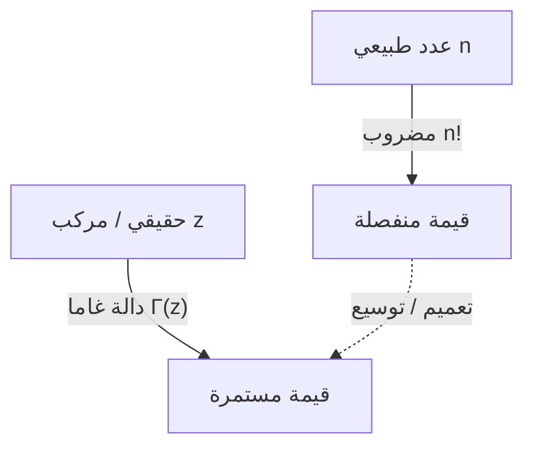

# ما هي دالة غاما؟

عند دراسة الرياضيات، نواجه أحيانًا السؤال التالي: "هل يمكن توسيع مفهوم منفصل إلى مفهوم مستمر؟" أحد أجمل وأهم الأمثلة على ذلك هو **دالة غاما**.

توسع دالة غاما "المضروب" ($n!$)، المُعرَّف للأعداد الطبيعية، إلى الأعداد الحقيقية الموجبة وحتى إلى المستوى المركب بأكمله. تظهر هذه الدالة، التي اكتشفها عالم الرياضيات العظيم ليونهارت أويلر في القرن الثامن عشر، في كل مجال تقريبًا، من التحليل الرياضي ونظرية الاحتمالات إلى الإحصاء والفيزياء.

في هذا المقال، سنلقي نظرة فاحصة على أساسيات دالة غاما وخصائصها العميقة.

## فكرة توسيع المضروب

يُعرَّف المضروب على النحو التالي:

$$ n! = n \times (n-1) \times \dots \times 2 \times 1 $$

على سبيل المثال، $3! = 6$ و $4! = 24$. ومع ذلك، فإن هذا التعريف يكون منطقيًا فقط عندما يكون $n$ عددًا صحيحًا. تنشأ أسئلة بشكل طبيعي، مثل "ما هو $2.5!$؟" أو "هل يمكننا حساب $(-1.5)!$؟".

تصدى أويلر لهذه المشكلة ووجد دالة تحقق خصائص المضاريب مع أخذ قيم مستمرة للأعداد الحقيقية والمركبة.

# تعريف دالة غاما

تُعرَّف دالة غاما $\Gamma(z)$ عادةً بواسطة التكامل التالي (تكامل أويلر من النوع الثاني):

$$ \Gamma(z) = \int_0^\infty t^{z-1} e^{-t} dt $$

هنا، $z$ هو عدد مركب له جزء حقيقي موجب ($\text{Re}(z) > 0$). يتقارب هذا التكامل وله قيمة محدودة طالما أن الجزء الحقيقي من $z$ موجب.

## الخصائص الأساسية

من تعريف التكامل هذا، يمكننا اشتقاق **علاقة التكرار**، وهي أهم خاصية لدالة غاما. باستخدام التكامل بالتجزئة، نحصل على العلاقة التالية:

$$ \Gamma(z+1) = z \Gamma(z) $$

هذه المعادلة هي السبب الرئيسي في أن دالة غاما هي امتداد للمضروب. إذا كان $z$ عددًا طبيعيًا $n$، فيمكننا حسابه على النحو التالي باستخدام $\Gamma(1) = 1$:

$$ \Gamma(n) = (n-1) \Gamma(n-1) = (n-1)(n-2) \Gamma(n-2) = \dots = (n-1)! \Gamma(1) = (n-1)! $$

بعبارة أخرى، توجد علاقة بين المضروب ودالة غاما بحيث **$\Gamma(n) = (n-1)!$** أو **$\Gamma(n+1) = n!$**. لاحظ أن الفهرس مُزاح بمقدار واحد.

# الامتداد التحليلي في المستوى المركب

تعريف التكامل الموضح سابقًا صالح فقط عندما يكون $\text{Re}(z) > 0$. ومع ذلك، باستخدام علاقة التكرار $\Gamma(z) = \frac{\Gamma(z+1)}{z}$ بشكل عكسي، يمكننا إجراء **امتداد تحليلي** لمجال دالة غاما إلى نصف المستوى الأيسر (المنطقة ذات الأجزاء الحقيقية السالبة).

على سبيل المثال، بالنسبة لـ $z$ في النطاق $-1 < \text{Re}(z) < 0$، يمكن حساب $\Gamma(z+1)$ لأن جزأه الحقيقي موجب. بقسمته على $z$، يتم تحديد قيمة $\Gamma(z)$.

بتكرار هذه العملية، تصبح دالة غاما دالة جزئية الشكل مُعرَّفة على المستوى المركب بأكمله، باستثناء $z = 0, -1, -2, \dots$ (جميع الأعداد الصحيحة غير الموجبة). تتباعد دالة غاما عند الأعداد الصحيحة غير الموجبة، ويوجد **قطب** في كل من هذه النقاط.

# صيغة الانعكاس لأويلر

نظرية أخرى توضح جمال دالة غاما هي **صيغة الانعكاس لأويلر**.

$$ \Gamma(z)\Gamma(1-z) = \frac{\pi}{\sin(\pi z)} $$

تصلح هذه الصيغة للأعداد المركبة $z$ التي ليست أعدادًا صحيحة. باستخدام هذه الصيغة، يمكننا بسهولة إيجاد القيمة عندما يكون $z = \frac{1}{2}$، على سبيل المثال.

$$ \Gamma\left(\frac{1}{2}\right)\Gamma\left(\frac{1}{2}\right) = \frac{\pi}{\sin\left(\frac{\pi}{2}\right)} = \pi $$

لذلك، $\Gamma\left(\frac{1}{2}\right) = \sqrt{\pi}$. هذه نتيجة حاسمة مرتبطة ارتباطًا وثيقًا بالتكاملات في التوزيعات الطبيعية.

# العلاقة مع دالة بيتا

ترتبط دالة غاما ارتباطًا وثيقًا بدالة خاصة مهمة أخرى، وهي **دالة بيتا**. تُعرَّف دالة بيتا $B(x, y)$ على النحو التالي:

$$ B(x, y) = \int_0^1 t^{x-1} (1-t)^{y-1} dt $$

توجد علاقة مذهلة بين دالة غاما ودالة بيتا:

$$ B(x, y) = \frac{\Gamma(x)\Gamma(y)}{\Gamma(x+y)} $$

هذه الصيغة هي أداة قوية تختزل حسابات التكامل المعقدة إلى حسابات جبرية لدالة غاما.

# تقريب ستيرلينغ

عندما يكون $n$ كبيرًا جدًا، يصعب حساب $n!$ بدقة. في مثل هذه الحالات، يصف **تقريب ستيرلينغ** السلوك التقاربي للمضاريب (ولدالة غاما).

$$ n! \approx \sqrt{2\pi n} \left(\frac{n}{e}\right)^n $$

بشكل أعم، بالنسبة لدالة غاما، يمكننا أن نكتب:

$$ \Gamma(z+1) \approx \sqrt{2\pi z} \left(\frac{z}{e}\right)^z $$

هذا التقريب لا غنى عنه عند حساب الإنتروبيا في الميكانيكا الإحصائية أو عند التعامل مع مجموعات هائلة في نظرية الاحتمالات.

# التطبيقات والاستنتاج

دالة غاما ليست مجرد نتاج فضول رياضي. فهي تلعب دورًا عمليًا في العديد من المجالات، مثل:

1. **الاحتمالات والإحصاء**: يتم تعريف توزيع غاما، وتوزيع كاي تربيع، وتوزيع تي لستودنت باستخدام دالة غاما.
2. **الفيزياء**: في التنظيم البعدي داخل ميكانيكا الكم ونظرية المجال الكمي، تلعب دالة غاما دورًا في التحكم في التباعدات.
3. **نظرية الأعداد التحليلية**: من خلال علاقتها بدالة زيتا لريمان، تحتل موقعًا مركزيًا في دراسة توزيع الأعداد الأولية.

كشف البحث الذي بدأ بسؤال بسيط حول توسيع المضروب إلى الأعداد الحقيقية عن بنية رائعة تمتد عبر الرياضيات بأكملها. دالة غاما هي حقًا تحفة أويلر، حيث تسد الفجوة بين العالمين المنفصل والمستمر.
