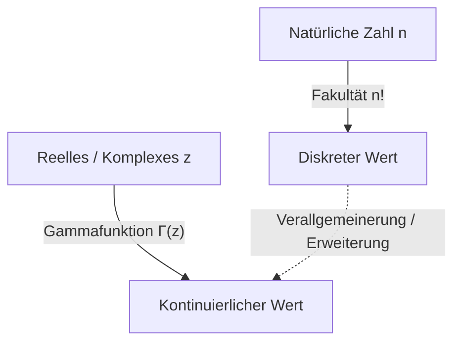

# Was ist die Gammafunktion?

Beim Studium der Mathematik stehen wir manchmal vor der Frage: "Kann ein diskretes Konzept zu einem kontinuierlichen erweitert werden?" Eines der schönsten und wichtigsten Beispiele hierfür ist die **Gammafunktion**.

Die Gammafunktion erweitert die für natürliche Zahlen definierte „Fakultät“ ($n!$) auf positive reelle und sogar auf die gesamte komplexe Zahlenebene. Diese vom großen Mathematiker des 18. Jahrhunderts, Leonhard Euler, entdeckte Funktion taucht in fast jedem Bereich auf, von der Analysis und Wahrscheinlichkeitstheorie bis hin zu Statistik und Physik.

In diesem Artikel werden wir uns die Grundlagen der Gammafunktion und ihre tiefgreifenden Eigenschaften genauer ansehen.

## Die Idee der Fakultätserweiterung

Die Fakultät ist wie folgt definiert:

$$ n! = n \times (n-1) \times \dots \times 2 \times 1 $$

Zum Beispiel ist $3! = 6$ und $4! = 24$. Diese Definition ist jedoch nur sinnvoll, wenn $n$ eine ganze Zahl ist. Es stellen sich natürlich Fragen wie "Was ist $2.5!$?" oder "Können wir $(-1.5)!$ berechnen?".

Euler nahm sich dieses Problems an und fand eine Funktion, die die Eigenschaften von Fakultäten erfüllt und gleichzeitig kontinuierliche Werte für reelle und komplexe Zahlen annimmt.

# Definition der Gammafunktion

Die Gammafunktion $\Gamma(z)$ wird normalerweise durch das folgende Integral (Eulersches Integral zweiter Art) definiert:

$$ \Gamma(z) = \int_0^\infty t^{z-1} e^{-t} dt $$

Hier ist $z$ eine komplexe Zahl mit einem positiven Realteil ($\text{Re}(z) > 0$). Dieses Integral konvergiert und hat einen endlichen Wert, solange der Realteil von $z$ positiv ist.

## Grundeigenschaften

Aus dieser Integraldefinition können wir die **Rekursionsrelation** ableiten, die wichtigste Eigenschaft der Gammafunktion. Mit Hilfe der partiellen Integration erhalten wir folgende Beziehung:

$$ \Gamma(z+1) = z \Gamma(z) $$

Diese Gleichung ist der Hauptgrund, warum die Gammafunktion eine Erweiterung der Fakultät ist. Wenn $z$ eine natürliche Zahl $n$ ist, können wir sie mit $\Gamma(1) = 1$ wie folgt berechnen:

$$ \Gamma(n) = (n-1) \Gamma(n-1) = (n-1)(n-2) \Gamma(n-2) = \dots = (n-1)! \Gamma(1) = (n-1)! $$

Mit anderen Worten, es gibt eine Beziehung zwischen der Fakultät und der Gammafunktion, sodass **$\Gamma(n) = (n-1)!$** oder **$\Gamma(n+1) = n!$**. Beachten Sie, dass der Index um eins verschoben ist.

# Analytische Fortsetzung in der komplexen Ebene

Die zuvor gezeigte Integraldefinition gilt nur für $\text{Re}(z) > 0$. Wenn wir jedoch die Rekursionsrelation $\Gamma(z) = \frac{\Gamma(z+1)}{z}$ rückwärts verwenden, können wir eine **Analytische Fortsetzung** des Definitionsbereichs der Gammafunktion in die linke Halbebene (den Bereich mit negativen Realteilen) durchführen.

Für ein $z$ im Bereich $-1 < \text{Re}(z) < 0$ kann beispielsweise $\Gamma(z+1)$ berechnet werden, da der Realteil positiv ist. Durch Division durch $z$ wird der Wert von $\Gamma(z)$ bestimmt.

Durch Wiederholen dieser Operation wird die Gammafunktion zu einer meromorphen Funktion, die über die gesamte komplexe Ebene definiert ist, mit Ausnahme von $z = 0, -1, -2, \dots$ (alle nicht positiven ganzen Zahlen). Die Gammafunktion divergiert bei nicht positiven ganzen Zahlen, und an jedem dieser Punkte existiert ein **Pol**.

# Eulerscher Reflexionssatz

Ein weiterer Satz, der die Schönheit der Gammafunktion demonstriert, ist der **Eulersche Reflexionssatz**.

$$ \Gamma(z)\Gamma(1-z) = \frac{\pi}{\sin(\pi z)} $$

Diese Formel gilt für komplexe Zahlen $z$, die keine ganzen Zahlen sind. Mit dieser Formel können wir leicht den Wert finden, wenn beispielsweise $z = \frac{1}{2}$ ist.

$$ \Gamma\left(\frac{1}{2}\right)\Gamma\left(\frac{1}{2}\right) = \frac{\pi}{\sin\left(\frac{\pi}{2}\right)} = \pi $$

Daher ist $\Gamma\left(\frac{1}{2}\right) = \sqrt{\pi}$. Dies ist ein entscheidendes Ergebnis, das tief mit Integralen in Normalverteilungen verbunden ist.

# Beziehung zur Betafunktion

Die Gammafunktion ist eng verwandt mit einer anderen wichtigen speziellen Funktion, der **Betafunktion**. Die Betafunktion $B(x, y)$ ist wie folgt definiert:

$$ B(x, y) = \int_0^1 t^{x-1} (1-t)^{y-1} dt $$

Es besteht eine erstaunliche Beziehung zwischen der Gammafunktion und der Betafunktion:

$$ B(x, y) = \frac{\Gamma(x)\Gamma(y)}{\Gamma(x+y)} $$

Diese Formel ist ein leistungsstarkes Werkzeug, das komplexe Integralberechnungen auf algebraische Berechnungen der Gammafunktion reduziert.

# Stirlingsche Formel

Wenn $n$ sehr groß ist, ist die exakte Berechnung von $n!$ schwierig. In solchen Fällen beschreibt die **Stirlingsche Formel** (oder Stirlingsche Näherung) das asymptotische Verhalten von Fakultäten (und der Gammafunktion).

$$ n! \approx \sqrt{2\pi n} \left(\frac{n}{e}\right)^n $$

Allgemeiner ausgedrückt, für die Gammafunktion können wir schreiben:

$$ \Gamma(z+1) \approx \sqrt{2\pi z} \left(\frac{z}{e}\right)^z $$

Diese Näherung ist unabdingbar bei der Berechnung der Entropie in der statistischen Mechanik oder beim Umgang mit massiven Kombinationen in der Wahrscheinlichkeitstheorie.

# Anwendungen und Fazit

Die Gammafunktion ist nicht nur ein Produkt mathematischer Neugier. Sie spielt in vielen Bereichen eine praktische Rolle, wie zum Beispiel:

1. **Wahrscheinlichkeitstheorie und Statistik**: Die Gammaverteilung, Chi-Quadrat-Verteilung und die Student-t-Verteilung werden unter Verwendung der Gammafunktion definiert.
2. **Physik**: Bei der dimensionalen Regularisierung innerhalb der Quantenmechanik und der Quantenfeldtheorie spielt die Gammafunktion eine Rolle bei der Kontrolle von Divergenzen.
3. **Analytische Zahlentheorie**: Durch ihre Beziehung zur Riemannschen Zetafunktion nimmt sie eine zentrale Stellung bei der Untersuchung der Primzahlverteilung ein.

Die Suche, die mit einer einfachen Frage zur Erweiterung der Fakultät auf reelle Zahlen begann, offenbarte eine großartige Struktur, die sich durch die gesamte Mathematik zieht. Die Gammafunktion ist wahrlich Eulers Meisterwerk und schlägt eine Brücke zwischen der diskreten und der kontinuierlichen Welt.
