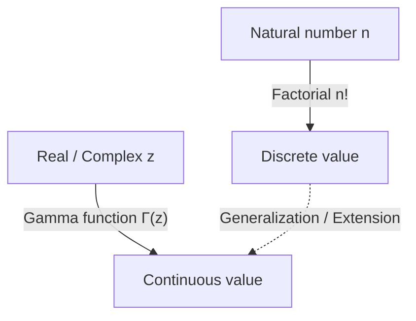

# What is the Gamma Function?

When studying mathematics, we sometimes face the question: "Can a discrete concept be extended to a continuous one?" One of the most beautiful and important examples of this is the **Gamma Function**.

The Gamma function extends the "factorial" ($n!$), defined for natural numbers, to positive real numbers and even to the entire complex plane. Discovered by the great 18th-century mathematician Leonhard Euler, this function appears in almost every field, from mathematical analysis and probability theory to statistics and physics.

In this article, we will take a closer look at the basics of the Gamma function and its profound properties.

## The Idea of Extending the Factorial

The factorial is defined as follows:

$$ n! = n \times (n-1) \times \dots \times 2 \times 1 $$

For example, $3! = 6$ and $4! = 24$. However, this definition only makes sense when $n$ is an integer. Questions naturally arise, such as "What is $2.5!$?" or "Can we calculate $(-1.5)!$?".

Euler tackled this problem and found a function that satisfies the properties of factorials while taking continuous values for real and complex numbers.

# Definition of the Gamma Function

The Gamma function $\Gamma(z)$ is usually defined by the following integral (Euler's integral of the second kind):

$$ \Gamma(z) = \int_0^\infty t^{z-1} e^{-t} dt $$

Here, $z$ is a complex number with a positive real part ($\text{Re}(z) > 0$). This integral converges and has a finite value as long as the real part of $z$ is positive.

## Basic Properties

From this integral definition, we can derive the **recurrence relation**, which is the most important property of the Gamma function. Using integration by parts, we obtain the following relationship:

$$ \Gamma(z+1) = z \Gamma(z) $$

This equation is the core reason why the Gamma function is an extension of the factorial. If $z$ is a natural number $n$, we can calculate it as follows using $\Gamma(1) = 1$:

$$ \Gamma(n) = (n-1) \Gamma(n-1) = (n-1)(n-2) \Gamma(n-2) = \dots = (n-1)! \Gamma(1) = (n-1)! $$

In other words, there is a relationship between the factorial and the Gamma function such that **$\Gamma(n) = (n-1)!$** or **$\Gamma(n+1) = n!$**. Note that the index is shifted by one.

# Analytic Continuation to the Complex Plane

The integral definition shown earlier is only valid for $\text{Re}(z) > 0$. However, by using the recurrence relation $\Gamma(z) = \frac{\Gamma(z+1)}{z}$ backwards, we can perform **Analytic Continuation** of the Gamma function's domain to the left half-plane (the region with negative real parts).

For example, for a $z$ in the range $-1 < \text{Re}(z) < 0$, $\Gamma(z+1)$ can be calculated because its real part is positive. By dividing it by $z$, the value of $\Gamma(z)$ is determined.

By repeating this operation, the Gamma function becomes a meromorphic function defined over the entire complex plane, except for $z = 0, -1, -2, \dots$ (all non-positive integers). The Gamma function diverges at non-positive integers, and there exists a **Pole** at each of these points.

# Euler's Reflection Formula

Another theorem that demonstrates the beauty of the Gamma function is **Euler's Reflection Formula**.

$$ \Gamma(z)\Gamma(1-z) = \frac{\pi}{\sin(\pi z)} $$

This formula holds for complex numbers $z$ that are not integers. Using this formula, we can easily find the value when $z = \frac{1}{2}$, for example.

$$ \Gamma\left(\frac{1}{2}\right)\Gamma\left(\frac{1}{2}\right) = \frac{\pi}{\sin\left(\frac{\pi}{2}\right)} = \pi $$

Therefore, $\Gamma\left(\frac{1}{2}\right) = \sqrt{\pi}$. This is a crucial result deeply related to integrals in normal distributions.

# Relationship with the Beta Function

The Gamma function is closely related to another important special function, the **Beta Function**. The Beta function $B(x, y)$ is defined as follows:

$$ B(x, y) = \int_0^1 t^{x-1} (1-t)^{y-1} dt $$

An astonishing relationship holds between the Gamma function and the Beta function:

$$ B(x, y) = \frac{\Gamma(x)\Gamma(y)}{\Gamma(x+y)} $$

This formula is a powerful tool that reduces complex integral calculations to algebraic computations of the Gamma function.

# Stirling's Approximation

When $n$ is very large, calculating $n!$ exactly is difficult. In such cases, **Stirling's Approximation** describes the asymptotic behavior of factorials (and the Gamma function).

$$ n! \approx \sqrt{2\pi n} \left(\frac{n}{e}\right)^n $$

More generally, for the Gamma function, we can write:

$$ \Gamma(z+1) \approx \sqrt{2\pi z} \left(\frac{z}{e}\right)^z $$

This approximation is indispensable when calculating entropy in statistical mechanics or dealing with massive combinations in probability theory.

# Applications and Conclusion

The Gamma function is not merely a product of mathematical curiosity. It plays a practical role in many fields, such as:

1. **Probability and Statistics**: The Gamma distribution, Chi-squared distribution, and Student's t-distribution are defined using the Gamma function.
2. **Physics**: In dimensional regularization within quantum mechanics and quantum field theory, the Gamma function plays a role in controlling divergences.
3. **Analytic Number Theory**: Through its relationship with the Riemann zeta function, it holds a central position in the study of prime number distribution.

The quest that began with a simple question of extending the factorial to real numbers revealed a magnificent structure that runs through all of mathematics. The Gamma function is truly Euler's masterpiece, bridging the discrete and continuous worlds.
