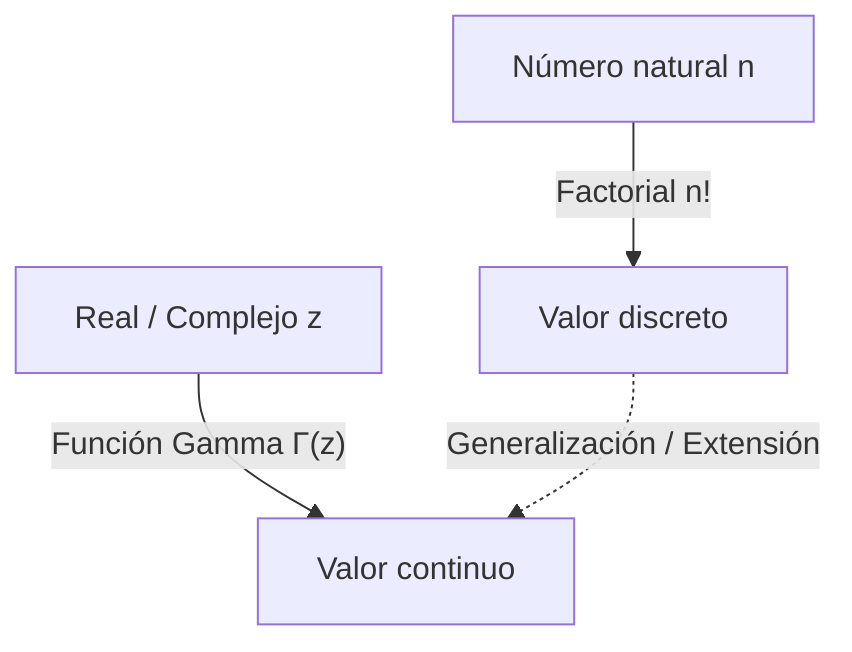

# ¿Qué es la Función Gamma?

Al estudiar matemáticas, a veces nos enfrentamos a la pregunta: "¿Se puede extender un concepto discreto a uno continuo?". Uno de los ejemplos más hermosos e importantes de esto es la **Función Gamma**.

La función Gamma extiende el "factorial" ($n!$), que se define para los números naturales, a los números reales positivos e incluso a todo el plano complejo. Descubierta por el gran matemático del siglo XVIII [Leonhard Euler](https://kenji.blog/es/p/euler/), esta función aparece en casi todos los campos, desde el análisis matemático y la teoría de la probabilidad hasta la estadística y la física.

En este artículo, analizaremos de cerca los conceptos básicos de la función Gamma y sus profundas propiedades.

## La idea de extender el factorial

El factorial se define de la siguiente manera:

$$ n! = n \times (n-1) \times \dots \times 2 \times 1 $$

Por ejemplo, $3! = 6$ y $4! = 24$. Sin embargo, esta definición solo tiene sentido cuando $n$ es un número entero. Es natural preguntarse: "¿Qué es $2.5!$?" o "¿Se puede calcular $(-1.5)!$?".

Euler abordó este problema y encontró una función que satisface las propiedades de los factoriales al tiempo que toma valores continuos para números reales y complejos.

# Definición de la Función Gamma

La función Gamma $\Gamma(z)$ se define normalmente mediante la siguiente integral (la integral de Euler de segunda especie):

$$ \Gamma(z) = \int_0^\infty t^{z-1} e^{-t} dt $$

Aquí, $z$ es un número complejo con una parte real positiva ($\text{Re}(z) > 0$). Esta integral converge y tiene un valor finito siempre que la parte real de $z$ sea positiva.

## Propiedades básicas

A partir de esta definición integral, podemos derivar la **relación de recurrencia**, que es la propiedad más importante de la función Gamma. Usando la integración por partes, obtenemos la siguiente relación:

$$ \Gamma(z+1) = z \Gamma(z) $$

Esta ecuación es la razón principal por la que la función Gamma es una extensión del factorial. Si $z$ es un número natural $n$, podemos calcularlo de la siguiente manera usando $\Gamma(1) = 1$:

$$ \Gamma(n) = (n-1) \Gamma(n-1) = (n-1)(n-2) \Gamma(n-2) = \dots = (n-1)! \Gamma(1) = (n-1)! $$

En otras palabras, existe una relación entre el factorial y la función Gamma tal que **$\Gamma(n) = (n-1)!$** o **$\Gamma(n+1) = n!$**. Tenga en cuenta que el índice está desplazado en una unidad.

# Continuación analítica en el plano complejo

La definición integral mostrada anteriormente solo es válida para $\text{Re}(z) > 0$. Sin embargo, al usar la relación de recurrencia $\Gamma(z) = \frac{\Gamma(z+1)}{z}$ en sentido inverso, podemos realizar la **Continuación Analítica** del dominio de la función Gamma hacia el semiplano izquierdo (la región con partes reales negativas).

Por ejemplo, para un $z$ en el rango $-1 < \text{Re}(z) < 0$, $\Gamma(z+1)$ se puede calcular porque su parte real es positiva. Al dividirlo por $z$, se determina el valor de $\Gamma(z)$.

Repitiendo esta operación, la función Gamma se convierte en una función meromorfa definida sobre todo el plano complejo, excepto para $z = 0, -1, -2, \dots$ (todos los enteros no positivos). La función Gamma diverge en los enteros no positivos, y existe un **Polo** en cada uno de estos puntos.

# Fórmula de reflexión de Euler

Otro teorema que demuestra la belleza de la función Gamma es la **Fórmula de Reflexión de Euler**.

$$ \Gamma(z)\Gamma(1-z) = \frac{\pi}{\sin(\pi z)} $$

Esta fórmula es válida para números complejos $z$ que no son enteros. Usando esta fórmula, podemos encontrar fácilmente el valor cuando $z = \frac{1}{2}$, por ejemplo.

$$ \Gamma\left(\frac{1}{2}\right)\Gamma\left(\frac{1}{2}\right) = \frac{\pi}{\sin\left(\frac{\pi}{2}\right)} = \pi $$

Por lo tanto, $\Gamma\left(\frac{1}{2}\right) = \sqrt{\pi}$. Este es un resultado crucial profundamente relacionado con las integrales en las distribuciones normales.

# Relación con la Función Beta

La función Gamma está estrechamente relacionada con otra función especial importante, la **Función Beta**. La función Beta $B(x, y)$ se define de la siguiente manera:

$$ B(x, y) = \int_0^1 t^{x-1} (1-t)^{y-1} dt $$

Existe una relación asombrosa entre la función Gamma y la función Beta:

$$ B(x, y) = \frac{\Gamma(x)\Gamma(y)}{\Gamma(x+y)} $$

Esta fórmula es una herramienta poderosa que reduce cálculos integrales complejos a cálculos algebraicos de la función Gamma.

# Aproximación de Stirling

Cuando $n$ es muy grande, calcular $n!$ con exactitud es difícil. En tales casos, la **Aproximación de Stirling** describe el comportamiento asintótico de los factoriales (y de la función Gamma).

$$ n! \approx \sqrt{2\pi n} \left(\frac{n}{e}\right)^n $$

De manera más general, para la función Gamma, podemos escribir:

$$ \Gamma(z+1) \approx \sqrt{2\pi z} \left(\frac{z}{e}\right)^z $$

Esta aproximación es indispensable al calcular la entropía en mecánica estadística o al tratar con combinaciones masivas en la teoría de la probabilidad.

# Aplicaciones y conclusión

La función Gamma no es simplemente un producto de la curiosidad matemática. Juega un papel práctico en muchos campos, tales como:

1. **Probabilidad y Estadística**: La distribución Gamma, la distribución Chi-cuadrado y la distribución t de Student se definen utilizando la función Gamma.
2. **Física**: En la regularización dimensional dentro de la mecánica cuántica y la teoría cuántica de campos, la función Gamma juega un papel en el control de las divergencias.
3. **Teoría Analítica de Números**: A través de su relación con la función zeta de [Riemann](https://kenji.blog/es/p/riemann/), ocupa una posición central en el estudio de la distribución de los números primos.

La búsqueda que comenzó con una simple pregunta sobre cómo extender el factorial a los números reales reveló una magnífica estructura que atraviesa todas las matemáticas. La función Gamma es verdaderamente la obra maestra de Euler, tendiendo un puente entre el mundo discreto y el continuo.
