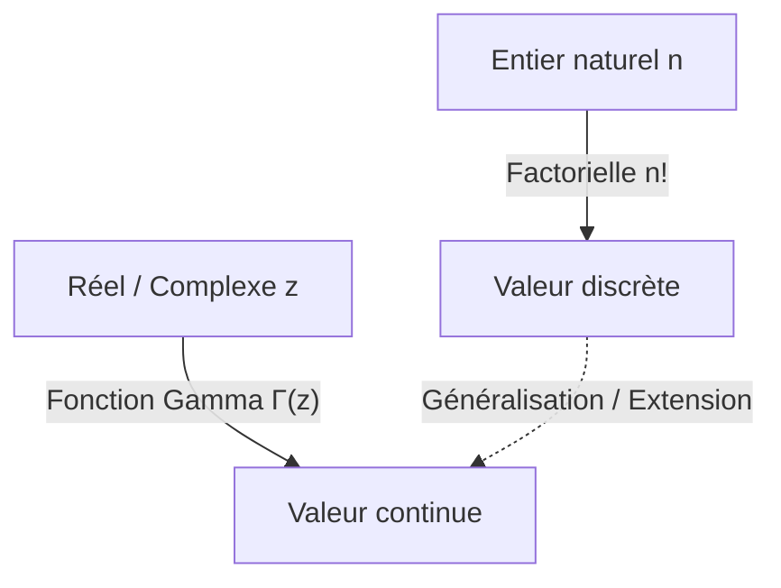

# Qu'est-ce que la Fonction Gamma ?

Lorsqu'on étudie les mathématiques, on est parfois confronté à la question : « Un concept discret peut-il être étendu à un concept continu ? » L'un des exemples les plus beaux et les plus importants en est la **Fonction Gamma**.

La fonction Gamma étend la « factorielle » ($n!$), définie pour les nombres entiers naturels, aux nombres réels positifs et même à l'ensemble du plan complexe. Découverte par le grand mathématicien du 18ème siècle [Leonhard Euler](https://kenji.blog/fr/p/euler/), cette fonction apparaît dans presque tous les domaines, de l'analyse mathématique et la théorie des probabilités aux statistiques et à la physique.

Dans cet article, nous allons examiner de plus près les bases de la fonction Gamma et ses propriétés profondes.

## L'idée de l'extension de la factorielle

La factorielle est définie comme suit :

$$ n! = n \times (n-1) \times \dots \times 2 \times 1 $$

Par exemple, $3! = 6$ et $4! = 24$. Cependant, cette définition n'a de sens que si $n$ est un entier. Des questions se posent naturellement, telles que « Qu'est-ce que $2.5!$ ? » ou « Peut-on calculer $(-1.5)!$ ? ».

Euler s'est attaqué à ce problème et a trouvé une fonction qui satisfait aux propriétés des factorielles tout en prenant des valeurs continues pour les nombres réels et complexes.

# Définition de la Fonction Gamma

La fonction Gamma $\Gamma(z)$ est généralement définie par l'intégrale suivante (l'intégrale eulérienne de seconde espèce) :

$$ \Gamma(z) = \int_0^\infty t^{z-1} e^{-t} dt $$

Ici, $z$ est un nombre complexe avec une partie réelle positive ($\text{Re}(z) > 0$). Cette intégrale converge et a une valeur finie tant que la partie réelle de $z$ est positive.

## Propriétés fondamentales

À partir de cette définition intégrale, nous pouvons dériver la **relation de récurrence**, qui est la propriété la plus importante de la fonction Gamma. En utilisant l'intégration par parties, nous obtenons la relation suivante :

$$ \Gamma(z+1) = z \Gamma(z) $$

Cette équation est la raison principale pour laquelle la fonction Gamma est une extension de la factorielle. Si $z$ est un entier naturel $n$, nous pouvons le calculer comme suit en utilisant $\Gamma(1) = 1$ :

$$ \Gamma(n) = (n-1) \Gamma(n-1) = (n-1)(n-2) \Gamma(n-2) = \dots = (n-1)! \Gamma(1) = (n-1)! $$

En d'autres termes, il existe une relation entre la factorielle et la fonction Gamma telle que **$\Gamma(n) = (n-1)!$** ou **$\Gamma(n+1) = n!$**. Notez que l'indice est décalé de un.

# Prolongement analytique dans le plan complexe

La définition intégrale montrée précédemment n'est valide que pour $\text{Re}(z) > 0$. Cependant, en utilisant la relation de récurrence $\Gamma(z) = \frac{\Gamma(z+1)}{z}$ à l'envers, nous pouvons effectuer un **Prolongement Analytique** du domaine de la fonction Gamma vers le demi-plan gauche (la région avec des parties réelles négatives).

Par exemple, pour un $z$ dans l'intervalle $-1 < \text{Re}(z) < 0$, $\Gamma(z+1)$ peut être calculé car sa partie réelle est positive. En le divisant par $z$, la valeur de $\Gamma(z)$ est déterminée.

En répétant cette opération, la fonction Gamma devient une fonction méromorphe définie sur l'ensemble du plan complexe, à l'exception de $z = 0, -1, -2, \dots$ (tous les entiers négatifs ou nuls). La fonction Gamma diverge aux entiers non positifs, et il existe un **Pôle** en chacun de ces points.

# Formule de réflexion d'Euler

Un autre théorème qui démontre la beauté de la fonction Gamma est la **Formule de réflexion d'Euler**.

$$ \Gamma(z)\Gamma(1-z) = \frac{\pi}{\sin(\pi z)} $$

Cette formule est valable pour les nombres complexes $z$ qui ne sont pas des entiers. En utilisant cette formule, nous pouvons facilement trouver la valeur lorsque $z = \frac{1}{2}$, par exemple.

$$ \Gamma\left(\frac{1}{2}\right)\Gamma\left(\frac{1}{2}\right) = \frac{\pi}{\sin\left(\frac{\pi}{2}\right)} = \pi $$

Par conséquent, $\Gamma\left(\frac{1}{2}\right) = \sqrt{\pi}$. Il s'agit d'un résultat crucial profondément lié aux intégrales dans les lois normales.

# Relation avec la Fonction Bêta

La fonction Gamma est étroitement liée à une autre fonction spéciale importante, la **Fonction Bêta**. La fonction Bêta $B(x, y)$ est définie comme suit :

$$ B(x, y) = \int_0^1 t^{x-1} (1-t)^{y-1} dt $$

Une relation étonnante existe entre la fonction Gamma et la fonction Bêta :

$$ B(x, y) = \frac{\Gamma(x)\Gamma(y)}{\Gamma(x+y)} $$

Cette formule est un outil puissant qui réduit des calculs d'intégrales complexes à des calculs algébriques de la fonction Gamma.

# Approximation de Stirling

Lorsque $n$ est très grand, calculer exactement $n!$ est difficile. Dans de tels cas, l'**Approximation de Stirling** décrit le comportement asymptotique des factorielles (et de la fonction Gamma).

$$ n! \approx \sqrt{2\pi n} \left(\frac{n}{e}\right)^n $$

Plus généralement, pour la fonction Gamma, nous pouvons écrire :

$$ \Gamma(z+1) \approx \sqrt{2\pi z} \left(\frac{z}{e}\right)^z $$

Cette approximation est indispensable lors du calcul de l'entropie en mécanique statistique ou lors de la manipulation de combinaisons massives en théorie des probabilités.

# Applications et conclusion

La fonction Gamma n'est pas seulement le produit d'une curiosité mathématique. Elle joue un rôle pratique dans de nombreux domaines, tels que :

1. **Probabilités et Statistiques** : La loi Gamma, la loi du Chi-deux et la loi de Student sont définies à l'aide de la fonction Gamma.
2. **Physique** : Dans la régularisation dimensionnelle en mécanique quantique et en théorie quantique des champs, la fonction Gamma joue un rôle dans le contrôle des divergences.
3. **Théorie Analytique des Nombres** : Grâce à sa relation avec la fonction zêta de [Riemann](https://kenji.blog/fr/p/riemann/), elle occupe une position centrale dans l'étude de la répartition des nombres premiers.

La quête qui a commencé par une simple question sur l'extension de la factorielle aux nombres réels a révélé une structure magnifique qui traverse l'ensemble des mathématiques. La fonction Gamma est véritablement le chef-d'œuvre d'Euler, jetant un pont entre le monde discret et le monde continu.
