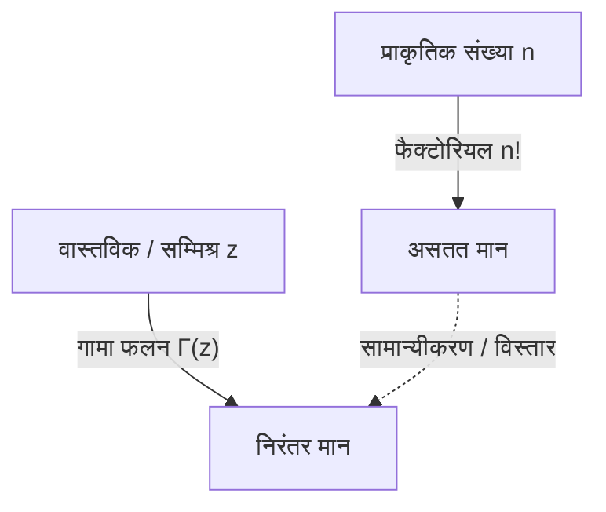

# [गामा फलन](https://kenji.blog/p/gamma-function/) क्या है?

गणित का अध्ययन करते समय, हमें कभी-कभी इस सवाल का सामना करना पड़ता है: "क्या किसी असतत अवधारणा को निरंतर अवधारणा तक बढ़ाया जा सकता है?" इसका सबसे सुंदर और महत्वपूर्ण उदाहरण **[गामा फलन](https://kenji.blog/p/gamma-function/)** है।

[गामा फलन](https://kenji.blog/p/gamma-function/), प्राकृतिक संख्याओं के लिए परिभाषित "फैक्टोरियल" ($n!$) को धनात्मक वास्तविक संख्याओं और यहां तक कि संपूर्ण सम्मिश्र तल तक विस्तारित करता है। 18वीं सदी के महान गणितज्ञ [लियोनहार्ड यूलर](https://kenji.blog/p/euler/) द्वारा खोजा गया यह फलन, गणितीय विश्लेषण और प्रायिकता सिद्धांत से लेकर सांख्यिकी और भौतिकी तक, लगभग हर क्षेत्र में दिखाई देता है।

इस लेख में, हम [गामा फलन](https://kenji.blog/p/gamma-function/) की मूल बातों और इसके गहरे गुणों पर करीब से नज़र डालेंगे।

## फैक्टोरियल का विस्तार करने का विचार

फैक्टोरियल को इस प्रकार परिभाषित किया गया है:

$$ n! = n \times (n-1) \times \dots \times 2 \times 1 $$

उदाहरण के लिए, $3! = 6$ और $4! = 24$। हालाँकि, यह परिभाषा तभी समझ में आती है जब $n$ एक पूर्णांक हो। प्रश्न स्वाभाविक रूप से उठते हैं, जैसे "$2.5!$ क्या है?" या "क्या हम $(-1.5)!$ की गणना कर सकते हैं?"।

यूलर ने इस समस्या से निपटा और एक ऐसा फलन पाया जो वास्तविक और सम्मिश्र संख्याओं के लिए निरंतर मान लेते हुए फैक्टोरियल के गुणों को संतुष्ट करता है।

# [गामा फलन](https://kenji.blog/p/gamma-function/) की परिभाषा

[गामा फलन](https://kenji.blog/p/gamma-function/) $\Gamma(z)$ को आमतौर पर निम्नलिखित समाकलन (यूलर का दूसरे प्रकार का समाकलन) द्वारा परिभाषित किया जाता है:

$$ \Gamma(z) = \int_0^\infty t^{z-1} e^{-t} dt $$

यहाँ, $z$ एक धनात्मक वास्तविक भाग ($\text{Re}(z) > 0$) के साथ एक सम्मिश्र संख्या है। यह समाकलन अभिसरित होता है और इसका एक सीमित मान होता है जब तक कि $z$ का वास्तविक भाग धनात्मक हो।

## बुनियादी गुण

इस समाकलन परिभाषा से, हम **पुनरावृत्ति संबंध** प्राप्त कर सकते हैं, जो [गामा फलन](https://kenji.blog/p/gamma-function/) का सबसे महत्वपूर्ण गुण है। खंडशः समाकलन (integration by parts) का उपयोग करके, हम निम्नलिखित संबंध प्राप्त करते हैं:

$$ \Gamma(z+1) = z \Gamma(z) $$

यह समीकरण मुख्य कारण है कि [गामा फलन](https://kenji.blog/p/gamma-function/) फैक्टोरियल का विस्तार है। यदि $z$ एक प्राकृतिक संख्या $n$ है, तो हम $\Gamma(1) = 1$ का उपयोग करके इसकी गणना इस प्रकार कर सकते हैं:

$$ \Gamma(n) = (n-1) \Gamma(n-1) = (n-1)(n-2) \Gamma(n-2) = \dots = (n-1)! \Gamma(1) = (n-1)! $$

दूसरे शब्दों में, फैक्टोरियल और [गामा फलन](https://kenji.blog/p/gamma-function/) के बीच एक संबंध है जैसे कि **$\Gamma(n) = (n-1)!$** या **$\Gamma(n+1) = n!$**। ध्यान दें कि सूचकांक एक से स्थानांतरित हो गया है।

# सम्मिश्र तल में विश्लेषणात्मक निरंतरता

पहले दिखाई गई समाकलन परिभाषा केवल $\text{Re}(z) > 0$ के लिए मान्य है। हालाँकि, पुनरावृत्ति संबंध $\Gamma(z) = \frac{\Gamma(z+1)}{z}$ का पीछे की ओर उपयोग करके, हम [गामा फलन](https://kenji.blog/p/gamma-function/) के डोमेन को बाएँ आधे-तल (ऋणात्मक वास्तविक भागों वाले क्षेत्र) में **विश्लेषणात्मक निरंतरता (Analytic Continuation)** कर सकते हैं।

उदाहरण के लिए, $-1 < \text{Re}(z) < 0$ की सीमा में $z$ के लिए, $\Gamma(z+1)$ की गणना की जा सकती है क्योंकि इसका वास्तविक भाग धनात्मक है। इसे $z$ से विभाजित करके, $\Gamma(z)$ का मान निर्धारित किया जाता है।

इस ऑपरेशन को दोहराकर, [गामा फलन](https://kenji.blog/p/gamma-function/) $z = 0, -1, -2, \dots$ (सभी गैर-धनात्मक पूर्णांकों) को छोड़कर संपूर्ण सम्मिश्र तल पर परिभाषित एक मेरोमोर्फिक फलन बन जाता है। [गामा फलन](https://kenji.blog/p/gamma-function/) गैर-धनात्मक पूर्णांकों पर अपसरित होता है, और इनमें से प्रत्येक बिंदु पर एक **ध्रुव (Pole)** मौजूद होता है।

# यूलर का परावर्तन सूत्र

एक और प्रमेय जो [गामा फलन](https://kenji.blog/p/gamma-function/) की सुंदरता को प्रदर्शित करता है, वह है **यूलर का परावर्तन सूत्र**।

$$ \Gamma(z)\Gamma(1-z) = \frac{\pi}{\sin(\pi z)} $$

यह सूत्र उन सम्मिश्र संख्याओं $z$ के लिए मान्य है जो पूर्णांक नहीं हैं। इस सूत्र का उपयोग करके, हम आसानी से मान ज्ञात कर सकते हैं जब उदाहरण के लिए $z = \frac{1}{2}$ हो।

$$ \Gamma\left(\frac{1}{2}\right)\Gamma\left(\frac{1}{2}\right) = \frac{\pi}{\sin\left(\frac{\pi}{2}\right)} = \pi $$

इसलिए, $\Gamma\left(\frac{1}{2}\right) = \sqrt{\pi}$। यह सामान्य वितरणों में समाकलन से गहराई से जुड़ा एक महत्वपूर्ण परिणाम है।

# बीटा फलन के साथ संबंध

[गामा फलन](https://kenji.blog/p/gamma-function/) एक और महत्वपूर्ण विशेष फलन, **बीटा फलन** से निकटता से संबंधित है। बीटा फलन $B(x, y)$ को इस प्रकार परिभाषित किया गया है:

$$ B(x, y) = \int_0^1 t^{x-1} (1-t)^{y-1} dt $$

[गामा फलन](https://kenji.blog/p/gamma-function/) और बीटा फलन के बीच एक आश्चर्यजनक संबंध है:

$$ B(x, y) = \frac{\Gamma(x)\Gamma(y)}{\Gamma(x+y)} $$

यह सूत्र एक शक्तिशाली उपकरण है जो जटिल समाकलन गणनाओं को [गामा फलन](https://kenji.blog/p/gamma-function/) की बीजगणितीय गणनाओं में कम कर देता है।

# स्टर्लिंग का सन्निकटन

जब $n$ बहुत बड़ा होता है, तो $n!$ की सटीक गणना करना कठिन होता है। ऐसे मामलों में, **स्टर्लिंग का सन्निकटन** फैक्टोरियल (और [गामा फलन](https://kenji.blog/p/gamma-function/)) के स्पर्शोन्मुख व्यवहार का वर्णन करता है।

$$ n! \approx \sqrt{2\pi n} \left(\frac{n}{e}\right)^n $$

अधिक सामान्यतः, [गामा फलन](https://kenji.blog/p/gamma-function/) के लिए, हम लिख सकते हैं:

$$ \Gamma(z+1) \approx \sqrt{2\pi z} \left(\frac{z}{e}\right)^z $$

यह सन्निकटन सांख्यिकीय यांत्रिकी में एन्ट्रापी की गणना करते समय या प्रायिकता सिद्धांत में बड़े पैमाने पर संयोजनों से निपटते समय अपरिहार्य है।

# अनुप्रयोग और निष्कर्ष

[गामा फलन](https://kenji.blog/p/gamma-function/) केवल गणितीय जिज्ञासा का उत्पाद नहीं है। यह कई क्षेत्रों में व्यावहारिक भूमिका निभाता है, जैसे:

1. **प्रायिकता और सांख्यिकी**: गामा वितरण, ची-स्क्वायर्ड वितरण और छात्र का टी-वितरण [गामा फलन](https://kenji.blog/p/gamma-function/) का उपयोग करके परिभाषित किए गए हैं।
2. **भौतिकी**: क्वांटम यांत्रिकी और क्वांटम क्षेत्र सिद्धांत के भीतर आयामी नियमितीकरण में, [गामा फलन](https://kenji.blog/p/gamma-function/) अपसरण को नियंत्रित करने में एक भूमिका निभाता है।
3. **विश्लेषणात्मक संख्या सिद्धांत**: रीमैन जीटा फलन के साथ इसके संबंध के माध्यम से, यह अभाज्य संख्या वितरण के अध्ययन में एक केंद्रीय स्थान रखता है।

फैक्टोरियल को वास्तविक संख्याओं तक विस्तारित करने के एक साधारण प्रश्न के साथ शुरू हुई खोज ने एक शानदार संरचना का खुलासा किया जो पूरे गणित में चलती है। [गामा फलन](https://kenji.blog/p/gamma-function/) वास्तव में यूलर की उत्कृष्ट कृति है, जो असतत और निरंतर दुनिया के बीच की खाई को पाटती है।
