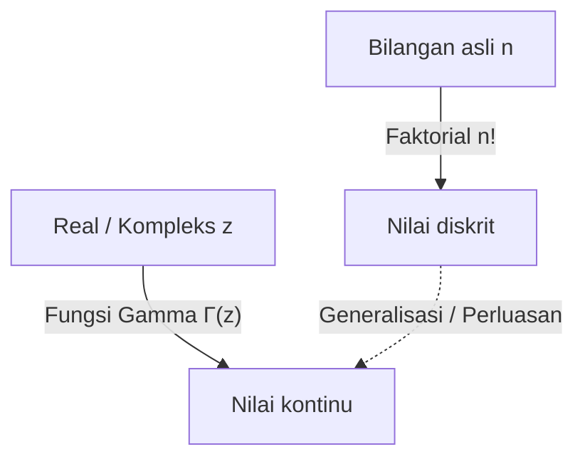

# Apa itu [Fungsi Gamma](https://kenji.blog/id/p/gamma-function/)?

Saat belajar matematika, kita terkadang dihadapkan pada pertanyaan: "Bisakah konsep yang diskrit diperluas menjadi konsep yang kontinu?" Salah satu contoh paling indah dan penting dari ini adalah **[Fungsi Gamma](https://kenji.blog/id/p/gamma-function/)**.

[Fungsi Gamma](https://kenji.blog/id/p/gamma-function/) memperluas "faktorial" ($n!$), yang didefinisikan untuk bilangan asli, ke bilangan real positif dan bahkan ke seluruh bidang kompleks. Ditemukan oleh ahli matematika hebat abad ke-18 [Leonhard Euler](https://kenji.blog/id/p/euler/), fungsi ini muncul di hampir setiap bidang, mulai dari analisis matematika dan teori probabilitas hingga statistik dan fisika.

Dalam artikel ini, kita akan melihat lebih dekat dasar-dasar fungsi Gamma dan sifat-sifatnya yang mendalam.

## Gagasan Memperluas Faktorial

Faktorial didefinisikan sebagai berikut:

$$ n! = n \times (n-1) \times \dots \times 2 \times 1 $$

Misalnya, $3! = 6$ dan $4! = 24$. Namun, definisi ini hanya masuk akal jika $n$ adalah bilangan bulat. Pertanyaan secara alami muncul, seperti "Berapa $2.5!$?" atau "Bisakah kita menghitung $(-1.5)!$?".

Euler mengatasi masalah ini dan menemukan fungsi yang memenuhi sifat faktorial sambil mengambil nilai kontinu untuk bilangan real dan kompleks.

# Definisi [Fungsi Gamma](https://kenji.blog/id/p/gamma-function/)

[Fungsi Gamma](https://kenji.blog/id/p/gamma-function/) $\Gamma(z)$ biasanya didefinisikan oleh integral berikut (integral Euler jenis kedua):

$$ \Gamma(z) = \int_0^\infty t^{z-1} e^{-t} dt $$

Di sini, $z$ adalah bilangan kompleks dengan bagian real positif ($\text{Re}(z) > 0$). Integral ini konvergen dan memiliki nilai berhingga selama bagian real $z$ positif.

## Sifat Dasar

Dari definisi integral ini, kita dapat memperoleh **relasi perulangan**, yang merupakan sifat paling penting dari fungsi Gamma. Menggunakan integrasi parsial, kita memperoleh hubungan berikut:

$$ \Gamma(z+1) = z \Gamma(z) $$

Persamaan ini adalah alasan utama mengapa fungsi Gamma merupakan perluasan dari faktorial. Jika $z$ adalah bilangan asli $n$, kita dapat menghitungnya sebagai berikut menggunakan $\Gamma(1) = 1$:

$$ \Gamma(n) = (n-1) \Gamma(n-1) = (n-1)(n-2) \Gamma(n-2) = \dots = (n-1)! \Gamma(1) = (n-1)! $$

Dengan kata lain, ada hubungan antara faktorial dan fungsi Gamma sedemikian rupa sehingga **$\Gamma(n) = (n-1)!$** atau **$\Gamma(n+1) = n!$**. Perhatikan bahwa indeksnya bergeser satu.

# Kelanjutan Analitik ke Bidang Kompleks

Definisi integral yang ditunjukkan sebelumnya hanya berlaku untuk $\text{Re}(z) > 0$. Namun, dengan menggunakan relasi perulangan $\Gamma(z) = \frac{\Gamma(z+1)}{z}$ secara mundur, kita dapat melakukan **Kelanjutan Analitik** (Analytic Continuation) dari domain fungsi Gamma ke setengah bidang kiri (wilayah dengan bagian real negatif).

Misalnya, untuk $z$ dalam rentang $-1 < \text{Re}(z) < 0$, $\Gamma(z+1)$ dapat dihitung karena bagian realnya positif. Dengan membaginya dengan $z$, nilai $\Gamma(z)$ ditentukan.

Dengan mengulangi operasi ini, fungsi Gamma menjadi fungsi meromorfik yang didefinisikan di seluruh bidang kompleks, kecuali untuk $z = 0, -1, -2, \dots$ (semua bilangan bulat non-positif). [Fungsi Gamma](https://kenji.blog/id/p/gamma-function/) divergen pada bilangan bulat non-positif, dan terdapat sebuah **Kutub** (Pole) di setiap titik ini.

# Rumus Refleksi Euler

Teorema lain yang menunjukkan keindahan fungsi Gamma adalah **Rumus Refleksi Euler**.

$$ \Gamma(z)\Gamma(1-z) = \frac{\pi}{\sin(\pi z)} $$

Rumus ini berlaku untuk bilangan kompleks $z$ yang bukan bilangan bulat. Dengan menggunakan rumus ini, kita dapat dengan mudah menemukan nilai ketika $z = \frac{1}{2}$, misalnya.

$$ \Gamma\left(\frac{1}{2}\right)\Gamma\left(\frac{1}{2}\right) = \frac{\pi}{\sin\left(\frac{\pi}{2}\right)} = \pi $$

Oleh karena itu, $\Gamma\left(\frac{1}{2}\right) = \sqrt{\pi}$. Ini adalah hasil krusial yang sangat terkait dengan integral dalam distribusi normal.

# Hubungan dengan Fungsi Beta

[Fungsi Gamma](https://kenji.blog/id/p/gamma-function/) berkaitan erat dengan fungsi khusus penting lainnya, yaitu **Fungsi Beta**. Fungsi Beta $B(x, y)$ didefinisikan sebagai berikut:

$$ B(x, y) = \int_0^1 t^{x-1} (1-t)^{y-1} dt $$

Hubungan yang menakjubkan berlaku antara fungsi Gamma dan fungsi Beta:

$$ B(x, y) = \frac{\Gamma(x)\Gamma(y)}{\Gamma(x+y)} $$

Rumus ini adalah alat yang ampuh yang mereduksi perhitungan integral kompleks menjadi perhitungan aljabar fungsi Gamma.

# Aproksimasi Stirling

Ketika $n$ sangat besar, menghitung $n!$ secara tepat adalah hal yang sulit. Dalam kasus seperti itu, **Aproksimasi Stirling** menjelaskan perilaku asimtotik dari faktorial (dan fungsi Gamma).

$$ n! \approx \sqrt{2\pi n} \left(\frac{n}{e}\right)^n $$

Secara lebih umum, untuk fungsi Gamma, kita dapat menulis:

$$ \Gamma(z+1) \approx \sqrt{2\pi z} \left(\frac{z}{e}\right)^z $$

Aproksimasi ini sangat diperlukan saat menghitung entropi dalam mekanika statistik atau saat berhadapan dengan kombinasi masif dalam teori probabilitas.

# Aplikasi dan Kesimpulan

[Fungsi Gamma](https://kenji.blog/id/p/gamma-function/) bukan hanya sekadar produk keingintahuan matematika. Ia memainkan peran praktis di banyak bidang, seperti:

1. **Probabilitas dan Statistik**: Distribusi Gamma, distribusi Chi-kuadrat, dan distribusi t Student didefinisikan menggunakan fungsi Gamma.
2. **Fisika**: Dalam regularisasi dimensional di dalam mekanika kuantum dan teori medan kuantum, fungsi Gamma berperan dalam mengendalikan divergensi.
3. **Teori Bilangan Analitik**: Melalui hubungannya dengan fungsi zeta Riemann, ia memegang posisi sentral dalam studi distribusi bilangan prima.

Pencarian yang dimulai dengan pertanyaan sederhana tentang memperluas faktorial ke bilangan real mengungkapkan struktur luar biasa yang membentang di seluruh matematika. [Fungsi Gamma](https://kenji.blog/id/p/gamma-function/) benar-benar mahakarya Euler, yang menjembatani dunia diskrit dan kontinu.
